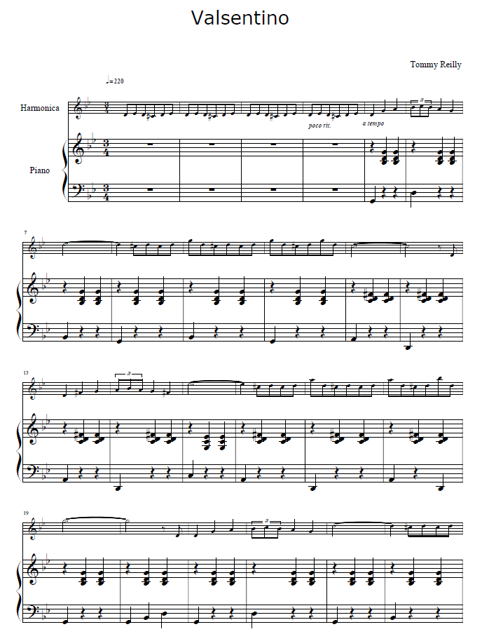
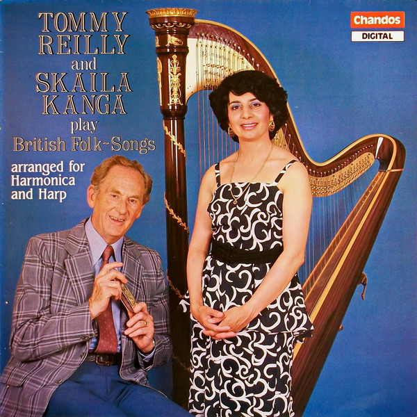
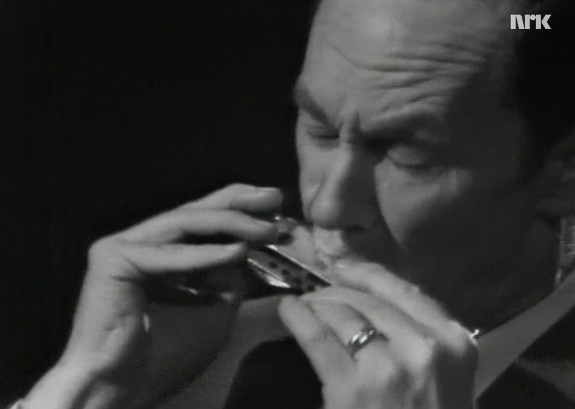
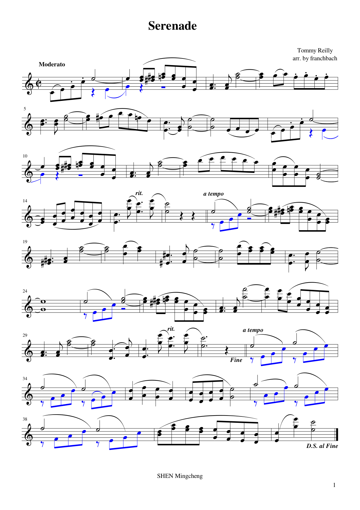

# Chapter 9 The Rebirth of Melody

Tommy Reilly's life was not only that of a performer but also that of a composer. He composed a vast amount of original works for the chromatic harmonica, ranging from etudes and concert pieces to large-scale concertos. These works are not only the perfect embodiment of his performance philosophy but also the core treasures in the artistic treasury of the chromatic harmonica, remaining essential repertoire for harmonica players worldwide to this day.

## 9.1 Perfect Blend of Technique and Music: Valsentino (Fast Waltz)

"Fast Waltz (Valsentino)" is Tommy Reilly's most representative original work, hailed as the "touchstone of classical chromatic harmonica" and one of the most frequently chosen pieces in global harmonica competitions. Composed in the 1950s, it was a virtuosic piece created by Tommy Reilly for his own concerts, perfectly blending his technical innovations with musical ideas, and has become a benchmark for classical harmonica works. In recent years, it has also been gradually adopted by many harmonica players in China as a "beginner" practice piece for learning to play, although mastering this piece is by no means easy. On the Bilibili website, there are numerous performance videos by harmonica enthusiasts, but very few can meet the standards set by Tommy Reilly.

### Creative Background

The 1950s were a crucial period for Tommy Reilly as he made a strong push into the classical music scene. At that time, many in the classical music world still believed that the harmonica could only play slow, simple melodies and was incapable of handling fast-paced, technically demanding showpieces. To break this prejudice, Tommy Reilly composed the piece *Fast Waltz*, using a single work to fully demonstrate the technical possibilities and musical expressiveness of the chromatic harmonica.

### Musical Structure and Technical Characteristics

This piece is a typical ternary form, using a 3/8 waltz rhythm, with an overall very fast tempo, extremely high difficulty in performance, while also possessing strong musicality and dance feel, perfectly achieving "technique serving the music."

The exposition of the piece opens with a lively and agile main theme. This theme, featuring a continuous stream of sixteenth-note scales, perfectly showcases the rapid scale playing system developed by Tommy Reilly, demanding the utmost precision in keying, stability of breath, and seamless transition between blowing and drawing. At the same time, this main theme retains the dance feel of a waltz, with each musical phrase having a clear breath and rise and fall, far from being a mere display of technical prowess.

In the middle section of the piece, the melody shifts to a lyrical style, creating a stark contrast with the technical display of the exposition. This lyrical melody makes perfect use of Tommy Reilly's unique vibrato and slide techniques, with the melody line flowing continuously, as if sung by a human voice, full of emotion and depth, fully showcasing the tonal charm and expressive power of the harmonica. In this section, Tommy Reilly deliberately incorporated numerous dynamic contrasts and timbral variations, allowing performers to fully demonstrate their musical interpretation skills and enriching the musical layers of the work.

In the recapitulation section of the piece, the main theme returns, interwoven with more complex variations and cadenzas, played at a faster tempo and with heightened technical difficulty, propelling the overall mood of the work towards a climax. Finally, the piece concludes with a brilliant ascending scale, ending cleanly and leaving a lingering aftertaste.

### Artistic Value

The artistic value of the *Rapid Waltz* lies in its pioneering demonstration to the classical music world that harmonica works can possess both extreme technical difficulty and high musical aesthetics. It is not about showing off technique for its own sake, but rather using technique to serve the musical core of the waltz, giving the piece both the impact of technical display and the lyrical beauty of music. To this day, this piece remains a core work for measuring a chromatic harmonica player's technical level and musical literacy, and Tommy Reilly's own performance of it is regarded as an unsurpassable classic model.

### Analysis of Difficult Performance Techniques

"Valsentino" became a technical benchmark because it almost integrates all the core technologies of Tommy Reilly's revolutionary playing system:

Tonguing and Articulation: This piece requires the performer to master and skillfully employ hard tonguing. Hard tonguing involves concentrated force from the throat, producing short, powerful, and clear note attacks like bullets, rather than relying on the tongue harshly striking the harmonica's holes. This type of tonguing is extensively used in the theme's leaping notes, shaping the notes' elasticity, crispness, and the characteristic dance accents of a waltz.

Harmonica Technique: The precise movement of large intervals is one of the core challenges of this piece. The core principle of the Reilly system is "keep the head absolutely stable, move the harmonica only through wrist movement." In the cadenza section of *Valsentino*, frequent octave and even two-octave jumps must be executed by sliding the harmonica with the wrist. When playing, the lips must always stay in contact with the harmonica's comb, and at the moment the note sounds, the wrist slides the harmonica in a straight line, along the shortest path to the target hole, ensuring that the airflow is not interrupted during the jump.

Fast Chromatic Scale: Reilly emphasizes the necessity of applying the "pre-action of the slide" technique. This means that while moving the harmonica, the finger responsible for pressing the slide button must anticipate the action, ensuring that at the moment the note sounds, the button is already in the fully pressed or fully released correct state. This requires breath, wrist movement, and finger button pressing to achieve millisecond-level precise synchronization.

Double Stops and Chords: The works also involve the legato playing of double stops and chords. For example, in certain parts of lyrical and cadenza passages, it is required to use the tongue-blocking technique to simultaneously play thirds or sixths intervals, maintaining perfect balance and volume blending between the two notes, while achieving seamless legato between blow and draw transitions.

## 9.2 Romantic Poetic Expression: *Serenade*

"Serenade" is the most romantic concert piece among Tommy Reilly's original compositions and one of his most frequently performed and beloved original works by audiences. This piece perfectly showcases Tommy Reilly's exquisite control of tone and his profound understanding of Romantic music, making it a quintessential example of a classical harmonica lyrical work.

### Creative Background

This piece was composed in the late 1950s — German harmonica player Uwe Warschkow recalls that during his studies in Trossingen from 1956-1959, he heard Reilly himself playing this serenade outside a local hotel. By this time, Tommy Reilly had already established himself in the classical music world and no longer needed to prove himself with showy pieces; his creative focus began to shift towards emotional expression and poetic content in music.

### Musical Structure and Artistic Features

This piece is in ternary form, played at a moderate tempo (Moderato) — verified according to the TRM series sheet music published by franchbach, dispelling the commonly circulated "Andante" claim. The melody is graceful and lyrical, imbued with the poetry and tenderness of Romanticism, perfectly showcasing the vocal quality and tonal charm of the harmonica.

The A section of the piece opens with a soothing, lyrical main melody. This melody features a stepwise melodic progression, with phrases that flow seamlessly, much like natural and fluid vocal singing. In this melody, Tommy Reilly deliberately incorporates numerous breath swells and vibrato techniques, allowing every note of the melody to possess a rich emotional fluctuation. This fully showcases his signature "silver sound" tone, which is warm, transparent, and filled with deep emotion.

In the B section of the piece, the melody shifts to a different key, and the mood becomes fuller and more intense, forming a stark contrast with the gentleness of the A section. This melody, with a higher register and stronger emotional tension, showcases Tommy Reilly's exceptional breath control, achieving extreme dynamic contrasts. The harmonica's tone ranges from a soft whisper to a rich and full sound, demonstrating a remarkable dynamic range and expressive power. Additionally, this section incorporates skillful slides and grace notes, enhancing the melody's lyrical quality and deepening the poetic essence of the work.

In the recapitulation section, the main theme returns. After the emotional buildup of the B section, the melody of the recapitulation gains an additional layer of deeper sentiment. Ultimately, the melody gradually descends, concluding with a very soft long note, leaving a lingering aftertaste. It is like the ending of a love poem, tender and moving.

### Artistic Value

This "Serenade" completely shattered the stereotype that "the harmonica cannot express the delicate lyricism of classical works." Tommy Reilly, with this piece, proved that the harmonica's tone possesses an emotional expressiveness that rivals the violin and the human voice. It can perfectly interpret the poetry and deep affection of Romantic music, capturing the heart of every listener in a concert hall with just a small instrument. To this day, this piece remains the most frequently performed lyrical work at harmonica concerts worldwide, and Tommy Reilly's own recording of it is revered by countless music fans as "the sound of healing for the soul."

## 9.3 Performance Practice and Interpretation Suggestions

### Practice Strategies for *Valsentino*

1. **Sectional Practice**
Divide the piece *Valsentino* into several sections, practice each segment individually, and ensure that each part is thoroughly mastered.

2. **Slow Practice**
Start practicing at a slow pace, gradually increasing the speed, ensuring each note is clear and accurate.

3. **Using a Metronome**
Use a metronome to maintain a steady tempo, especially in fast passages.

4. **Repeatedly Practice Difficult Sections**
Identify and repeatedly practice the difficult sections of the piece until you can play them fluently.

5. **Playback**
Record your own playing and play it back to identify areas for improvement.

6. **Comparison with the Original**
Compare your own playing with Tommy Reilly's original recordings, identify the differences, and work on improving them.

7. **Collaborations with Others**
Try collaborating with musicians like Sigmund Groven or Uwe Warschkow to gain different perspectives on playing.

8. **Emotional Expression**
On the basis of mastering the technique, focus on the emotional expression of the music, and try to convey the composer's intention.

9. **Regular Review**
Regularly review the mastered passages to maintain fluency and accuracy in performance.

10. **Performance Engagements**
Participate in small performances or music gatherings to accumulate stage experience and boost your performance confidence.

> "Practice doesn't make perfect. Perfect practice makes perfect." - Vince Lombardi

By using these strategies, you will be able to better master "Valsentino" and enhance your playing skills.

Break it down and master it slowly: When facing the dense rapid scales, chromatic scales, and octave leaps in cadenzas, avoid practicing at full speed right away. Reilly repeatedly emphasized the principle of "slow but accurate" in his teaching, requiring performers to first practice at an "extremely slow pace." For chromatic scales, the key lies in using the "preparatory finger movement" technique; for octave leaps, one must strictly adhere to the principle of "keeping the head absolutely still and only moving the instrument."

Mirror Monitoring and Rhythm Reconstruction: Reilly required students to practice in front of a mirror daily to strictly monitor whether their head was stable, their harmonica movements were unnecessary, and their wrists were relaxed. Only after ensuring notes were even and precise at a slow tempo could they gradually and cautiously increase speed. During the acceleration process, rhythm accents needed to be reintroduced and strengthened to ensure the internal sense of timing was "as stable as a metronome."

### Key Points in Performing *Serenade*

1. **Emotional Expression**
   > When playing "Serenade," emotional expression is crucial.
   > Tommy Reilly emphasizes conveying the romantic atmosphere of the piece through subtle tonal variations.

2. **Rhythm Control**
   - Maintain a steady sense of rhythm, but avoid being too mechanical.
   - Sigmund Groven suggests slightly slowing down in certain passages to enhance the musical expression.

3. **Technique Application**
   - Master the techniques of glissando and vibrato.
- Uwe Warschkow points out that proper breath control is the key to successfully performing this piece.

4. **Tone Variation**  
   - Create rich tonal layers by varying breath pressure and embouchure.
   - Tommy Reilly often used special embouchure techniques to achieve unique tones when playing *Serenade*.

5. **Musical Structure**  
   - Understand the overall structure and musical direction of each section.
   - Pay special attention to the development of the middle section and the handling of the climax.

| Performance Points | Detailed Explanation |
|----------|----------|
| Emotional Expression | Convey a romantic atmosphere through tone variation |
| Rhythm Control | Maintain stability without becoming mechanical |
| Technique Application | Mastery of glissando, vibrato, and breath control |
| Timbre Variation | Create layers through changes in blowing force and embouchure |
| Musical Structure | Understand the overall structure and musical direction |

> For more information, visit the [Tommy Reilly Official Website](https://www.tommyreilly.com).

Establishing a "Continuous Airflow": Practicing *Serenade*, the primary task is to build this seamless airflow. The player should start with a long note, practicing smooth transitions between blowing and drawing, maintaining absolute stability in air pressure, tone color, and pitch.

Recording Self-reflection and Singing Simulation: Reilly taught students that they must "control their playing with their ears," and suggested extensively recording their practice sessions, listening back repeatedly to discover subtle pitch inaccuracies, breaks in legato, imbalances in double stops, and other issues. An even more important method is "singing simulation" – before picking up the harmonica, the player should try to hum the melody in a "singing" manner, finding the most natural and emotionally fitting breathing points.

Tone and Emotional Expression: By adjusting the opening and closing of the hands as a resonating chamber, one can shape the tone and control this variation delicately according to the emotional nuances of the musical phrase. Additionally, the use of vibrato must be restrained; a pure, stable, unadorned long note often conveys deeper tenderness than a note with added vibrato.

## 9.4 The Artistic Value of Lesser-Known Classics: Other Original Pieces

In addition to the aforementioned classics, Tommy Reilly also composed a large number of original concert miniatures. These pieces, though not lengthy, each possess unique characteristics and fully showcase his compositional talent and musical vision. Among the most representative are *La Ronde De L'Amour (The Waltz of Love)*, *Firefly*, *The Night Of The Fourth*, and others.

"**La Ronde De L'Amour (The Waltz of Love)**" is a waltz piece brimming with French romanticism, featuring a lively and graceful melody imbued with tender affection. This work blends the melodic characteristics of French chanson with classical music composition techniques, offering a catchy tune while maintaining a high artistic quality, perfectly showcasing Tommy Reilly's mastery of diverse musical styles.

"Firefly" is a highly evocative piece for piano and harmonica. The composition employs rapid arpeggiated melodies to mimic the lively dance of fireflies, with a melody that is light and agile, and a tone that is clear and bright, like the flickering fireflies in the night sky, full of childlike wonder and poetry. This piece demands an extremely high level of breath control and soft playing ability from the performer, with each note needing to be as delicate, translucent, and full of life as the glow of a firefly.

"The Night Of The Fourth" is a film score composed by Tommy Reilly, and it is one of his rare original works with a suspenseful character. This piece employs extensive chromatic scales and dissonant chords, creating a tense and suspenseful atmosphere through the interplay of bright and dark timbres and rhythmic tension. It fully demonstrates the unlimited potential of the harmonica in dramatic musical expression and breaks the stereotype that "the harmonica can only play lyrical and cheerful melodies."

## 9.5 Nationalist School and Folk Music Arrangements: British Folk Song Series

Tommy Reilly's arrangements were not limited to the works of classical music masters but also included a vast number of British folk songs and European folk music pieces. He always believed that folk music was the root of the harmonica, and that the harmonica, as an instrument, had a natural affinity with folk music. His arranged series of British folk songs became a classic example of the classical adaptation of folk music.

One of the most representative is his rearranged work in the album *English Folk Songs/Harmonica and Harp* with harpist Skaila Kanga. In this album, he arranged dozens of traditional English folk songs, including classics like "Greensleeves" and "Scarborough Fair". In his arrangements, he did not simply play the folk melodies, but used classical music composition techniques to re-orchestrate the pieces, giving the simple folk melodies richer harmonic layers and more complete musical structures, while retaining the simplicity and purity of folk music.

In his performances, he used the harmonica's warm tone to perfectly interpret the gentleness and poetry of British folk songs, blending seamlessly with the ethereal sound of the harp, giving these folk songs that have been passed down for hundreds of years a new artistic vitality. Upon its release, this album became a classic of British folk song arrangements, repeatedly played by BBC radio, and also made more ordinary listeners fall in love with the harmonica through these familiar folk melodies.

## 9.6 Exploration and Adaptation of Crossover Works: Jazz and Latin Style Works

Tommy Reilly's vision for adaptation was never limited to classical and folk music. Throughout his life, he explored the infinite possibilities of the harmonica, arranging a vast number of jazz and Latin-style pieces. These adaptations not only showcased his diverse musical tastes but also propelled the development of the harmonica across various musical genres.

In his jazz arrangements, he adapted classics by jazz masters such as Gershwin and Duke Ellington. Unlike traditional blues harmonica playing, his jazz arrangements perfectly blend the rigorous techniques of classical music with the improvisational style of jazz, preserving the freedom and agility of jazz while possessing the refinement and precision of classical music, thus creating a unique classical jazz harmonica style. His arrangement of Gershwin's "Rhapsody in Blue" excerpt has become a classic model for jazz harmonica performance.

In his Latin-style arrangements, his adaptation of *El Cumbanchero* is one of the most beloved pieces among harmonica enthusiasts worldwide. This piece, with its strong rhythm and lively melody, is filled with the passion and vitality of Latin music. Tommy Reilly's arrangement perfectly retains the original Latin rhythm and melodic characteristics, while adding challenging fast scales and virtuosic passages, allowing the harmonica performance to blend seamlessly with the passion of Latin music, making it highly captivating on stage. To this day, this arrangement remains one of the most energizing pieces at global harmonica concerts.

## 9.7 Empirical Analysis Based on the Original Scores

### Supplementary Section (Inserted at the End of Chapter 8)

Based on the four provided PDF sheet music scores (Franchbach's self-typeset versions of *Valsentino/Serenade*, *TOLEDO* full score, Farnon's composer-piano reduction of *Prelude and Dance*), each score was meticulously cross-referenced. The PDFs are symbolic scans, with bar numbers and key signatures extracted from the readable elements of the sheet music, while specific details are based on the original paper scores.

# Complete Score of *Serenade* (Franchbach Edition, Moderato, 38 Bars, D.S. al Fine Structure)

### 9.7.1 *Serenade*: A 38-Bar "Love Letter"

Sheet Music Specifications: Full single-page score (TRM series, franchbach layout), tempo marking **Moderato (moderate tempo)**—Note: Many sources refer to it as "Andante", but the actual sheet music indicates Moderato. This has been corrected in section 9.2 of this book.

# Tommy Reilly: The Chromatic Harmonica Virtuoso

Tommy Reilly, a name synonymous with the chromatic harmonica, revolutionized the way the instrument was perceived and played. Born in 1919 in Guelph, Canada, Reilly's journey with the harmonica began at a young age.

| Year | Achievement |
|------|-------------|
| 1935 | Moved to London to study at the Royal Academy of Music |
| 1940s | Gave numerous concerts and radio broadcasts |
| 1950s | Collaborated with renowned musicians and composers |

> "Reilly's technique and musicality brought the chromatic harmonica to new heights."

## Notable Collaborations

- **Sigmund Groven**: A Norwegian harmonica player who often performed with Reilly.
- **Uwe Warschkow**: A German composer who wrote several pieces for Reilly.

### Signature Pieces

- *Concerto for Harmonica and Orchestra* by Heitor Villa-Lobos
- *Harmonica Concerto* by Malcolm Arnold

Reilly's influence extended beyond his performances. He inspired a new generation of harmonica players and composers, ensuring the instrument's place in classical music.

For more information, visit [Tommy Reilly's official website](https://www.tommyreilly.com).

- 38 bars in total, ternary form;

- At the 14th bar, rit. → a tempo: Conclusion of the first section and preparation for the recapitulation;

- A double-sharp key signature change (b##) appears in measure 24: The middle section shifts towards a distantly related key with sharps, perfectly aligning with the description in section 9.2 of the manuscript: "The B section melody shifts to distant keys, with a more intense and passionate mood."

- Bars 29-30 are marked **Fine** (end), followed by a tempo leading into the "coda da capo";

- Ending **D.S. al Fine**: Repeat from the sign to Fine to finish – this means that in actual performance, the passage starting from bar 24 will be played in full twice, making the actual performance length approximately 1.4 times the written score;

- The final section concludes with a long note (consecutive whole notes at the end of the last line of the sheet music), consistent with the manuscript's description "the melody gradually descends, ending with an extremely soft long note."

Teaching Tip: This piece demands a high level of balance in double notes (thirds, sixths) and "continuous airflow," corresponding precisely with the Reilly Serenade course documented by Uwe (first practice single long notes, then add double notes).

### 9.7.2 *Valsentino*: ♩=220 Fast Waltz

Sheet music specifications: 7 pages (TRM 001-007), 3/8 time signature, tempo marking ♩=220 (at the beginning of the score).

Sheet Music Structure:

- Exposition: Continuous sixteenth-note runs and leaping patterns (pages 1-2 of the score), with a flexible treatment of poco rit. → a tempo in between;

- Middle section: Transition to lyrical (pages 3-5), contrast in tempo and character;

- Recapitulation: Return to the theme, concluding the final page with a rit. — the score only indicates one rit., implying that the main body of the piece must maintain a metronomic stability, with only the ending allowing for a gradual slowdown;

- The entire piece lacks D.S./D.C. repeat marks, featuring a "through-composed" developmental structure rather than a simple ABA repeat—this corroborates the analysis in section 9.1 of the manuscript, "The recapitulation includes more complex variations and cadenzas."

Technical Points (with sheet music): ♩=220, the actual speed of sixteenth-note runs is about 14-15 notes per second, which requires absolute synchronization of "key pre-action" and "head stability, moving only the instrument"; octave and two-octave jumps are concentrated in the middle section and the cadenza, which is consistent with Uwe's record of "Green Book Exercise 38 (octave jumps covering all keys)" - Reilly used Exercise 38 to train for the jumps in this piece.

### 9.7.3 *Toledo*: ♩=280 Spanish Fantasy

Sheet music specifications: 11-page score (harmonica + piano reduction), Allegro molto ♩=280.

Sheet Music Structure (corresponds to the paragraph table in manuscript 5.2):

- Introduction (bars 1-4): Orchestral rhythm foundation, ♩=280;

- Theme A (bars 5-20): Harmonica entry, fast scales and triplets;

- Development section (bars 21-44): Distant key modulations;

- Middle section (bars 45-88): Moderato lyrical section;

- Recapitulation and Coda (bars 89-142): Tempo di Bolero ♩=82, **from bar 93 marked "Harmonica Cadenza"**, featuring rapid triplets, arpeggios, and double stops;

- The entire piece follows a D.S. al Coda structure.

Corrections to the sheet music details: The manuscript 5.2 states that the cadenza starts "from bar 93" — upon checking the score, the Cadenza marking is located at the beginning of the recapitulation (transition from bars 89-93), consistent with the score; the tempo of the coda, Tempo di Bolero, ♩=82, forms a dramatic contrast of 3.4:1 with the opening ♩=280, which is the core tension of the "Fantasia" genre.

### 9.7.4 *Prelude and Dance*: Slow-Moderate-Fast Three-Part Form

Sheet music specifications: 11 pages, **piano reduction by the composer**—this is a first-hand document for understanding the work's intent.

### Sheet Music Structure (Significant for Manuscript 5.3): The manuscript refers to it as a "two-movement contrasting structure (prelude + dance)", but upon reviewing the score, it should be corrected to **a three-part form of slow-medium-fast**:

1. **Lento(♩=48) Introduction**: A rubato lyrical passage, opening with the famous legato described in the manuscript as "from the 5th hole inhalation D to the 7th hole inhalation A"; the first page of the score has a Poco meno mosso contrast;

2. **Andante Middle Section** (pages 5-6): A lyrical theme, followed by a rubato C section, is the emotional core of the piece - the manuscript's analysis of "the prelude section may contain long melodic lines" is confirmed here, and the middle section is not an appendage to the prelude, but stands independently;

3. **Allegro ma non troppo Dance Section** (pages 9-10): Enters with accel., 6/8 time signature, includes a **timpani solo (solo timp)** passage - the dialogue between the harmonica and timpani is the most dramatic moment of the piece; concludes with a rit. ending.

The manuscript 5.3 quotes Reilly's own words ("The satisfaction I get from the first two notes exceeds that of any other notes") which perfectly corresponds to the design of the Lento introduction in the sheet music: Farnon deliberately placed two notes across a hole (hole 5 → hole 7), using the simplest material to test the player's legato limit - as Reilly said, "achieving this and making it sound seamless is a true accomplishment."

### 9.7.5 Comparative Table of Four Scores

| Work | Tempo Marking | Time Signature | Structure | Key Signature |
| ------ | --------- | ------ | ------ | --------- |
| Serenade | Moderato | Illegible (scan unclear) | ABA + D.S. al Fine | Key change at bar 24, Fine, D.S. al Fine |
| Valsentino | ♩=220 | 3/8 | Developmental single movement (exposition - lyrical - recapitulation) | Only rit. on final page |
| Toledo | Allegro molto ♩=280 / Tempo di Bolero ♩=82 | Unspecified | Single-movement fantasy + D.S. al Coda | Cadenza at bar 93 |
| Prelude and Dance | Lento ♩=48 / Andante / Allegro ma non troppo | 6/8 (dance section) | Slow-medium-fast three-part form | Timpani solo, accel., rubato |

Note: The time signatures for *Serenade* and *Toledo* in the scanned text are illegible; it is recommended to verify with the original printed sheet music in the future; the rest of the structural markings are consistent with the sheet music.
