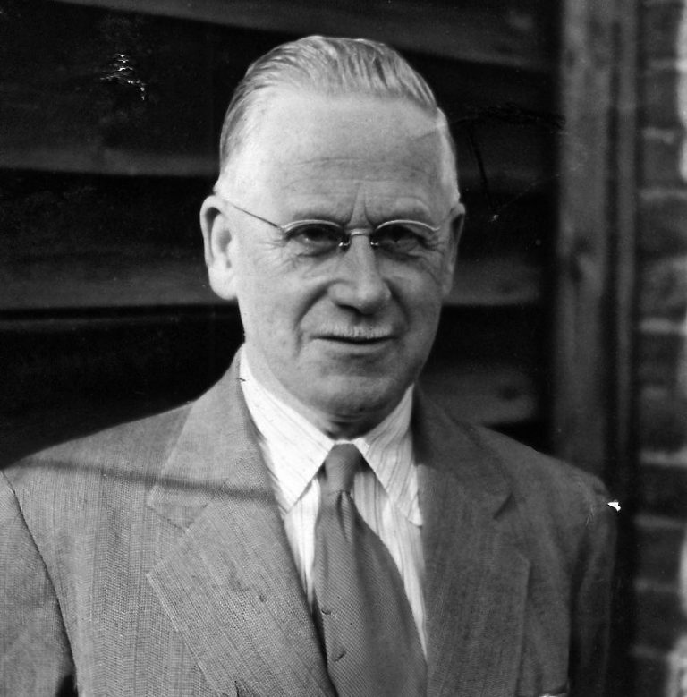
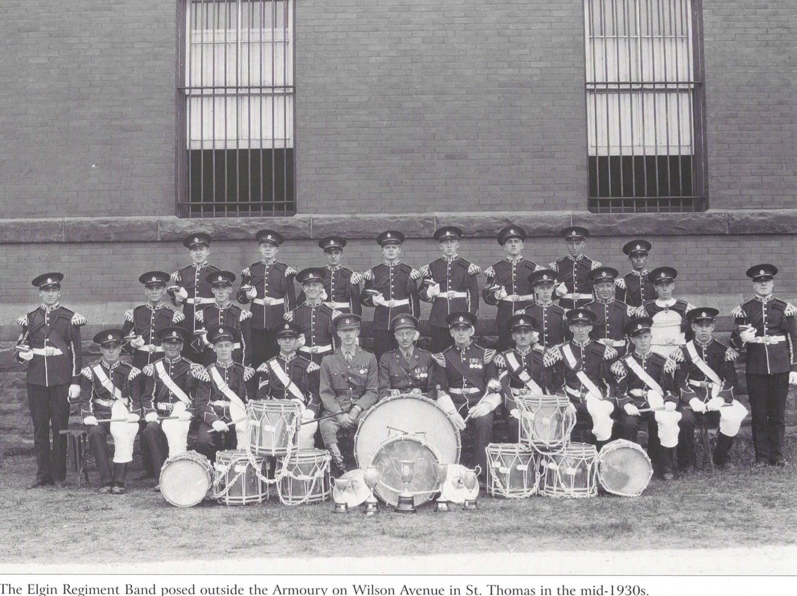
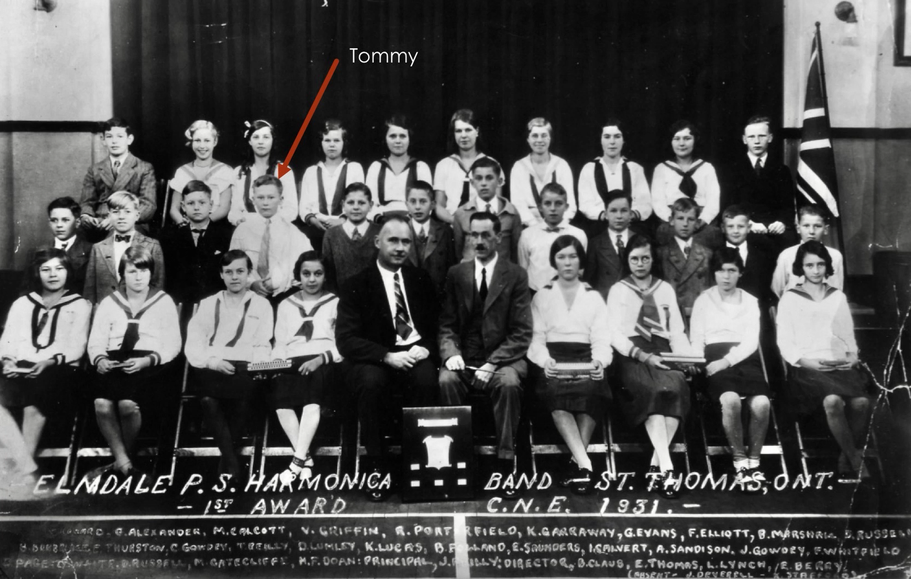
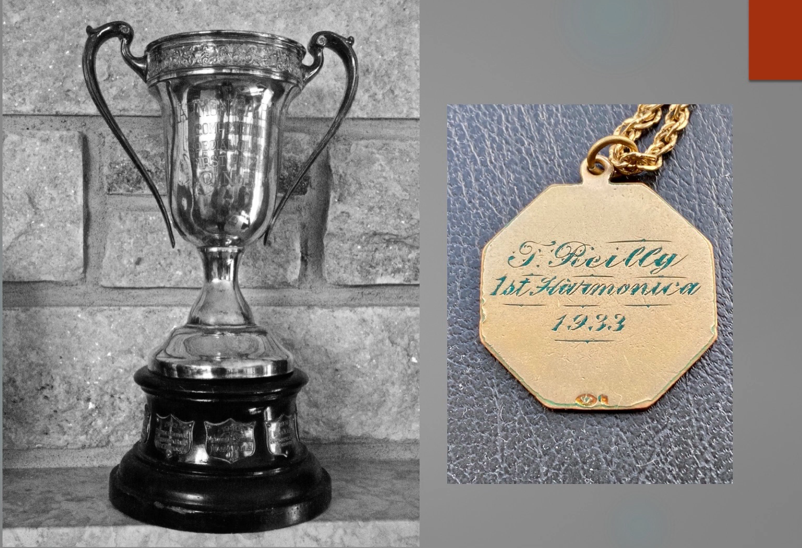
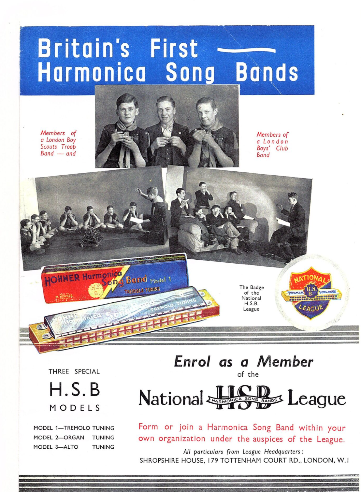
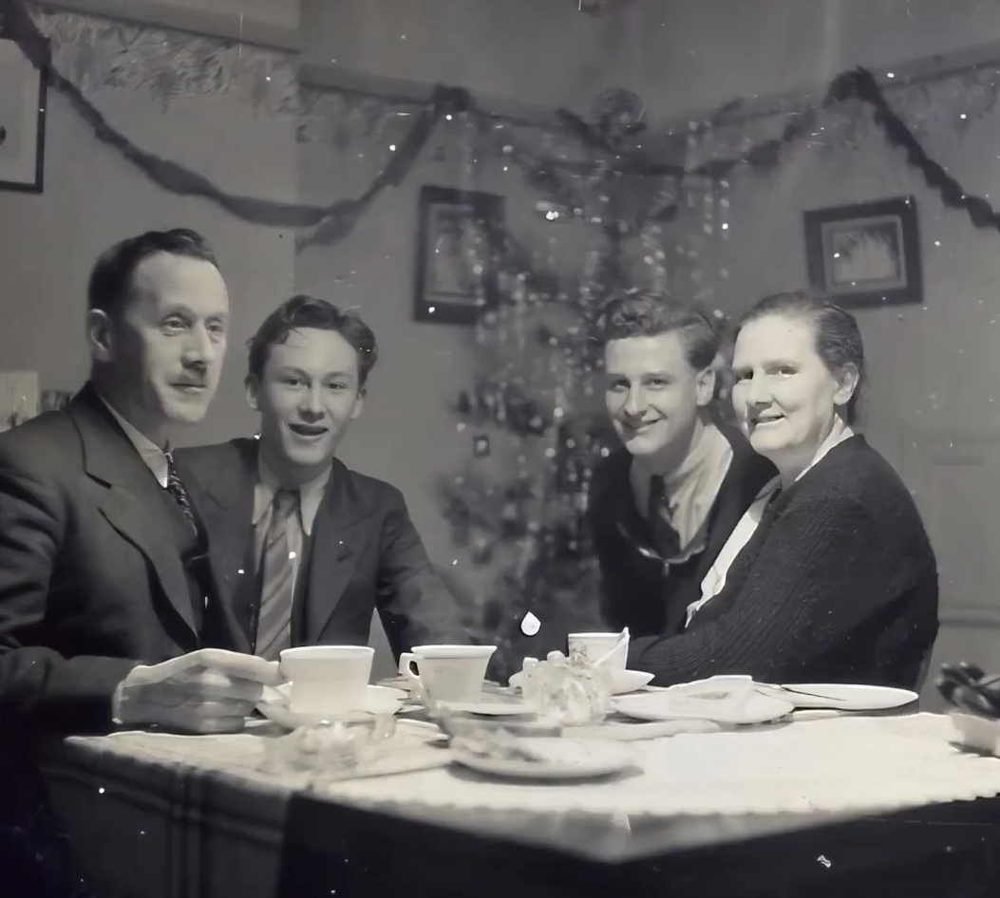
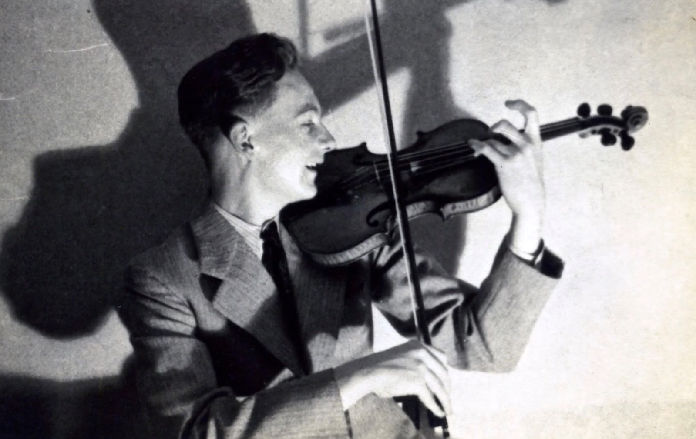
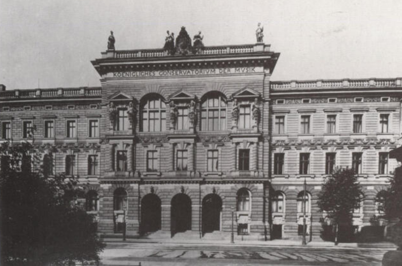
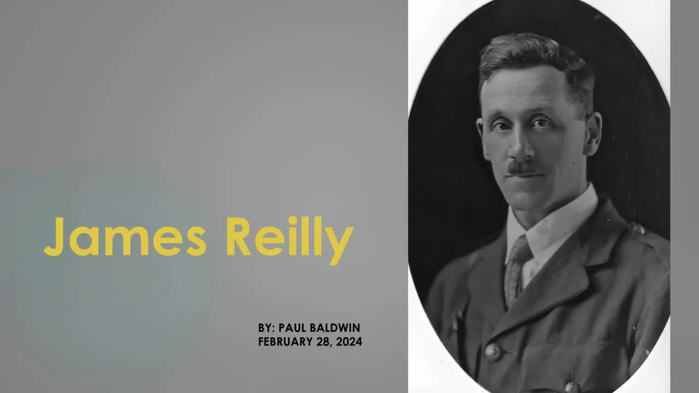
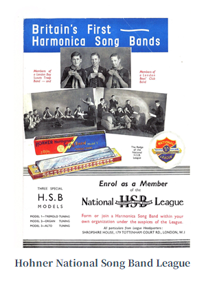

# 第一章 早年岁月：从加拿大到英国（1919-1939）

## 1.1 出生与童年

Tommy Reilly于1919年8月21日出生于加拿大安大略省的圭尔夫（Guelph）。这是一个位于多伦多西南约100公里的小城市，以其农业和制造业闻名。Reilly出生在一个具有深厚音乐素养的家庭，他的父亲James Reilly上尉是一位具有深厚音乐素养的军乐指挥家，曾在英国皇家军事音乐学院（Royal Military School of Music, RMSM）Kneller Hall担任乐队指挥，后移居加拿大担任圭尔夫军营的乐队指挥，同时领导OAC交响乐团和当地合唱团。

这一军乐家庭背景为Tommy的早期音乐教育提供了独特环境：军乐传统强调的技术精确性、合奏纪律性和曲目广泛性，深刻影响了Tommy日后的艺术发展。James Reilly不仅是一位指挥家，更是加拿大早期爵士乐发展的先驱人物之一，他于1920年代在圭尔夫创建了Elmdale口琴乐队，这一创举为Tommy的口琴生涯埋下了伏笔。1929年经济大萧条爆发后，James Reilly转至Elmdale公立学校担任管理员，并于1930年在学校创建了口琴乐队。

The Elgin Regiment Band埃尔金团军乐队 （摄于1930年）

在Reilly的童年时代，口琴在加拿大是一种非常流行的民间乐器。无论是农场工人、铁路工人，还是街头艺人，口琴都是他们最喜爱的伴侣。这种小巧便携、价格低廉的乐器，能够演奏出丰富多样的旋律，深受各阶层人民的喜爱。年幼的Reilly第一次接触口琴，是在邻居家的一个孩子手中。那个孩子吹奏的一首简单民谣，深深吸引了Reilly，他立刻被这种神奇的乐器所迷住。

Reilly的音乐天赋在很小的时候就显现出来。他不仅对口琴有着天生的亲和力，而且对音乐的记忆力惊人。听过一遍的旋律，他就能大致模仿出来。这种天赋让他的父母意识到，儿子可能在音乐方面有着不凡的潜力。于是，在Reilly八岁那年，父母决定让他学习小提琴。

## 1.2 音乐启蒙：小提琴与口琴的双重训练

小提琴的学习对Reilly产生了深远的影响。虽然口琴是他的初恋，但小提琴的系统训练为他日后的音乐发展奠定了坚实的基础。在当时的加拿大，小提琴被视为一种"正经"的乐器，学习小提琴意味着接受正规的音乐教育，包括视唱练耳、乐理知识、演奏技巧等。

Reilly的小提琴老师是一位来自欧洲的移民，他带来了欧洲古典音乐的传统和严谨的教学方法。在老师的指导下，Reilly学习了正确的持弓姿势、指法、运弓技巧，以及如何演奏出优美、连贯的旋律。这些基本功的训练，虽然枯燥乏味，但Reilly却乐在其中。他发现，小提琴的演奏技巧可以应用到口琴上，这让他在口琴演奏上有了质的飞跃。

在学习小提琴的同时，Reilly从未放弃对口琴的热爱。他把小提琴上学到的技巧，如揉弦、滑音、连奏等，一一尝试在口琴上实现。当时的口琴主要是十孔布鲁斯口琴，音域有限，但Reilly已经能够在这小小的乐器上演奏出令人惊讶的复杂旋律。

Elmdale公立学校创建的口琴乐队与Tommy Reilly照片（摄于1931年）

十一岁时，他加入了父亲在Elmdale公立学校创建的口琴乐队，成为该乐队的独奏演员。这一口琴乐队在当时极为成功，多次在加拿大国家展览（Canadian National Exhibition）上获奖，而Tommy本人也于1932年和1933年连续两年获得独奏金奖。值得注意的是，半音阶口琴当时刚刚由德国Hohner公司推向世界市场，是一种全新的乐器类型，而Reilly家族的创新实践使其成为这一乐器早期历史的重要参与者。

Elmdale口琴乐队获得的奖杯及奖牌

Elmdale口琴乐队的成功不仅体现在比赛成绩上，更在于其教育模式的创新性。该乐队将口琴演奏组织化、系统化，使其成为学校音乐教育的重要组成部分。对于年轻的Tommy而言，这一环境提供了宝贵的合奏经验和独奏展示平台。他在乐队中同时演奏口琴和手风琴，培养了多乐器演奏能力和适应性。更重要的是，父亲作为乐队指挥的严格要求，使他从小就建立了专业音乐家的工作伦理和技术标准。这种早期训练的一个关键特征是强调音乐的"可读性"——即通过乐谱进行精确演奏，而非仅仅依赖听觉模仿，这为他日后处理复杂的古典曲目奠定了基础。

口琴在古典音乐中的地位演变

口琴的历史可以追溯到19世纪初。1821年，德国乐器制造商Christian Friedrich Buschmann发明了最早的口琴原型。此后，口琴经历了多次改良，逐渐发展成为一种流行的民间乐器。19世纪末20世纪初，口琴在美国和欧洲广泛流行，成为工人阶级和农民最喜爱的乐器之一。然而，由于其民间乐器的出身，口琴长期被古典音乐界所忽视，很难登上大雅之堂。20世纪初，一些音乐家开始尝试将口琴引入古典音乐领域。1920年代，美国口琴演奏家John Sebastian Sr.开始在欧洲演出，演奏古典音乐改编曲，但并没有引起广泛的关注。正是在这样的背景下，Reilly的童年经历——同时接受小提琴的古典训练和口琴的民间熏陶——为他日后 bridging this gap 奠定了基础。

## 1.3 移民英国与职业首演

1935年，随着大萧条对加拿大经济的冲击，James Reilly接受Hohner公司的邀请，返回英国担任新成立的"Hohner National Song Band League"音乐总监，全家随之移居伦敦。这一迁移为Tommy Reilly的职业发展打开了新的空间。

年仅16岁的他立即开始了专业演出生涯，最初在一个马戏团中担任乐手和杂技演员，在欧洲大陆巡回演出。这一经历虽然看似与古典音乐相去甚远，却锻炼了他的舞台适应能力、即兴反应能力和在多变环境下保持演奏质量的专业素养。1937年，他加入了名为"The Four Phillips"的综艺表演组合，在欧洲各地的综艺剧院（variety theatres）演出，进一步积累了舞台经验。

初到英国，Reilly一家定居在伦敦。与加拿大的宁静生活相比，伦敦的繁华和喧嚣让年轻的Reilly既兴奋又有些不知所措。然而，他很快就适应了这里的生活，并开始积极寻找音乐发展的机会。他继续学习小提琴，同时也没有放弃口琴。

1935年初到英国的Tommy Reilly一家

照片中还有其父亲、哥哥、母亲

1936年，17岁的Reilly在伦敦进行了他的职业首演。这是一场在小型音乐厅举行的演出，观众不多，但对于Reilly来说，这是他音乐生涯的重要起点。他演奏了一系列口琴独奏曲目，包括古典音乐改编曲和民间音乐。他的演奏技巧和对音乐的理解，给观众留下了深刻印象。

Tommy Reilly唯一一张拉小提琴的照片

首演的成功，让Tommy Reilly获得了更多的演出机会。他开始在欧洲各地的综艺剧场巡回演出，作为一名口琴独奏演员。这种演出形式在当时非常流行，观众期待看到各种新奇的表演，而Reilly的口琴演奏正好满足了这种需求。他不仅能够演奏优美的旋律，还能模仿各种声音效果，如鸟鸣、火车汽笛等，这让他的表演充满了趣味性和娱乐性。

后来Tommy Reilly跟着“The Four Phillips”跑遍了欧洲——包括德国、意大利等地——到处演出。他甚至还跟着团员学习过杂耍，比如抛接棒、扔碗、扔碟子，包括爬到马背上表演等等。

1939年，Reilly做出了一个重要决定：进入德国莱比锡音乐学院（Leipzig Conservatory）深造小提琴。莱比锡作为巴赫长期工作和生活的城市，拥有深厚的音乐传统，其音乐学院也是欧洲最古老、最负盛名的音乐学府之一。这一选择表明Reilly当时仍将以小提琴作为职业发展方向，口琴只是辅助性的表演工具。然而，历史的发展完全改变了这一规划。

## 1.4 父亲 James Reilly:英国口琴教育的奠基人

James Reilly 肖像(Paul Baldwin 2024 年 2 月制作,Elgin County Heritage Centre 讲座资料)

如果说 Tommy 的艺术成就是一棵大树,那么根系深深扎在父亲 James Reilly 上尉(1886-1955)的土壤里——其军乐指挥背景与移民经历见 1.1 节,本节侧重他在英国口琴教育中的组织贡献。

1929 年大萧条后,James 转任圣托马斯 Elmdale 公立学校管理员,1930 年在校创办口琴乐队——正是这支在加拿大国家展览会上屡获大奖的乐队,让年幼的 Tommy 第一次以独奏演员身份登台,也奠定了父子二人"以乐谱精确演奏"的教育基因。1935 年,James 接受 Hohner 公司邀请回国,出任新成立的"Hohner 歌曲乐队联盟"(HSBL)音乐总监,这一任命同时把 16 岁的 Tommy 带回了英国。

此后二十年,James 全身心投入英国口琴教育事业:为联盟编写系统教材,创作《温莎进行曲》等乐队经典曲目,兼任英国手风琴学院青少年培训与考官;二战后出任 Hohner 音乐部门销售经理,邀请大量作曲家为口琴、手风琴创作新作,建立了英国最大的口琴音乐目录;1950 年代初组建 Hohner 员工乐队。他长期担任联盟及改组后的国家口琴联盟(NHL)副主席。1954 年退休,翌年逝世,享年 69 岁。Hohner 英国公司总经理 Meyer 博士在悼词中说:在他担任音乐总监的 20 年间,英国的大多数口琴演奏者都通过他编写的教材、他提供的指导和他出版的音乐接受了教育。

父子两代人的接力,构成了英国口琴教育的完整谱系:父亲用二十年为英国口琴搭建了组织与教材框架(HSBL 1935 年创立、1951 年改组为 NHL、1981 年独立后创办《Harmonica World》杂志);儿子则用一生为口琴构建了技术体系、古典曲目库与国际化教学网络。1955 年父亲去世时,Tommy 已是英国家喻户晓的广播明星;十二年后,Tommy 在父亲曾经服务的 Hohner 体系内,创制了世界第一支音乐会口琴——两代人的口琴革命,在这一刻完成了交接。

Hohner National Song Band League 宣传册与品牌口琴
