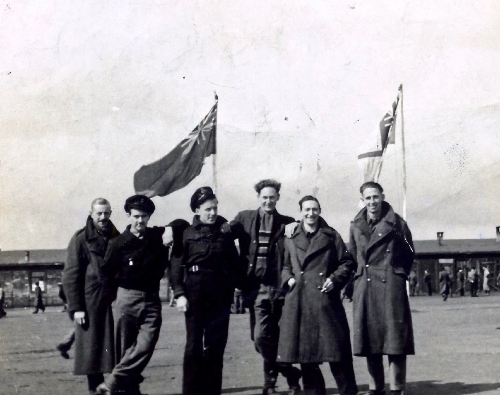
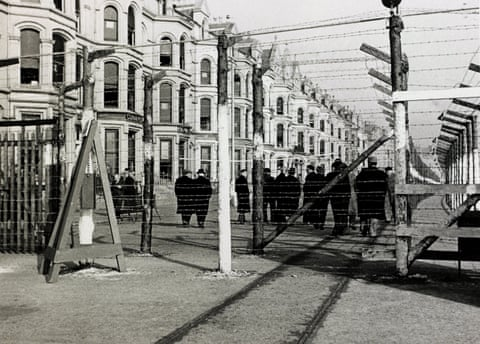
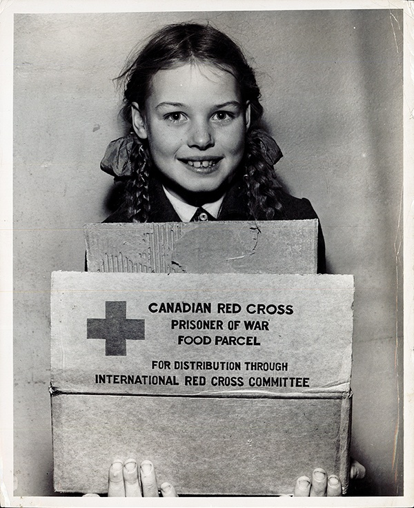
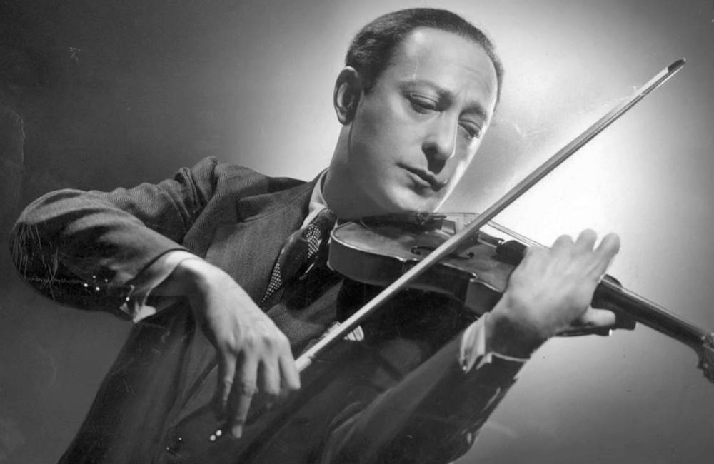
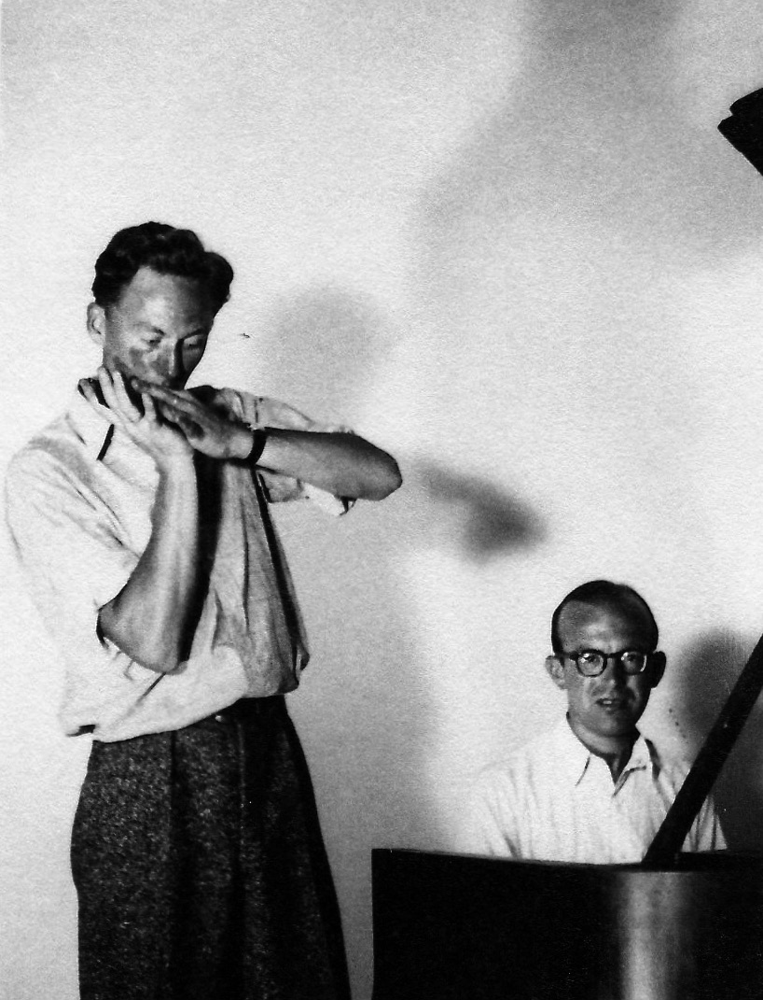
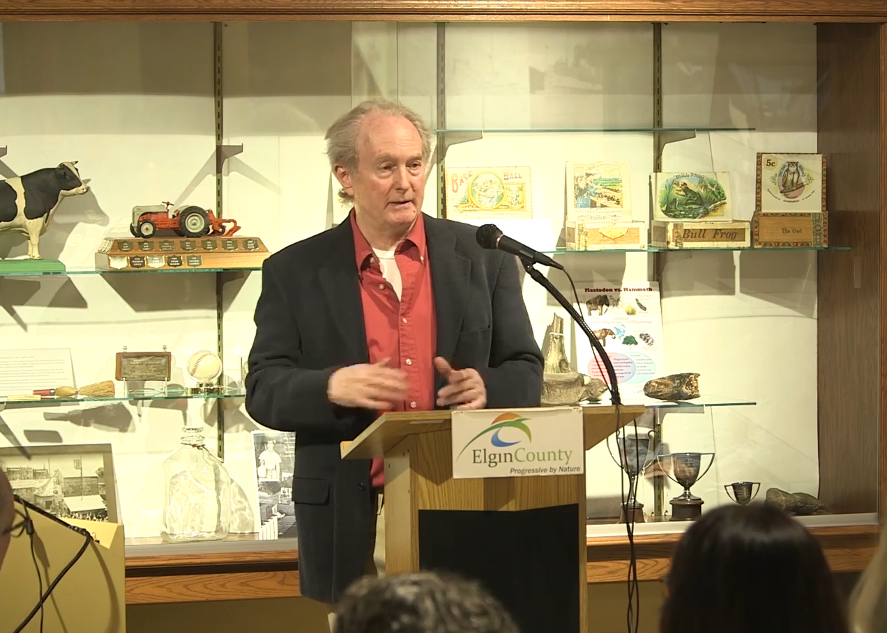

# 第二章 战火中的坚守：战俘营岁月（1939-1945）

## 2.1 战争爆发与被捕

1939年9月1日，纳粹德国入侵波兰，第二次世界大战正式爆发；同月，英国与加拿大先后对德宣战。作为英国公民，Reilly在德国的处境立刻变得危险起来。1939年8月，战争爆发前夕，年仅20岁、仍怀抱着青春梦想正在德国莱比锡音乐院学习的Tommy Reilly在其下榻的旅馆被盖世太保以敌国侨民（enemy alien）为理由当作人质拘捕（一说9月3日）。

二战时期Tommy Reilly照片（中）

提起这次被捕还有一件有趣的或者说悲惨的事情，有一天晚上，当时Tommy Reilly正要去参加一次相亲并准备与一位来自德国国家芭蕾舞团的女孩见面。正当他从旅馆交完钥匙，准备出发的时候，盖世太保来了，然后就被捕了。有意思的是，15年后，Tommy Reilly在一次演出中，一位女士来到了后台，说他们从来没见过面，她就是当时那个芭蕾舞演员。后来，说起这件事Tommy Reilly不禁感慨，本来应该是开心的回忆缺成了终生难忘的被捕经历。

这不是简单的拘留，而是作为人质的辗转拘禁。Reilly 被先后关押在德国、波兰、法国等地的战俘营。这些战俘营的条件恶劣，生活艰苦，更重要的是，作为人质，他面临着对未来的极度不确定性——不知道明天会发生什么，不知道战争何时结束，甚至不知道自己能否存活。

对于年轻的Reilly来说，这是一个巨大的打击。他刚刚开始的音乐学习被迫中断，自由被剥夺，未来变得一片渺茫。然而，正是在这种极端恶劣的环境中，Reilly展现出了惊人的意志力和对音乐的执着。他没有被困境击垮，而是将战俘营变成了自己的"音乐学院"。

## 2.2 辗转各战俘营与音乐作为精神支柱

他被盖世太保逮捕后，先是被送往巴伐利亚州威斯堡（Weissenburg）的一座有一千一百年历史的古堡中。约两年后，他收到了自己的行李，其中也包含了几把口琴。

Reilly的战俘营经历持续了五年零八个月，这一时间跨度远超一般人的想象。他被先后关押在德国、波兰和法国的多个战俘营，物质条件极为艰苦，精神压迫持续存在。战俘营的生活条件是极其艰苦的：食物匮乏、居住拥挤、卫生条件恶劣，还要承受繁重的体力劳动。许多战俘在这种环境中身心俱疲，甚至失去了活下去的勇气。

这段时期的具体细节 Reilly 很少对外人详细提及，但可以想象，一位20岁的年轻人，正当音乐学习的关键期，却被剥夺了演奏小提琴的条件，这种精神上的折磨是巨大的。

然而，Reilly却在这样的环境中找到了自己的生存之道——音乐。更重要的是，他通过加拿大红十字会食品包裹中的咖啡与一名加拿大裔的德军军需官进行交换，最终换来了两打（24把）新的Hohner口琴，包括Hohner 270 Chromatica半音阶口琴，因为当时的Hohner口琴琴格都是木格，带来的旧的几把口琴用久了基本都已经膨胀开裂导致无法再吹奏，而德国Hohner公司也是当时唯一能够制造口琴的企业。很多人不知道战后的德国Hohner公司到处融资差点倒闭。这位喜爱古典音乐的军需官不仅为他提供了口琴，还提供了广播设备和音乐谱纸。

Reilly选择用咖啡——一种在战时极为稀缺的奢侈品——换取口琴，表明他已经将音乐实践置于即时生理需求之上。这一选择预示了他日后艺术生涯的核心特征：对音乐完美主义的绝对追求，以及将口琴演奏提升至最高艺术层次的坚定决心。据记载，他每天练习数小时，"honing his skills as if playing a violin"，即将口琴视为与小提琴同等严肃的乐器来对待。这种态度在当时的口琴演奏界是极为罕见的，大多数演奏者将口琴视为娱乐性、辅助性的乐器，而非需要系统技术训练的专业工具。

如同音乐界所熟知的传奇故事，就在这段战俘营岁月中，Tommy Reilly 磨练出了出神入化的口琴技巧。由于一心一意想成为小提琴家，Reilly 完全是以小提琴的演奏方式来思考口琴的演奏——这种跨乐器的思维方式在口琴历史上是独一无二的。

Reilly在战俘营中通过秘密收音机收听广播，其中包括小提琴大师雅沙·海菲茨（Jascha Heifetz）的演奏。海菲茨（1901-1987）被公认为20世纪最伟大的小提琴家之一，以其完美的技术、精准的音准、独特的音色和强烈的音乐个性著称。他细心揣摩他最喜爱的小提琴家雅沙·海菲茨（Jascha Heifetz）的演奏，特别是海飞兹那标志性的持续绵密的震音（vibrato）、完美的音准控制以及歌唱性的音色（singing tone）。Reilly 试图在口琴这种由金属簧片发声的乐器上，重现小提琴弦乐的音色美感。

对于Reilly而言，海菲茨的演奏不仅是一种审美享受，更是一种技术研究的范本。他系统分析了海菲茨的颤音技术、揉弦方式、乐句处理和音色控制，并思考如何将这些技术迁移到口琴上。

这种追求造就了 Reilly 日后演奏风格的几个核心特征：

歌唱性音色：追求类似人声的温暖音色，而非口琴常见的金属质感

持续不断的震音：几乎不间断的震音运用，模仿小提琴的弦乐表现

完美的音准控制：对每个音的准确性有近乎苛刻的要求

音乐性的优先：技巧始终服务于音乐表现，而非炫技

这段经历不仅塑造了他的技术，更塑造了他的音乐哲学：在极端环境中，音乐是生存的意义；在自由世界中，音乐应当是情感的真诚表达。

## 2.3 口琴技艺的精进：技法体系的建立

Reilly在战俘营中结识了一位名叫Frank Still的钢琴家。Still后来成为了Reilly的固定伴奏者，两人合作多年。这段在战俘营中建立的友谊，对Reilly战后的音乐发展产生了重要影响。

在战俘营中，Reilly有大量的时间可以专注于口琴练习。他将小提琴学习中获得的知识和技巧，系统地应用到口琴上，进行了开创性的研究。他分析了口琴的发声原理、气息控制、指法技巧等，逐步建立起一套完整的古典口琴演奏技法。

Reilly在战俘营中发展的核心技法

气息控制：小提琴演奏中，运弓的力度和速度直接影响音色和音量。Reilly将这种概念应用到口琴上，通过控制呼气和吸气的力度、速度和稳定性，实现了音色的细腻变化和音量的精确控制。从物理学角度看，口琴的簧片振动频率与通过的气流速度成正比，而音量则与气流的流量相关。

揉弦技巧：揉弦是小提琴演奏中表达情感的重要手段。Reilly发现，通过控制气息的规律性波动——通常是小二度以内，频率约为每秒5-7次——可以在口琴上实现类似小提琴揉弦的效果。这种波动应该来自横膈膜的控制，而不是喉咙或舌头的动作。

连奏与断奏：小提琴演奏中有丰富的弓法变化，如连弓、分弓、跳弓等。Reilly研究了如何在口琴上实现类似的发音法，通过控制气息的中断和连接，以及舌头和喉咙的配合，实现了各种演奏效果。

压音：虽然口琴是"固定音高"乐器，但Reilly发现，通过控制气息的角度和力度，可以对口琴的音高进行微调。这种技巧在演奏旋律性强的作品时尤为重要，可以让音乐更加富有表现力。

Reilly将小提琴技术迁移到口琴上的努力是系统性和创造性的。在颤音技术方面，他开发了多种口琴特有的颤音类型，包括颌部颤音（jaw vibrato）、喉部颤音（throat vibrato）和腹式颤音，以模拟小提琴揉弦的丰富变化。在音色控制方面，他研究了气息压力、口腔形状和簧片响应之间的关系，实现了从单簧管式暗色到长笛式明亮的音色光谱。在乐句处理方面，他将小提琴的弓法概念转化为口琴的气息控制，创造了"连弓"（legato）和"断弓"（staccato）的口琴等价物。

Reilly颤音技术的精细化程度在当时是无与伦比的。新加坡口琴演奏家Cheng Jang Ming在分析其录音时特别指出："I actually prefer his vibrato from his early years, more intense, more violin-like"，这表明他的颤音具有强烈的"小提琴性"——即那种高度控制、富有表现力的揉弦效果。更为惊人的是他的喉部断奏（throat staccato）技术，这一技术使他在演奏快速乐段时能够实现"so incredibly fast and yet distinctly clean"的效果。在作品《Red Flame》和《Hora Staccato》中，他甚至能够在高速度下演奏八度双音的喉部断奏，这一技术难度在当时被认为是不可思议的。

## 2.4 战俘营的经历：生命中的一部分

Tommy Reilly在战俘营中的音乐实践并非孤立进行，而是积极参与了营地的音乐生活。他为狱友演奏，组织音乐活动，与其他音乐家合作。这些实践不仅维持了他的演奏状态，也培养了他的舞台表现力和观众沟通能力。在极端压抑的环境中，音乐成为精神解放的重要途径，而Tommy Reilly的演奏无疑为许多战俘提供了难得的心理慰藉。

直到1945年春天，二战即将结束前，Reilly 才在德国北方的吕讷堡（Luneburg）被英国军队救出，据Tommy Reilly儿子David Reilly回忆，应该是苏格兰军队。总计 Reilly 在战俘营里度过的5年8个月，使他成为二战期间被关押时间最长的战俘之一。当然，Tommy Reilly也不是没有想过逃走，他曾三次策划出逃，但每次都被抓了回来，甚至有一次差点被德国军官一枪打死。

2024年2月 Tommy Reilly的儿子David Reilly

在加拿大Elgin County Heritage Centre回忆讲述其父亲

当他走出战俘营的大门时，手中紧握着那把陪伴他度过六年艰难岁月的口琴。这把口琴，见证了一个音乐家的成长，也见证了一段不屈不挠的精神历程。战后，Reilly回忆起这段岁月时曾说："在那些黑暗的日子里，口琴是我唯一的朋友。它让我保持理智，让我相信总有一天我会重获自由，继续我的音乐梦想。"

比较讽刺的是，据Tommy Reilly的儿子所述，整个二战被俘期间，Tommy Reilly的小提琴并没有被德军没收。我个人猜测是因为他的音乐才能，受到了德军军官的照顾。二战结束后，Tommy Reilly被遣返回了英国。然而，最终他并没有收到他的小提琴，应该是被当时的英军士兵给偷走了。以至于后来Tommy Reilly说我再也不会拉小提琴了。

战后，他获得了1英镑的战争赔偿金——这个数字在今天看来微不足道，但在当时象征着一个时代的结束。曾有记者在战后问他，会不会觉得在战俘营里白白浪费了6年的生命。

Reilly 的回答显示了他非凡的生命态度：

「这些在战俘营的日子是我生命中的一部分，并非从我生命中抽离。」（"These years in the prison camp were part of my life, not taken out of my life."）。

虽然有这样不愉快的经验，Reilly 并未对德国产生怨怼。相反，他热衷于阅读二战历史，举凡市面上有关二战的书籍他都没漏掉过。或许，他是想通过了解历史，来理解自己为何会遭遇这样的命运。
