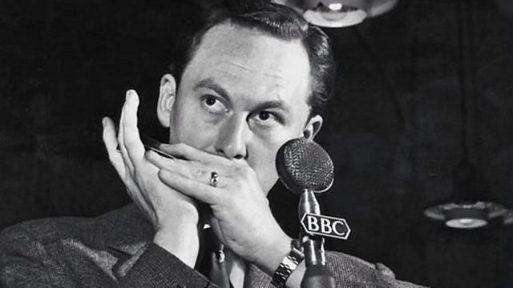

# 第三章 战后重建：技法科学与演奏风格的奠基（1945-1951）

## 3.1 回到英国与广播事业的起步

### 战后英国广播的黄金时代（背景）

说明:以下段落插入原 3.1《回到英国与广播事业的起步》开头。内容基于 BBC 广播史常识与书稿已有材料整理,凡超出资料范围处均标注"推断"。

### 收音机里的英国:1945-1960 年的广播生态

要理解 Reilly 战后迅速成名,必须理解他所进入的媒介环境。1945 年的英国,电视尚未普及(1953 年伊丽莎白二世加冕礼才真正把电视带进千家万户),**广播是绝对的大众媒体**。BBC 以公营垄断之姿运行,其"国民服务"(Home Service)与"轻松节目"(Light Programme)覆盖了从新闻、戏剧到轻音乐的全部内容;晚间黄金时段的综艺节目拥有数百万听众。

Reilly 参与的正是这条轻音乐-综艺流水线:《Variety Bandbox》(综艺节目)与《Workers Playtime》(工人娱乐时间,常在工厂食堂现场直播)是当时最受欢迎的节目形态——混合轻音乐、古典小品、喜剧与歌手演唱。这类节目对演奏者的要求极为苛刻:现场直播、一次成型、曲目庞杂、风格跨度大(古典改编与流行曲目并置)。Reilly 的"跨界能力"在这里如鱼得水:他既能在一档节目中演奏巴赫《Badinerie》,也能紧接着吹《El Cumbanchero》。

广播生态还塑造了他的录音模式:1950-1960 年代,他录制了大量广播录音(多数未商业发行),仅 Groven 目录记载的 BBC 合作乐团就有十余支;1953 年斯图加特"轻音乐周"的成功,立即转化为欧洲大陆广播与电视的邀约——战后欧洲的广播交响乐团(德国九支、北欧五支、荷比瑞法等)是比商业唱片更庞大的演出市场,Reilly 与其中数十支乐团合作的记录(见附录 F)正是这一生态的产物。

值得注意的历史细节:他 1947 年左右第一次 BBC 广播演出后,听众来信如潮;而他的广播生涯贯穿了从 78 转时代到立体声 LP、再到电视综艺的整个媒介变迁——1960 年代他甚至把《The Navy Lark》主题曲变成了英国家喻户晓的广播记忆(该剧 1959-1977 年播出,口琴主题曲伴随了整整一代英国人)。

(注:以上关于 BBC 节目形态与收听规模的描述为通识性背景,具体收听数据待考。)

1945年，第二次世界大战结束，Tommy Reilly回到了英国。六年的战俘营生活，让他从一个年轻的音乐学生成长为一位成熟的音乐家。虽然他的身体因长期营养不良而虚弱，但他的音乐技艺却达到了一个新的高度。

25岁的 Tommy Reilly 回到伦敦后，开始以演奏口琴为职业。然而，初期的道路并不顺遂。当时的口琴音乐界已经有两位巨星：Larry Adler（拉瑞·艾德勒）和John Sebastian（约翰·塞巴斯蒂安），他们的事业都已如日中天。

Larry Adler 以其惊人的技巧和舞台魅力著称，已将口琴带入古典音乐厅；John Sebastian 则以其深厚的音乐素养和作曲家的身份获得尊重。Reilly 作为后来者，必须找到自己的独特定位。

Reilly首先开始在英国各地的俱乐部、酒吧和小型音乐厅演出。他的演奏风格独特，既有古典音乐的严谨和深度，又有民间音乐的亲切和活力。1940年代后期，Reilly的事业迎来了重要的转折点——他开始在英国广播公司（BBC）的节目中演出。

他参与了"Variety Bandbox"、"Workers Playtime"等流行节目，这些节目混合了轻音乐、古典片段和娱乐性内容，正好契合Reilly跨界演奏的能力。广播演出不仅提升了他的公众知名度，也锻炼了他适应不同曲目风格和演出环境的能力。

1947年左右，Reilly的第一次BBC广播演出获得了听众的热烈反响，BBC收到了大量来信，询问这位"神奇的口琴演奏家"是谁。此后，Reilly成为了BBC的常客，经常出现在各种音乐节目中，成为了家喻户晓的名字。

Tommy Reilly 在英国BBC广播电台录制演奏口琴曲

Reilly在战后初期加入了Clarkson Rose音乐剧团的巡演，这一经历延续了他在综艺剧院的工作模式，但提供了更大规模的演出平台和更专业的制作标准。音乐剧团演出要求演奏者具备广泛的曲目储备、快速的曲目切换能力和与歌手、舞者等其他表演者的协调能力。这些经验为Reilly日后与交响乐团和室内乐团合作奠定了基础，使他能够在复杂的音乐环境中保持独奏的清晰性和表现力。

## 3.2 演奏风格的科学基础

Reilly的演奏风格，最显著的特点就是将小提琴的技巧和理念应用到口琴上。这种独特的风格，源于他早年学习小提琴的经历，以及在战俘营中的深入研究。他特别崇拜小提琴大师Jascha Heifetz（雅沙·海菲茨），曾尝试学习Heifetz的揉弦、颤音等技巧。

气息动力学的应用

Reilly的气息控制技术，可以从流体力学的角度来分析。口琴的簧片振动需要一定的气压和气流：气压决定了簧片的振动幅度（音量），气流决定了振动的持续性（音长）。Reilly通过精确控制呼气和吸气的速度和流量，实现音量和音长的精确控制。

在演奏长音时，Reilly能够保持气流的绝对稳定，这需要极强的呼吸肌肉控制能力。他的横膈膜、肋间肌和腹肌能够协调工作，维持恒定的气压。这种控制能力，与他早年学习小提琴时培养的运弓控制能力有异曲同工之妙。

口腔共鸣腔的调节

Reilly非常注重口腔作为共鸣腔的调节。口琴的音色不仅取决于簧片的振动，还受到口腔共鸣的影响。通过改变口腔的形状和大小，Reilly能够调节共鸣频率，从而改变音色：

大口腔空间：产生更加温暖、圆润的音色，低频泛音更加丰富，适合演奏柔和、抒情的段落。

小口腔空间：产生更加明亮、尖锐的音色，高频泛音更加突出，适合演奏激昂、明亮的段落。

舌头的Articulation技术

Reilly的articulation（发音法）技术中，舌头起着关键作用。通过舌头的快速运动，他能够实现各种效果：

连奏（Legato）：保持气流连续性，舌头保持放松，让声音连贯流动。

硬断奏（Hard Staccato）：舌头快速切断气流，产生短促有力的音符。

软断奏（Soft Staccato）：舌头动作柔和，音符较短但不过分尖锐。

半连奏（Portato）：介于连奏和断奏之间，音符之间有轻微分离但保持时值。

## 3.3 建立独特演奏风格

到1950年代初，Reilly已经建立起自己独特的演奏风格。他的演奏既有古典音乐的严谨和深度，又有民间音乐的亲切和活力；既有精湛的技巧展示，又有深刻的情感表达。

他的风格可以用以下几个关键词概括：歌唱性——旋律线条清晰流畅，仿佛有人在歌唱；精确性——每一个音符的时值、力度、音色都经过精心控制；表现力——善于通过音乐表达各种情感；多样性——曲目范围从巴洛克到现代音乐无所不包。

Reilly的持琴方式体现了对小提琴演奏姿态的借鉴。他将半音阶口琴以接近水平的角度持于面前，左手负责稳定琴身，右手则模拟小提琴弓法的动作，在琴身附近移动以辅助气息控制。这一姿态不仅具有视觉上的专业性——区别于民间口琴演奏的随意持琴——更重要的是实现了技术上的精确控制。左手稳定确保了吹口与嘴唇接触的可靠性，减少了漏气和不稳定音准的风险；右手的辅助动作则帮助调节气息压力和方向，实现类似弓法变化的音色控制。

滑音与连弓技术的实现是这一技术体系的关键组成部分。Reilly开发了多种技术来实现小提琴式的滑音（portamento）和连弓（legato）效果。滑音技术通过改变口腔形状和气息角度，在不使用按键的情况下实现音高之间的平滑过渡；连弓技术则通过精确的气息控制和按键操作，消除音与音之间的断裂感，创造连贯的旋律线条。
