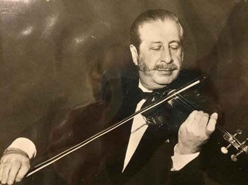
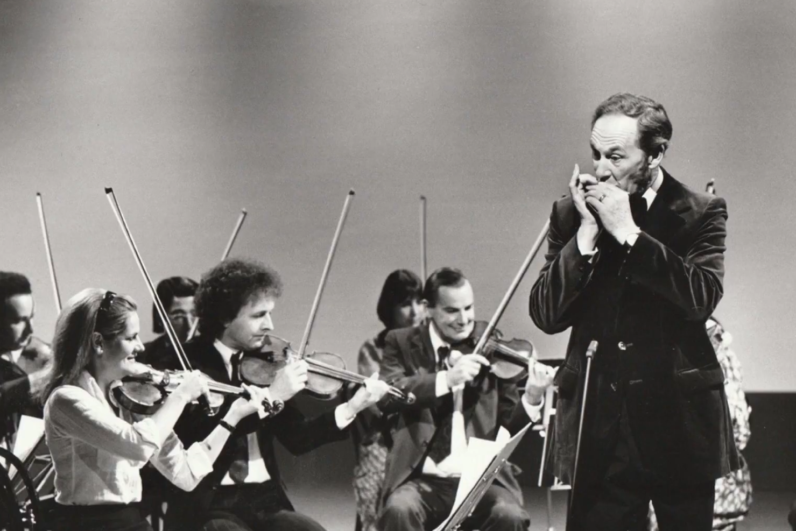
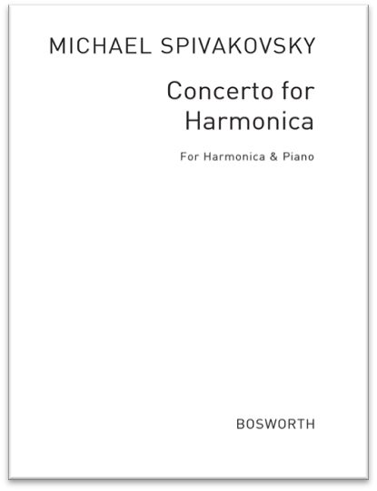
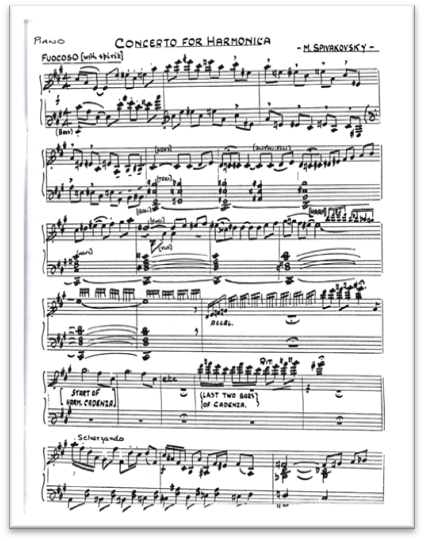
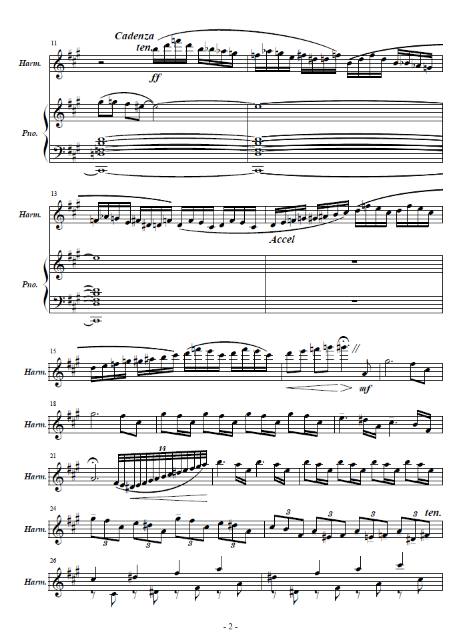
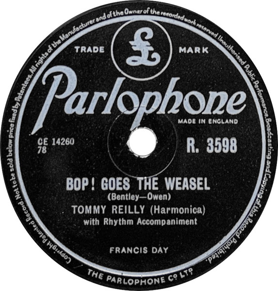

# 第四章 突破与认可：第一首口琴协奏曲与音乐分析（1951）

## 4.1 与Michael Spivakovsky的相遇

1951年是 Tommy Reilly 职业生涯的转折点。这一年，他发行了第一张唱片《Medley》——这是一张当时几首流行歌曲的混合曲（medley of popular songs）。虽然这不是古典音乐，但标志着他正式进入录音工业。

Tommy Reilly与Michael Spivakovsky（1919-1983）的相遇，是口琴历史上的重要时刻。Spivakovsky是一位出生于英国的小提琴家和作曲家，父亲是俄罗斯大提琴家。他在伦敦有着成功的职业生涯，拥有自己的管弦乐队——Stradivarius Orchestra。

Michael Spivakovsky（1919-1983）

1948年，Spivakovsky在Torquay交响乐团的一场音乐会上听到了Reilly的演奏，深深被打动，萌生了为Reilly创作一部作品的想法。就在同一年， Spivakovsky为 Tommy Reilly 写了一首口琴协奏曲（Concerto for Harmonica and Orchestra）。这首作品是专门为 Reilly 的技巧和音色特点创作的。

二战后Tommy Reilly与交响乐团合作演出照片

## 4.2 《不列颠节》首演与历史意义

1951年5月26日，这首协奏曲在"Festival of Britain"（英国艺术节）中首演，并通过BBC 广播电台进行现场转播。这是一个全国性的广播节目，意味着全英国的听众都能听到这位年轻口琴家的演奏。

Festival of Britain 是二战后英国举办的大型国家庆典，旨在提振战后士气，展示英国文化的活力。能在这样的场合首演一首新协奏曲，并通过 BBC 直播，意味着 Reilly 获得了主流古典音乐界的认可。

Concerto for Harmonica 钢琴伴奏版曲谱

Tommy Reilly担任独奏，伦敦广播音乐会乐团伴奏，Mark Lubbock指挥。演出通过BBC的"London Rhapsody"节目向全国直播，获得了巨大的成功。这是历史上第一首重要的口琴协奏曲，被认为是"the first important full-scale concerto for harmonica"，标志着口琴正式进入协奏曲文献，口琴正式成为古典音乐舞台上的独奏乐器。

## 4.3 协奏曲深度音乐分析

Spivakovsky的《口琴协奏曲》有三个乐章，每个乐章都有其独特的魅力和技术难点：

### 第一乐章：Fuocoso - Danse Drôle（热情的——滑稽的舞曲）

这个乐章的结构可以细分为以下几个部分：

管弦乐引子（第1-10小节）：以一个宽广的管弦乐段落开始，主要使用弦乐器和木管乐器。音乐在a小调上，节奏稳健，气氛庄重，让人联想到西贝柳斯的风格。

口琴华彩（第11-38小节）：这是创新之举——将无伴奏独奏华彩乐段放在乐曲如此靠前的位置。口琴以无伴奏的华彩乐段进入，包括快速的音阶跑动、大跳音程、装饰音等，让独奏者有机会以富有表现力和技巧性的方式向音乐会观众介绍他的乐器。

第一主题与第二主题（第38-96小节）：乐队重新进入，呈现活泼有力的第一主题。随后音乐转入C大调，呈现更加抒情优美的第二主题，口琴在这里展示了其歌唱性的特点。

发展段与再现段（第97-192小节）：对前面的材料进行发展和变化，技巧性较强，包括快速的音阶、琶音、双音等。最后第一主题和第二主题重新出现，以热烈的尾声结束。

### 第二乐章：Romance, Andante dolce（浪漫曲，柔和的行板）

这个慢板乐章充满了抒情和浪漫的气氛：

主题呈现（第1-24小节）：口琴独奏呈现优美流畅的主题，钢琴以简单的和声伴奏。

中段二重奏（第25-48小节）：这是这个乐章的亮点。一把高音独奏小提琴加入口琴，两种乐器形成美妙的二重奏，创造出独特的音响效果。

主题再现（第49-72小节）：主题再次出现，但有一些装饰和变化，最后以柔和的尾声结束。

### 第三乐章：Scherzo, Allegro ma non troppo（谐谑曲，不太快的快板）

这是一个快速、活泼的乐章，充满了技巧和活力：

口琴呈现轻快跳跃的主题，随后进入技巧展示段，包括快速的音阶跑动、大跳音程、变化的articulation等。中段音乐转入较慢的速度，气氛较为抒情，为前面的技巧展示提供对比。最后主题再次出现，以热烈的尾声结束全曲。

## 4.4 《口琴协奏曲》对Reilly演奏艺术的影响

这部协奏曲的首演由伦敦广播音乐会乐团伴奏、Mark Lubbock指挥，这一合作本身具有强烈的象征意义——广播音乐会乐团作为BBC旗下的专业乐团，其与口琴独奏家的合作打破了管弦乐团的乐器偏见，证明了口琴在音量、音色和技术表现力上能够与交响乐团有效互动。

Michael Spivakovsky 是一位重要的小提琴家和作曲家，他选择为 Reilly 创作口琴协奏曲，本身就说明了 Reilly 在古典音乐圈中已经建立了一定的声誉。这首1951年的协奏曲不仅技术要求高，更重要的是，它要求口琴以独奏乐器的身份与交响乐团平等对话，这在当时是非常前卫的。这首作品的成功首演，确立了 Reilly 作为古典口琴演奏家的地位，而非仅仅是流行口琴手。从此，他的事业才真正有了转变。越来越多的作曲家愿意为他写曲，正式的演出邀约——包括与交响乐团的合作——也不断飞来。

Reilly后来回忆道："我的演奏发生巨大变化始于1951年Michael Spivakovsky为我创作协奏曲的时候。我与他共度的那几个月教会了我很多东西。直到那时，我才意识到口琴能够产生多少可能性。虽然Michael Spivakovsky不会演奏口琴，但他本能地知道这件乐器上可以做到什么，他让我做到了。他是一个严厉的任务主，但我将永远感激他对我的'欺负'。"

这段经历也塑造了Reilly日后的教学方法。像Spivakovsky一样，他对音乐作品的诠释有着清晰的想法，直到学生在每一个细节上都接近他的想法，他才会满意。

1951年也是Reilly录音生涯的关键年份。他与Parlophone厂牌签约，其录音由年轻的George Martin制作。Martin后来因与披头士乐队的合作而成为传奇制作人，但在1950年代初，他刚刚开始其制作人生涯，而Reilly是他最早合作的艺术家之一。这一合作产生了多首成功的78转唱片，包括流行曲目的改编和古典小品。Martin和Reilly在录音中尝试了新技术，如回声效果和叠录（overdubbing），应用于"Bop! Goes the Weasel"和"Dinah"等曲目。

然而，仔细翻阅 Reilly 从1951年到1971年的出版纪录，会发现一个有趣的现象：一直到1971年之前，除了曾帮 Hohner 录过一张古典小品曲集外，Reilly 所有的唱片都是以当时的流行歌曲与拉丁音乐为主。

这二十年的商业录音生涯显示，尽管 Reilly 在古典音乐会上演奏协奏曲，但在录音室里，他主要还是录制轻音乐、流行歌曲改编曲和拉丁舞曲。这反映了当时唱片市场的现实：古典口琴唱片的消费群体还很小。直到1971年以后，Reilly 才开始正式打开古典音乐市场，在乐坛站稳一席之地。这一转变可能与市场成熟、听众口味变化以及 Reilly 本人艺术追求的提升有关。

在讨论 Reilly 的早期录音时，不能不提到一位重要的收藏家——金城武生 Takeo Kaneshiro。这位日本口琴狂人在早期口琴唱片的收藏与分享方面无出其右者。如果要找 Tommy Reilly、Larry Adler、John Sebastian 早期发行的唱片，到他的 YouTube 频道（https://www.youtube.com/c/Kim3chan/videos）找就对了。金城武生的收藏包括许多稀有、绝版的录音，为研究者提供了宝贵的资料。

这些早期录音记录了 Reilly 艺术风格的演变过程，从早期的流行风格到后期的古典大师风范，都可以在这些录音中听到轨迹。
