# 第五章 黄金年代：委托创作与作品深度解析（1951-1970）

## 5.1 Gordon Jacob与作品《Five Pieces》

在Spivakovsky协奏曲成功之后，Reilly开始积极寻求与其他作曲家的合作。其中最重要的合作之一，就是与英国作曲家的合作。

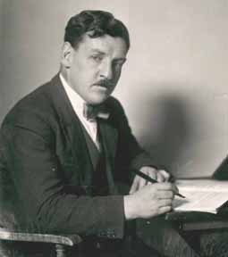

Gordon Jacob是20世纪英国最重要的作曲家、配器法专家及音乐教育家之一。1895年7月5日出生于伦敦上诺伍德（Upper Norwood），Jacob在一战期间服役于步兵部队，1917年被俘后在战俘营中通过阅读图书馆里的和声教科书开始自学作曲，并组织了战俘营"管弦乐团"为狱友演出。战后，他于1920年进入皇家音乐学院（RCM）学习，师从Charles Villiers Stanford、Ralph Vaughan Williams（作曲）、Herbert Howells（乐理）及Adrian Boult（指挥）。

从1924年至1966年退休，Jacob一直在RCM任教，教授作曲、配器法与乐理，培养出了包括Malcolm Arnold、Imogen Holst、Cyril Smith等著名音乐家。他是配器法领域的权威，著有《Orchestral Technique: A Manual for Students》（1931）、《The Elements of Orchestration》（1962）等经典教材，至今仍被广泛使用。作为作曲家，他一生创作了超过700部作品，涵盖交响曲、协奏曲、芭蕾舞剧、电影音乐及大量管乐作品。

### Gordon Jacob与Tommy Reilly的合作渊源

Jacob与Tommy Reilly的合作始于20世纪50年代中期。作为配器法专家，Jacob对管乐器的性能有着精深的了解，这为口琴这一特殊乐器的创作提供了技术基础。Jacob曾高度评价Reilly的艺术成就："He made the harmonica into a solo instrument of high artistic worth"（他将口琴变成了具有高度艺术价值的独奏乐器）。

除《Five Pieces》外，Jacob为口琴创作的作品还包括《Divertimento for Harmonica and String Quartet》（口琴与弦乐四重奏嬉游曲，1955年创作，题献Larry Adler，1956年11月由Adler首演；Reilly与Hindar四重奏团于1975年留下录音）及《Introduction and Galop》（引子与加洛普舞曲，收录于1976年双口琴专辑《Music for Two Harmonicas》）。这些作品构成了Reilly早期保留曲目的核心，为口琴在古典音乐界的地位奠定了基础。

### 《Five Pieces》作品基本信息介绍

《Five Pieces》采用了巴洛克组曲（Baroque Suite）的传统形式，由五个对比鲜明的乐章组成，整体结构类似于Jacob为竖笛（Recorder）创作的著名《Suite for Treble Recorder》（高音竖笛组曲）。这种多乐章结构在口琴文献中较为罕见，与后期Moody的单乐章幻想曲《Toledo》和Farnon的双乐章《Prelude and Dance》形成鲜明对比：

作品基本信息

创作时间：1957年

献辞对象：Tommy Reilly

首演：1957年12月26日，伦敦广播大厦音乐厅（Concert Hall, Broadcasting House, London）

首演者：Tommy Reilly（口琴），James Moody（钢琴伴奏）

版本：口琴与弦乐组 / 口琴与钢琴 / 圆号与钢琴（Mills Music Publishers出版改编版）

时长：约13分16秒

| 乐章 | 标题 | 时长 | 性格特征 | 技术重点 |
| I | Caprice（随想曲） | 1:42 | 自由奔放的炫技风格，节奏灵活 | 快速音阶、琶音、即兴感 |
| II | Cradle Song（摇篮曲） | 2:49 | 宁静抒情，歌唱性旋律 | 长音控制、音色纯净、气息连贯 |
| III | Country Dance（乡村舞曲） | 1:42 | 英式民间舞曲风格，轻快活泼 | 节奏精准、弹跳感、装饰音 |
| IV | Threnody（悲歌） | 3:04 | 深沉哀婉，葬礼进行曲性格 | 音色深沉、表情控制、半音阶下行 |
| V | Russian Dance（俄罗斯舞曲） | 3:46 | 热烈的斯拉夫舞曲，全曲高潮 | 持续快速吐音、八度跳跃、力度对比 |

### 《Five Pieces》的音乐语言与风格特征

Jacob的音乐风格被描述为"坚定的传统主义"（firmly based upon the traditions），他相信旋律的重要性，并认为"the day that melody is discarded altogether, you may as well pack up music"（如果完全抛弃旋律，音乐就不复存在了）。在《Five Pieces》中，这种美学观念体现为：

（1）旋律优先原则：每个乐章都以清晰可辨的主题旋律为核心，特别是第二乐章《Cradle Song》的抒情线条，充分展现了口琴模仿人声的能力。

（2）民族音乐元素：第三乐章的《Country Dance》融入了英式民间舞曲的节奏特征（如6/8拍子或切分节奏），而第五乐章《Russian Dance》则采用了强烈的附点节奏和弗里几亚调式（Phrygian Mode）元素，模仿巴拉基列夫或柴可夫斯基的俄罗斯风格。

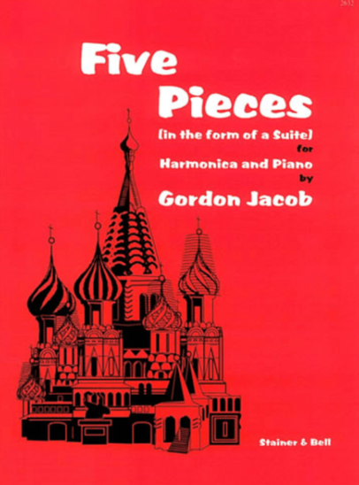

（3）配器色彩：作为配器法大师，Jacob在弦乐伴奏的写作上展现了高超技艺。有评论家指出："Jacob scores wonderfully well for wind instruments; he produces such variety in tone colour that the sound never cloys"（Jacob为管乐器的配器极为出色，他创造出如此丰富的音色变化，使听觉永不厌倦）。在《Five Pieces》中，弦乐组的拨奏（Pizzicato）、弱音器（Con sordino）及分奏（Divisi）技法与口琴的呼吸感形成精妙对话。

《Five Pieces》在Jacob的创作体系中属于"乐器特性组曲"（Character Suite）类别，与《Suite for Treble Recorder》（竖笛组曲）、《Divertimento for Bassoon》（巴松嬉游曲）等作品构成系列。音乐学者指出，这些作品"require a virtuoso performer to bring it to life"（需要 virtuoso 演奏家来赋予其生命）。对于口琴而言，这意味着演奏者必须掌握从巴洛克到现代的各种演奏技法，包括 vibrato（颤音）、glissando（滑音）、double tonguing（双吐）等。

### 《Five Pieces》口琴技术的全面展示

作为早期为Reilly创作的重要作品，《Five Pieces》在技术上建立了古典口琴演奏的标准：

（1）第一乐章《Caprice》：以"随想曲"（Caprice）命名，暗示了其炫技性质，类似于帕格尼尼的《Caprices》或圣-桑的《Introduction and Rondo Capriccioso》。这一乐章可能包含快速的三连音、琶音及即兴式的节奏伸缩（Rubato），考验演奏者的手指灵活性与音乐想象力。

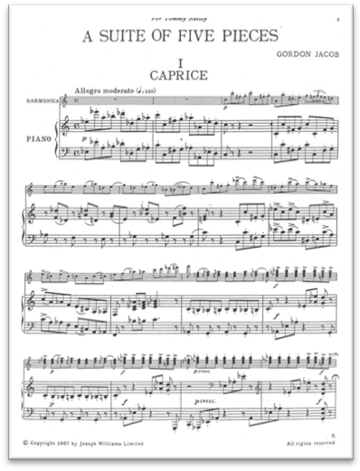

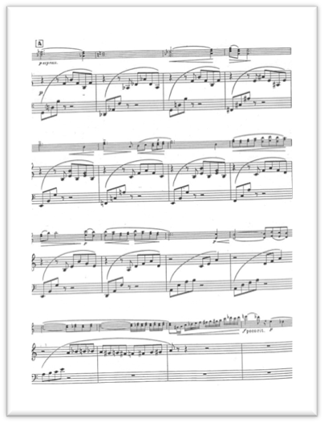

《五首小品》 I. Caprice 乐谱

（2）第二乐章《Cradle Song》：技术要求在于"看似简单的难度"——长音的纯净度、气息的控制力及音色的统一性。口琴在此必须模仿弦乐器的连奏（Legato）或人声的歌唱性，这要求演奏者掌握"腹式呼吸"（Diaphragmatic breathing）及微妙的颚部震动（Jaw vibrato）技巧。

（3）第四乐章《Threnody》：作为葬礼挽歌，这一乐章可能涉及口琴的低音区（Lower register）及半音阶下行线条，要求深沉、庄严的音色。标题"Threnody"（希腊语threnos，意为哀悼之歌）暗示了其悲剧性色彩，与Jacob纪念在一战中牺牲的兄弟Anstey的情感背景相呼应（Jacob的第一交响曲正是为此而作）。

作品的弦乐组编制（小提琴I、II，中提琴，大提琴，低音提琴）为口琴提供了丰富的和声支撑。Jacob善于利用弦乐器的各种演奏法：

拨奏（Pizzicato）：在《Country Dance》中模仿民间乐器的弹拨效果；

泛音（Harmonics）：在《Cradle Song》中营造空灵感；

分奏（Divisi）：在《Russian Dance》中创造浓厚的和声层。

口琴独奏与弦乐组的关系并非简单的"主奏-伴奏"模式，而是室内乐式的对话（Conversational texture），特别是在《Threnody》中，口琴与独奏大提琴或大提琴声部的呼应可能具有类似"二重协奏曲"的性质。

### 《Five Pieces》的历史地位与影响

《Five Pieces》（1957）是Tommy Reilly保留曲目中最早的重要原创组曲之一。它的创作标志着口琴从"民间娱乐乐器"向"严肃独奏乐器"转型的关键一步。在1957年首演时，口琴在古典音乐界的地位尚未确立，Jacob作为RCM教授及配器法权威的身份，为口琴的艺术性提供了重要背书。

该作品与Jacob的《Divertimento for Harmonica and String Quartet》（1955，题献Larry Adler）及《Introduction and Galop》共同构成了“Jacob口琴作品三部曲”，后两部均由Reilly留下经典录音。

《Five Pieces》首录于1976年，由Sir Neville Marriner指挥圣马丁室内乐团协奏，收录于Argo唱片《Works for Harmonica and Orchestra》（ZRG 856）；

1975年，Reilly与Hindar四重奏团录制了《Divertimento》及James Moody的《口琴五重奏》，收录于《The Silver Sound of the Harmonica》（Argo ZDA 206）；1990年Chandos再版时补入Moody的《Suite dans le style francais》，并加入竖琴家Skaila Kanga（CHAN 8802）。

1976年，Reilly与学生Sigmund Groven录制了双口琴版《Introduction and Galop》，收录于《Music for Two Harmonicas》（Polydor 2922 008）。

《Five Pieces》建立的"多乐章组曲"模式影响了后来的口琴创作。例如，James Moody为Reilly创作的《Little Suite》（小套曲，1960年）也采用了四个乐章的组曲形式（Bagatelle, Scherzino, Cantilena, Badinerie），与Jacob的《Five Pieces》形成呼应。

此外，该作品的钢琴改编版（由Mills Music Publishers出版）及圆号改编版，使其成为口琴与圆号演奏者的通用教材，促进了口琴曲目在其他管乐器领域的传播。

Gordon Jacob的《Five Pieces in the Form of a Suite for Harmonica and Strings》是20世纪口琴发展史上的奠基性作品。作为最早为Tommy Reilly创作的重要组曲之一，它不仅以精湛的配器技艺和成熟的音乐语言证明了口琴作为独奏乐器的艺术价值，更通过五个对比鲜明的乐章建立了古典口琴演奏的技术标准。

Jacob作为配器法大师和教育家的身份，赋予了这部作品独特的权威性。他在RCM近半个世纪的教学生涯中培养了一代英国音乐家，而他为口琴这一"非正统"乐器投入的创作精力，体现了一位真正教育者"不贬低任何可能性"（not considered effeminate）的开放态度。

今天，《Five Pieces》仍是检验口琴演奏者综合能力的试金石：从第一乐章的随想曲炫技，到第二乐章摇篮曲的歌唱性，再到末乐章俄罗斯舞曲的节奏爆发力，演奏者必须展现从巴洛克到现代、从技巧到音乐性的全方位素养。正如Jacob本人所言："I write music first to please myself; if it also pleases others, then that is all to the good"（我首先为自己创作音乐；如果它也能取悦他人，那就是锦上添花）——这部作品无疑既取悦了Reilly这样的大师，也教育了后来的口琴演奏者，更丰富了20世纪的室内乐文献。

## 5.2 James Moody 与作品《Toledo》

James Moody是20世纪英国重要的轻音乐作曲家、钢琴家及编曲家。作为Tommy Reilly的长期合作伙伴，Moody为其创作了大量口琴独奏及室内乐作品，包括《Little Suite》（小套曲）、《Suite dans le style français》（法式风格组曲）、《Quintet for Harmonica and String Quartet》（口琴与弦乐四重奏五重奏）以及《Toledo, Spanish Fantasy》（托莱多，西班牙幻想曲）等。

Moody的创作风格以旋律优美、和声丰富著称，他深谙口琴的技术特性，能够充分发挥半音阶口琴在古典音乐领域的表现力。据资料显示，Moody与Reilly的合作关系持续了数十年，直至Reilly晚年James Moody（1907-1995）是Reilly的长期合作伙伴，为他创作和改编了许多作品。Moody的贡献在于建立了口琴室内乐的曲目库，这些作品为口琴与弦乐四重奏、钢琴等组合的标准化提供了基础。

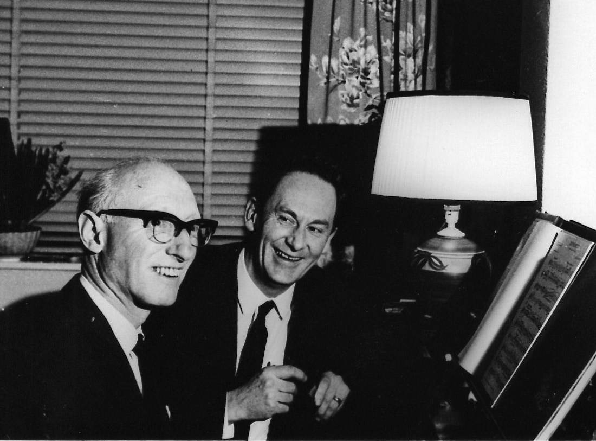

Tommy Reilly 与 James Moody  摄于1960年前

### 《Toledo》James Moody的杰出名作

Toledo这首曲子的全名是《Toledo, Spanish Fantasy for Harmonica and Orchestra》（托莱多，为口琴与管弦乐队的西班牙幻想曲），由英国作曲家James Moody于1960年为著名半音阶口琴演奏家Tommy Reilly创作的重要作品。该曲融合了西班牙民族音乐元素与现代演奏技法，充分展现了半音阶口琴的表现力，是20世纪中期口琴独奏文献中的代表性作品，至今仍是国际口琴比赛和音乐会的标准曲目。

《Toledo》创作于1960年，属于"迷你协奏曲"（Mini Piano Concerto/Tabloid Concerto）体裁，时长约6分43秒。该作品题献给Tommy Reilly，并很快成为其保留曲目（Repertoire Staple）。作品首录于1993年由Chandos唱片公司发行的专辑《Tommy Reilly Plays Harmonica Concertos》中，由Robert Farnon指挥慕尼黑广播交响乐团协奏。

基于钢琴缩编谱（Piano Reduction）分析，《Toledo》采用了单乐章幻想曲形式，内部包含多个对比段落：

| 段落 | 小节位置 | 速度/特征 | 音乐描述 |
| 引子（Intro） | 1-4 | Allegro molto, ♩=280 | 管弦乐节奏铺垫，营造张力 |
| 主题A | 5-20 | 西班牙舞曲节奏 | 口琴独奏进入，快速的音阶跑动与三连音 |
| 发展段 | 21-44 | 转调至远关系调 | 和声色彩变化，技巧展示 |
| 对比中段 | 45-88 | Moderato | 抒情性旋律，弦乐伴奏织体 |
| 再现与尾声（Coda） | 89-142 | Tempo di Bolero, ♩=82 | 波莱罗舞曲速度，华彩乐段（Cadenza），全曲高潮 |

作品主调为F大调（一个降号），但在发展过程中频繁使用远关系转调，特别是向降号方向的调性转移，这与西班牙民间音乐中常见的弗里几亚调式（Phrygian Mode）及安达卢西亚音乐风格相呼应。

乐谱特征观察：

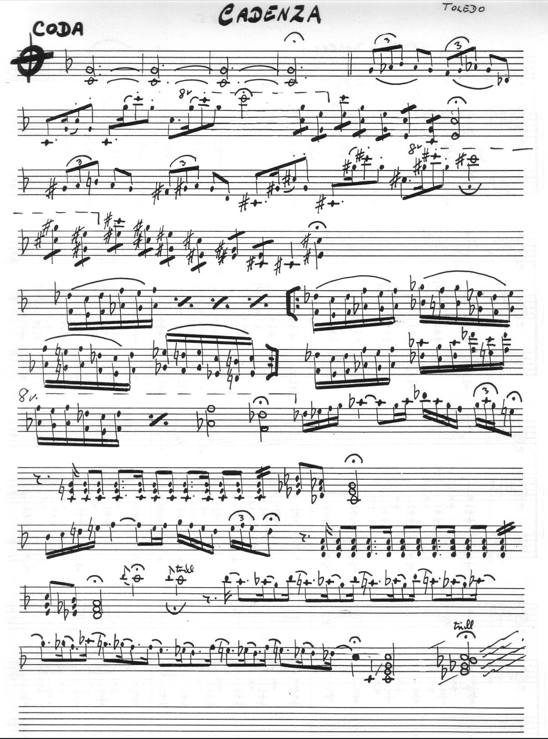

1. 速度极快：开篇标记Allegro molto, ♩=280，要求演奏者具备极高的气息控制与手指灵活性；

2. 八度运用：频繁使用"8va"标记，口琴在高音区的穿透力得以充分发挥；

3. 华彩段落第93小节起标记"Harmonica Cadenza"（口琴华彩），包含快速的三连音、琶音及双音（Double stops）技巧；

4. 重复记号：采用D.S. al Coda（从记号反复至尾声）结构，增强作品的即兴性与幻想曲特征。

### 《Toledo》演奏技术难点分析

作为为半音阶口琴（Chromatic Harmonica）量身定制的作品，《Toledo》在技术上具有以下特点：

（1）超吹与气息控制：开篇的高速段落（♩=280）要求演奏者运用"吐音"（Tonguing）与"腹式呼吸"技巧，在连续的三连音中保持音色的统一与清晰。

（2）八度跨越：乐谱中大量出现的"8va"标记表明，口琴需要在极短时间内完成两个八度以上的大跳，这对按键（Slide）操作的精准度提出极高要求。

（3）半音阶快速跑动：第108小节起进入全音符三连音的极速段落，要求演奏者熟练掌握半音阶口琴的推键（Slide in）与放键（Slide out）时机，实现半音关系的无缝连接。

### 《Toledo》成为口琴音乐会的保留曲目

《Toledo》被公认为20世纪口琴独奏文献中的"炫技小品"（Virtuoso Piece）典范。韩国口琴演奏家Yoonseok Lee在访谈中指出，尽管一些为口琴创作的协奏曲在技术含量上可能不及小提琴或钢琴的大型作品，但《Toledo》这类"西班牙幻想曲"却能让口琴不输于其他正规乐器，成为音乐会上的保留曲目。

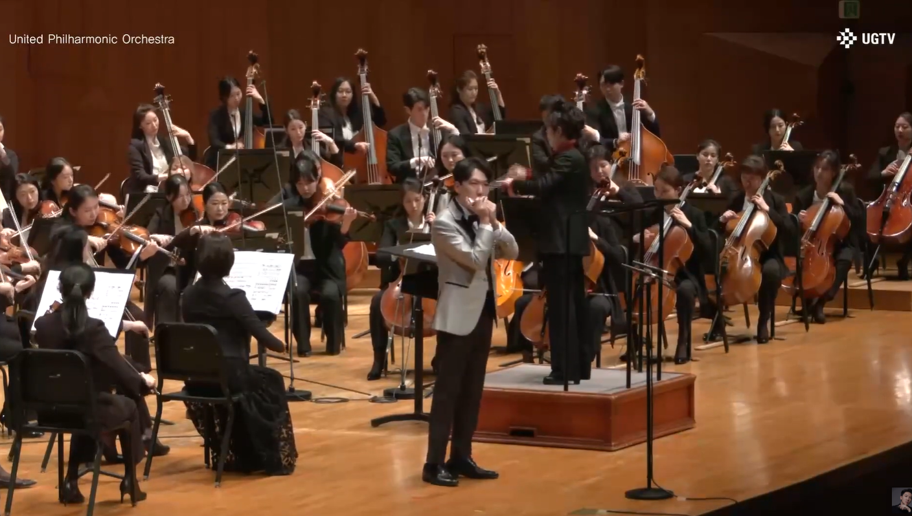

2023年韩国口琴演奏家Yoonseok Lee与United Philharmonic Orchestra

演出曲目Toledo的视频画面

在豆瓣音乐的用户评论中，有听者评价该曲："Spanish Fantasy实在是赞的不行，让口琴不输给其他正规乐器，百听不厌，难怪是Tommy Reilly的保留曲目。除Tommy Reilly外，该曲还被多位国际口琴演奏家纳入保留曲目

《Toledo》因其技术全面性与音乐表现力，常被用作高级口琴教学的必修曲目。上海某口琴教学培训机构在介绍该曲时指出，这是一首"技术性很强的口琴作品，旋律优美，节奏明快，融入了多种半音阶口琴演奏技巧"，充分展现了西班牙音乐的热情奔放。

James Moody为Tommy Reilly创作的《Toledo, Spanish Fantasy》是20世纪口琴音乐发展史上的重要里程碑。该作品成功地将西班牙民族音乐元素与半音阶口琴的现代演奏技法相结合，在有限的时长内（约7分钟）展现了口琴从抒情到炫技的全方位表现力。

从音乐学角度看，《Toledo》体现了"轻音乐"（Light Music）与"严肃音乐"（Serious Music）在20世纪中期的融合趋势。尽管其形式属于"迷你协奏曲"，但其艺术价值不输于大型协奏曲。Tommy Reilly通过委托此类作品，不仅提升了口琴在古典音乐界的地位，也为后世口琴演奏家留下了宝贵的技术财富。

今天，《Toledo》仍是国际口琴比赛（如香港国际口琴节、世界口琴锦标赛）的常选曲目，也是检验演奏家技术水平与音乐表现力的试金石。对于研究20世纪中期英国音乐、口琴发展史以及轻音乐创作风格的学者而言，该作品具有重要的研究价值。

### James Moody的口琴作品谱系

James Moody为口琴创作的作品远不止《Toledo》。据Groven目录整理，其口琴作品包括：

• 管弦乐与室内乐：Little Suite（小套曲）、Ballet Imaginaire、Cosmos、Bulgarian Wedding Dance、Fantasy、From Other Days、Quintet（五重奏）、'1771'（双口琴与弦乐四重奏）、Suite dans le style francais（口琴与竖琴）；

• 口琴与钢琴：Baby Talk、Bachanalia、Caprice、Duo Baroque、Jacaranda、Nocturne、Period Piece、Rondo Rococo、Sonatina、The Island Spell、The Sailor Boy、The Trinket Box、Valse Tendre、Viva Vivaldi、Broomy Hill、Irish Medley等；

• 双口琴与合奏：Echoes of Ireland、Nimbus、Sicilian Interlude、6 Irish Melodies、Wild Flowers、Contrasts（四重奏）、Suite for 3 Harmonicas等。

这些作品与Reilly的演奏互相成就，构成了20世纪口琴室内乐曲目库的基石。其中《Little Suite》与《Toledo》至今仍是国际比赛与音乐会的常选曲目。

## 5.3 Robert Farnon与作品《Prelude and Dance》

Robert Farnon（1917-2005）出生于加拿大，二战后定居英国，成为了著名的编曲家和作曲家。Robert Joseph Farnon是20世纪下半叶公认的"世界上最伟大的轻音乐作曲家"（the greatest composer of light orchestral music in the world）。他于1917年7月24日出生于加拿大多伦多，1930年代作为小号手在CBC（加拿大广播公司）的"快乐帮"（The Happy Gang）节目中成名。1940年接替Percy Faith担任CBC管弦乐团指挥，1944年以盟军远征军最高司令部加拿大军乐团长的身份来到英国，战后选择留在伦敦发展。

Farnon在英国发现了"轻音乐"（Light Music）这一独特的音乐类型，并将其与北美的新鲜活力相结合，为这一可能在上世纪50年代消逝的音乐形式注入了新的生命力。他不仅为BBC创作了大量广播音乐，还为电影配乐（如《Colditz》、《Captain Horatio Hornblower R.N.》等），并与Frank Sinatra、Oscar Peterson等音乐巨星合作。指挥家André Previn曾称他为"世界上最伟大的弦乐作家"（the greatest writer for strings in the world）。

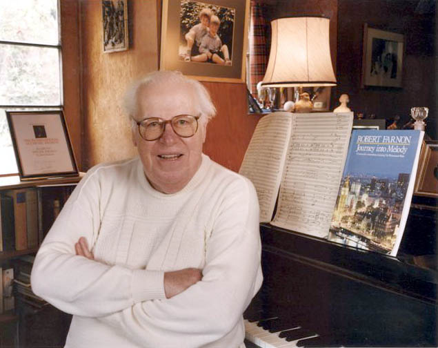

Robert Farnon（1917-2005）

Farnon与Tommy Reilly同为加拿大裔音乐家，两人在英国的音乐圈建立了深厚的合作关系。除了《Prelude and Dance》，Farnon还为Reilly的电影配乐作品创作口琴部分，并指挥了Reilly的多场重要录音。这种合作不仅是同乡情谊的体现，更是两位各自领域顶尖艺术家对音乐品质共同追求的成果。

《Prelude and Dance》创作于1966年（有资料记载为1960年代中期），是Farnon专门为展示Reilly的超凡技艺而创作的。根据Tommy Reilly在1973年的访谈记录，这部作品的创作成为了口琴发展史上的关键转折点：

"The final impetus was that Robert Farnon composed for me 'Prelude and Dance'. This work was both technically and musically so demanding, that I came to the conclusion that I can't meet these demands with a standard 'Hohner 270'."

（最后的推动力是Robert Farnon为我创作了《前奏曲与舞曲》。这部作品在技术和音乐上要求如此之高，使我意识到我无法用标准的'Hohner 270'来满足这些要求。）

这一认识直接促使Reilly于1967年前往伦敦考文特花园（Covent Garden）的银匠处，委托制作了世界上第一支为专业音乐会设计的银制半音阶口琴，后面章节会详细阐述。这支原型乐器本质上是以Hohner Chromonica II（12孔、3个八度）为基础，但改用实心银（solid silver）制作琴身和盖板。Reilly的学生、后来成为著名口琴演奏家的Sigmund Groven回忆，Hohner公司在听到这支银制口琴的首演后，立即决定将其量产，命名为"Hohner Silver Concerto"（型号7535），而Reilly获得的是第一支，Groven则在1969年10月获得了第二支。

### 《Prelude and Dance》音乐风格分析

基于现有录音与文献分析，《Prelude and Dance》采用了典型的两乐章对比结构，符合"前奏曲"（Prelude）与"舞曲"（Dance）的标题提示：

| 部分 | 特征 | 音乐性格 | 技术要点 |
| 前奏曲（Prelude） | 较慢的引子部分，抒情性 | 歌唱性旋律，展现口琴的"人声"特质 | 长音控制、气息连贯性、音色纯净度 |
| 舞曲（Dance） | 快速的主要部分，节奏性 | 轻快的舞曲节奏，可能融合爵士元素 | 快速吐音、八度跳跃、复杂节奏型 |

这种结构让人联想到巴洛克时期的"前奏曲与赋格"或"前奏曲与舞曲"套曲形式，但Farnon赋予了其典型的20世纪中期轻音乐管弦乐色彩。全曲时长约10分32秒，属于中型协奏曲体裁，比James Moody的《Toledo》（约6分43秒）更为宏大。

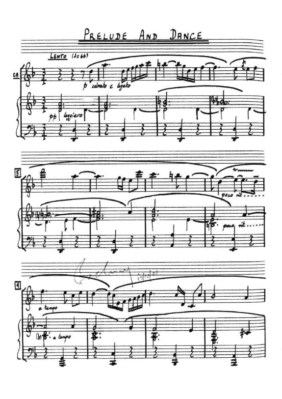

作为Farnon的代表作之一，该作品体现了他标志性的弦乐写作风格。Farnon的配器以"华丽的音乐床铺"（luscious musical bed）著称，他善于为独奏者营造既丰富又不喧宾夺主的管弦乐背景。根据1971年的录音信息，该作品由"Robert Farnon Orchestra"（Farnon自己的管弦乐团）协奏，这保证了作品在风格理解上的统一性。

乐队编制可能包括：完整的弦乐组、木管组（长笛、双簧管、单簧管、巴松）、铜管组（圆号、小号、长号）以及打击乐组。这种编制接近小型交响乐团，而非简单的"轻音乐"小编制，体现了Farnon对Reilly艺术地位的尊重。

Farnon的创作融合了多种音乐元素：

古典传统：作品中可以听到柴可夫斯基、拉威尔、德彪西乃至西贝柳斯的和声影响；

爵士色彩：Farnon与Dizzy Gillespie、Oscar Peterson等爵士大师的友谊使他的作品带有Swing节奏和即兴感；

电影音乐技法：Farnon为40多部电影配乐的经验，使作品具有强烈的画面感和戏剧张力；

加拿大民族元素：作为加拿大人，Farnon常在作品中融入对故土的情感，尽管《Prelude and Dance》主要展现的是国际性的轻音乐语汇。

### 《Prelude and Dance》技术难点分析

根据Reilly本人的评价，这部作品的技术与音乐要求极高。结合Farnon的作曲风格与Reilly的演奏技术，可以推断以下技术难点：

（1）气息控制与长音保持：前奏曲部分可能包含长线条的旋律，要求演奏者具备海菲兹（Jascha Heifetz）式的小提琴般连绵不断的弓法感。Reilly在战俘营时期正是以海菲茨的唱片为范本发展了口琴演奏技法，特别注重音与音之间的平滑连接（legato）。

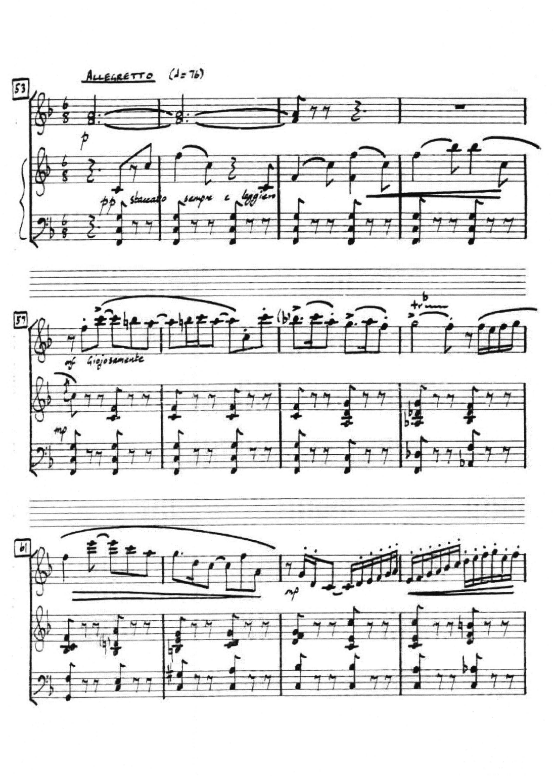

（2）快速技巧与节奏精准：舞曲部分可能包含类似"跳跃的豆子"（Jumping Bean）式的快节奏音型，要求精准的吐音（tonguing）和按键（slide）技术。Farnon作为小号手出身，对节奏精准度有极高要求。

（3）音色变化与动态对比：Farnon的作品通常要求丰富的动态层次（从pp到ff），而标准口琴在这方面存在局限。这正是Reilly寻求银制口琴的原因之一——银材质能产生更明亮、更有穿透力且动态范围更广的音色。

从前奏曲来说，开头的两个音符——D和A，从第5孔吸气到第7孔吸气，需要非常平滑的过渡，实现连奏效果。Reilly曾说："在我演奏过的所有音乐中，我必须说，Farnon作品开头的两个音符给我带来的满足感可能超过了其他任何音符。当每个音符之间都有一个孔时，要连奏地演奏两个音符并不容易。完成这个动作并让它听起来两个音符之间没有间隙，是一项真正的成就。"

舞曲部分采用了6/8拍子，快速有力，使用了大量的八分音符和十六分音符。这是口琴文献中技术上最困难的部分之一，包括了快速的音阶跑动、大跳音程、复杂的节奏型。

Reilly在BBC节目中讲述了他与Farnon的趣事："Bob Farnon为我写了一部严肃的作品。它太难演奏了，我觉得他写这部作品是希望我根本演奏不了。最后我在电话里告诉Bob Farnon：'Bob，我现在已经掌握你的作品了。'Bob Farnon回答说：'为我演奏最后几小节。'演奏完后，Bob Farnon说：'太棒了，Tommy，但速度要翻倍。'"

美国波士顿流行乐团指挥Richard Hayman在1971年收到收录《前奏曲与舞曲》的LP后写道："Tommy演奏Farnon作品的方式绝对令人叹为观止；演奏得如此完美和精湛，让我难以相信自己的耳朵。我真的非常激动，对于这位伟大演奏家手中口琴难以置信的能力的伟大展示。"

### 《Prelude and Dance》作品影响力分析

《Prelude and Dance》与James Moody的《Toledo》并列为Tommy Reilly保留曲目中最具代表性的两部"非完整协奏曲"作品（即单乐章或双乐章的协奏性作品）。如果说《Toledo》代表了西班牙色彩的炫技小品，《Prelude and Dance》则代表了更具交响性、更成熟稳重的轻音乐协奏曲风格。

该作品1971年首次录制于Polydor专辑《The Music of Robert Farnon》（编号2382 008），1993年由Chandos重新录音（CHAN 9248），收录于《Tommy Reilly Plays Harmonica Concertos》专辑中，与Spivakovsky、Arnold、Villa-Lobos的完整协奏曲并列，足见其在Reilly艺术生涯中的重要性。

《Prelude and Dance》可以说还间接推动了口琴制造业的专业化进程。Hohner公司在1968-1969年间将Silver Concerto投入量产，尽管价格昂贵且为订单式生产，但它确立了"专业演奏级口琴"（Concert Harmonica）的概念。此后，Yamaha等公司也开始关注高端口琴市场，而Reilly的学生Sigmund Groven后来与挪威工程师Georg Pollestad合作开发的"Polle Concert Harmonica"（1981年问世），也可视为这一传统的延续。

Farnon通过《Prelude and Dance》展示了轻音乐（Light Music）并非"轻浮的音乐"，而是具有高度艺术性和技巧性的音乐体裁。正如评论家所言，Farnon的作品"手工打造、旋律优美"，与莫扎特、贝多芬等古典大师一样，不应受时尚影响而被遗忘。这部作品为口琴在古典音乐界赢得了尊重，证明了这一"民间乐器"同样能够胜任严肃的音乐表达。

Robert Farnon的《Prelude and Dance for Harmonica and Orchestra》是20世纪口琴发展史上的双重里程碑：它既是一部艺术价值极高的音乐作品，也是乐器制造技术革新的催化剂。通过这部作品，Farnon不仅展现了其作为"轻音乐大师"的管弦乐写作功力，更推动了口琴从"民间玩具"向"严肃独奏乐器"的转型。

作品所催生的Silver Concerto口琴，至今仍是Hohner公司的旗舰产品，被世界各地的古典口琴演奏家使用。Tommy Reilly凭借这部作品及其所启发的乐器革新，进一步巩固了其在口琴艺术史上的地位，为1992年获得大英帝国勋章（MBE）——成为首位获此殊荣的口琴演奏家——奠定了坚实基础。

对于今天的口琴演奏者和研究者而言，《Prelude and Dance》不仅是一部需要攻克的技术难关，更是理解20世纪中期"轻音乐"美学、口琴专业化进程以及跨大西洋音乐文化交流的重要案例。它提醒我们，乐器的发展往往与具体作品的需求紧密相连，而伟大的艺术家（如Farnon和Reilly）总能在技术与艺术的交界处开辟新的可能性。

## 5.4 其他英国作曲家的重要作品

Tommy Reilly最重要的制度性贡献之一是建立了作曲家委托创作模式。从1951年Spivakovsky协奏曲开始，他建立了演奏家主动委约、作曲家专门创作、作品题献演奏家的完整链条，这一模式被后世广泛采用。超过30部协奏曲性质的作品为其创作，构成了口琴协奏曲的核心。

当然，也有参与过唱片录制或演出的并非专门为Tommy Reilly创作的口琴协奏曲类作品，比如为Larry Adler等创作的口琴协奏曲，但Tommy Reilly依然留下了经典的录音或者现场演出。

### 《Concerto for Harmonica and Orchestra, Op. 46》(1954)

Malcolm Arnold (1921-2006)是20世纪英国最重要的作曲家之一，以九部交响曲和大量协奏曲著称。他的《口琴协奏曲》（作品46号）创作于1954年，由BBC为当年逍遥音乐会（Proms）委约、题献给Larry Adler；Reilly将其纳入保留曲目并留下经典录音。该作品展现了Arnold"诗意的侧面"，与他为大型管弦乐队创作的华丽作品不同，这部协奏曲为小型室内管弦乐队而作，充分展示了口琴的"音乐品质"。

作品三个乐章分别为：I. Grazioso（优雅地）、II. Mesto（忧郁地）、III. Con Brio（有活力地）。第二乐章"Mesto"（忧郁的）体现了Arnold深沉的内省性格，而末乐章则回归他标志性的节奏活力。该作品由Reilly与伦敦小交响乐团（London Sinfonietta）录制，David Atherton指挥。

### 《Romance for Harmonica, Strings and Piano》(1951)

Ralph Vaughan Williams (1872-1958)作为英国民族乐派的代表人物，于1951年创作了《为口琴、弦乐与钢琴而作的浪漫曲》（Romance in D-flat）。这部作品最初是为Larry Adler创作（1952年5月3日纽约首演），但Reilly也将其纳入保留曲目并录制。

作品采用单乐章形式，风格温和怀旧，"像是一个关于简单时光的记忆，或许是壁炉旁宁静的夜晚"。Vaughan Williams运用了其标志性的英国田园风格，弦乐织体丰富，口琴演奏如歌的旋律。这部作品虽然不是为Reilly首演，但Reilly的演绎（与圣马丁室内乐团及Neville Marriner合作）成为经典录音。

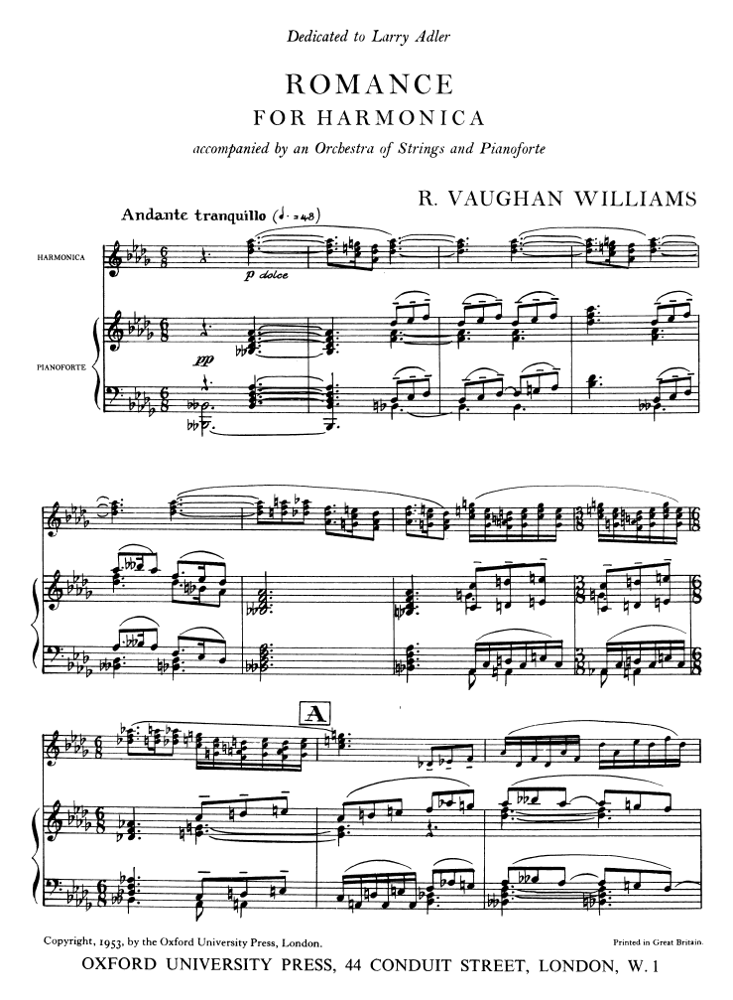

### 其他口琴协奏曲类作品

Vilem Tausky (1910-2004)：捷克裔英国指挥家、作曲家，创作了《Concertino for Harmonica and Orchestra》（三乐章：Allegro Moderato, Nocturne, Scherzo），收录于Reilly与圣马丁室内乐团的专辑中。

Graham Whettam (1927-2007)：创作了《Fantasy for Harmonica and Orchestra》。

Matyas Seiber (1905-1960)：匈牙利裔英国作曲家，创作了《Old Scottish Air for Harmonica, Strings and Harp》（为口琴、弦乐与竖琴而作的古老苏格兰曲调）。

George Martin (1926-2016)：著名的披头士制作人，也是Reilly在Parlophone唱片的制作人，创作了《Three American Sketches for Harmonica and Strings》和《Adagietto for Harmonica and Strings》。

Paul Patterson (1947-)：英国现代派作曲家，于1987年为Reilly创作了《Propositions for Harmonica and Strings》。《泰晤士报》评论称这部作品证明了Reilly"决心确立其银制乐器的'高雅' credentials，与他从这最难以驾驭的乐器中诱发出抒情、富有乐感的音响的技能相匹配"。

Alan Langford：创作了《Concertante for Harmonica and Strings》。

Max Saunders (1908-2000)：创作了《Sonatina for Harmonica and Piano》。

## 5.5 全球知名作曲家的重要作品

### 《Concerto for Harmonica and Orchestra》(1953)

Arthur Benjamin (1893-1960)是澳大利亚出生的作曲家（后定居英国），以《牙买加伦巴》（Jamaican Rumba）闻名。

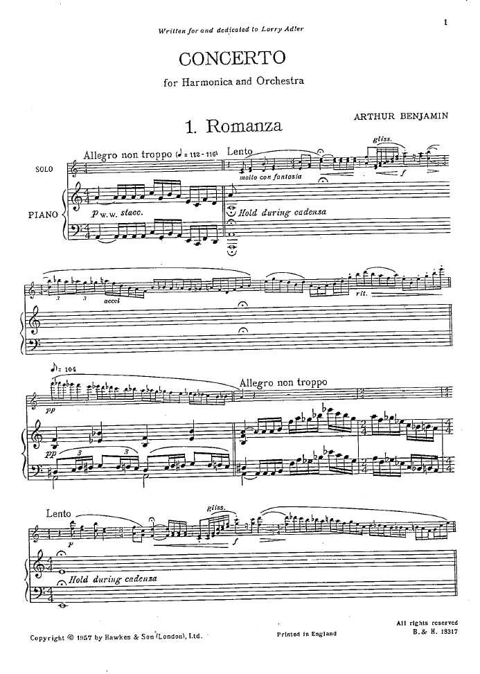

他的《Concerto for Harmonica and Orchestra》（口琴协奏曲）创作于1953年，是在Vaughan Williams的鼓励下为Larry Adler创作的，但同样成为Reilly的重要曲目。

作品三个乐章分别为：I. Romanza (Allegro non troppo)、II. Canzona Semplice (Andante poco lento)、III.  Rondo Amabile (Allegretto)。首演于1953年8月15日伦敦皇家阿尔伯特音乐厅的Proms音乐会，由伦敦交响乐团（LSO）协奏，Basil Cameron指挥。Tommy Reilly后来与伦敦小交响乐团录制了该作品（Argo ZRG 905, 1979年）。

乐队编制包括双管木管、两支小号、木琴、钢片琴和弦乐，体现了Benjamin对色彩性配器的追求。

### 《Concerto for Harmonica and Orchestra》(1955)

巴西最重要的作曲家Heitor Villa-Lobos (1887-1959)，受到上世纪另一位古典半音阶口琴名家John Sebastian的委托维拉-洛博斯创作了这首《Concerto for Harmonica and Orchestra》口琴协奏曲。这是口琴文献中为数不多的由"国际级"大师创作的作品，与巴西吉他大师塞戈维亚（Segovia）的《吉他协奏曲》并列为Villa-Lobos晚期的重要贡献。

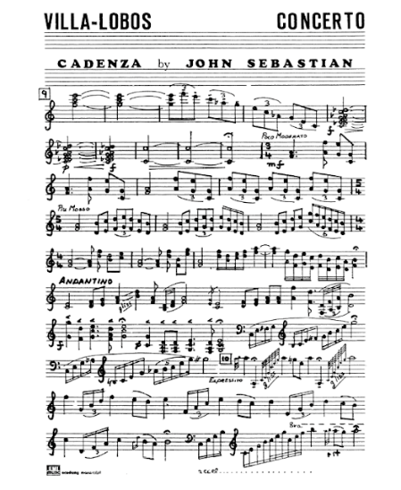

“在协奏曲创作期间，能与约翰和维拉-洛博斯一起工作是我的荣幸。作曲家坐在巨大的半圆形书桌前，桌上放着一壶浓浓的黑咖啡、几支雪茄和许多烟灰缸，他同时创作着几首曲子，并不时地看看电视。他总是戴着帽子……” 显然，John Sebastian对维拉最初创作的华彩乐段不太满意，于是他们一起修改了乐段：

作品三乐章结构：I. Allegro Moderato、II. Andante、III. Allegro。第二乐章尤其出色，"将独奏者与乐队置于丰富、出人意料的的和声色彩背景中"。Villa-Lobos充分发挥了口琴在高音区的表现力，同时探索了乐器的和声与半音阶可能性。

该作品由Reilly与伦敦小交响乐团录制（David Atherton指挥），是1993年Chandos专辑的核心曲目之一。

### 《Concerto for Harmonica and Orchestra》(1962)

美国现代派作曲家Henry Cowell (1897-1965)，于1962年创作了《Concerto for Harmonica and Orchestra》口琴协奏曲。

这部作品是Cowell应口琴演奏家John Sebastian（约翰·塞巴斯蒂安）的委约而创作的。原本计划在罗马进行演出并录制，但由于塞巴斯蒂安突然生病，这一计划未能实现。

首演情况：该曲在Cowell去世多年后，直到 1986 年才由口琴独奏家罗伯特·邦菲格里奥（Robert Bonfiglio）与布鲁克林爱乐乐团合作完成首演，由卢卡斯·福斯（Lukas Foss）担任指挥。

东西方融合：Cowell在创作晚期对非西方音乐表现出浓厚兴趣。这部作品深受日本雅乐（Gagaku）的影响，Cowell试图用口琴模拟日本传统乐器“笙”（Shō）的音色。

乐章结构：全曲分为三个乐章，整体风格被形容为庄重、哀婉且色彩丰富。

第一乐章：包含了如波浪般起伏的调式旋律。

第二乐章：以口琴的独奏长段旋律开始，伴随着弦乐的拨奏。

特色元素：作品中除了口琴，还为定音鼓等打击乐器安排了极具挑战性的声部。

Cowell将他标志性的“音块”（Tone Clusters）概念引入此曲，利用口琴多簧片同时发声的特性，创造出一种类似日本笙那种持续且无重击感的集群和声。乐评人认为该作品充分展示了口琴在旋律广度与音色变化上的潜力，尽管在现场演出中，独奏口琴与大乐团之间的平衡一直是一个技术难题。

## 5.6 艺术价值与历史意义

Reilly成功吸引了从Vaughan Williams、Villa-Lobos到Arnold、Benjamin等一流作曲家为口琴创作。这些作曲家并非"屈尊"为之，而是发现了口琴独特的音色潜力——"类似人声的特质"（vocal quality）和"极高的表现力范围"。

Reilly的委约作品涵盖了从巴洛克风格到现代派的各种技法，形成了从初级（如《Old Scottish Air》）到高级（如Spivakovsky《Concerto》）的完整教学体系。这些作品至今仍为口琴演奏者提供技术标准和艺术典范。

"For five and a half years, locked up in German prison camps, Tommy Reilly set about discovering the harmonica as no one had ever discovered it before. For 40 years since, his determination to establish the credentials of his solid silver instrument has been matched by his skill at coaxing lyrical, musicianly sounds from this most intractable of sources."

（"五个半年的时间里，被囚禁在德国的战俘营中，Tommy Reilly着手以从未有人做到过的方式发现口琴。此后的40年里，他确立其纯银乐器 credentials 的决心，与他从这最难以驾驭的乐器中诱发出抒情、富有乐感的音响的技能相匹配。"）

—— Richard Morrison, 《泰晤士报》
