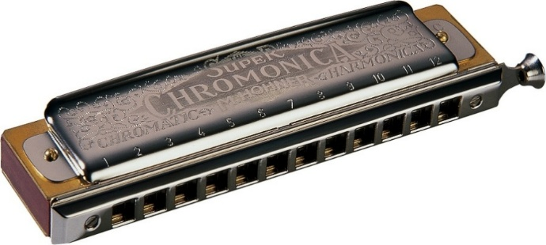
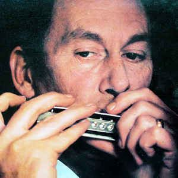
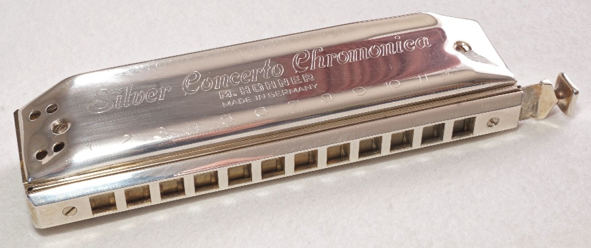
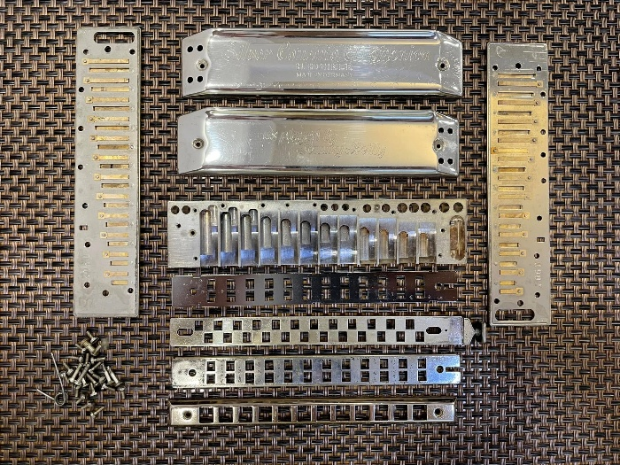
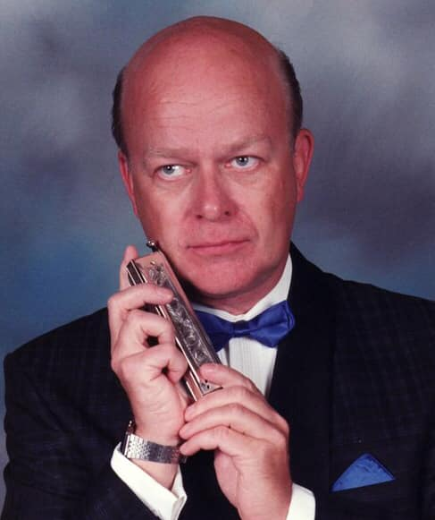
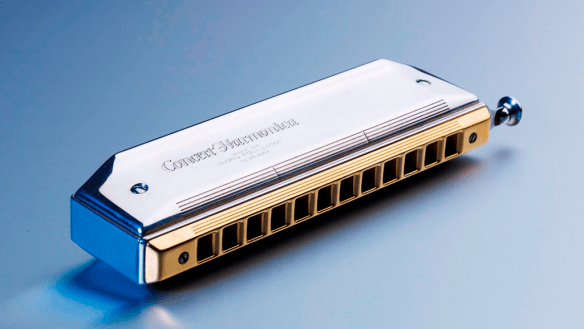
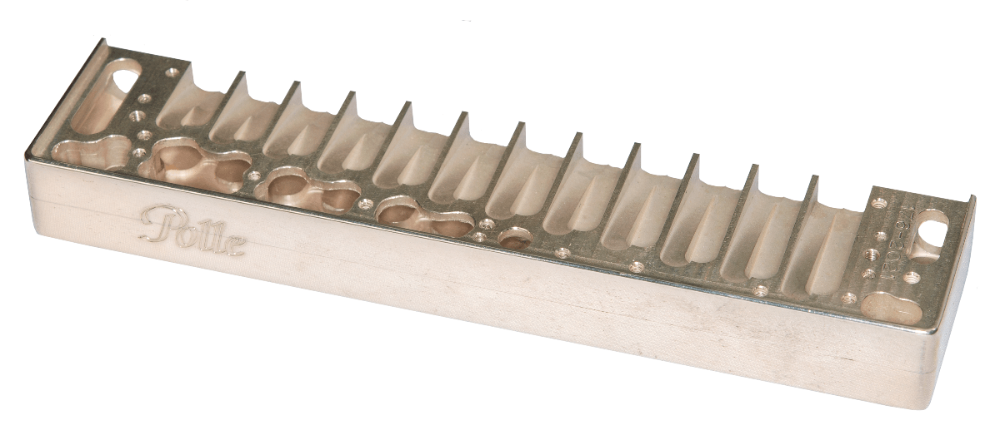
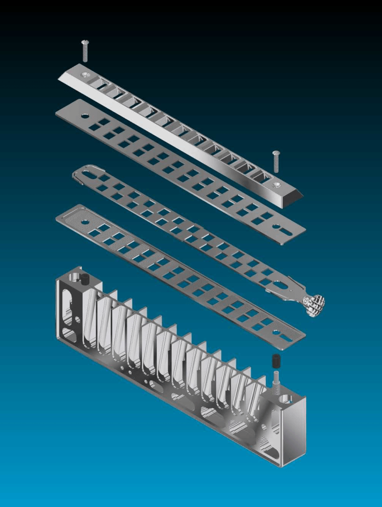
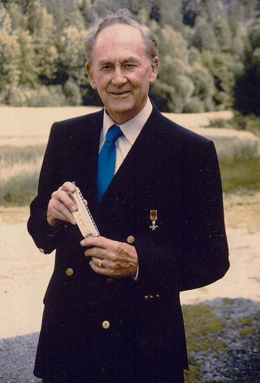

# 第六章 银口琴的诞生：乐器革新与制造工艺（1967）

## 6.1 与Hohner的合作契机

Tommy Reilly对口琴艺术的贡献，不仅体现在演奏和委托创作上，还体现在乐器本身的革新上。1960年代初，Reilly已经是世界著名的口琴演奏家，但他对现有的口琴并不完全满意。他认为，口琴的制造质量还有提升的空间，特别是对于古典音乐演奏来说。

Robert Farnon 为其创作的《Prelude and Dance》是直接触发因素——这部作品在技术和音乐上的要求如此之高,使 Reilly 得出结论:标准 Hohner 270 已无法满足(详见 5.3 节)。Hohner 270 Super Chromonica 是当时专业演奏家的标准乐器,但其木质琴格容易受潮膨胀、影响气密性与音准,标准簧片在面对 Farnon 作品中极端的动态范围和音色变化要求时也显得力不从心。

Hohner 270 Super Chromonica 半音阶口琴

更深层的动机则是Reilly长期持有的"银质口琴"理念。他在同一访谈中解释："我一直有银质口琴的想法。银对我来说是最好的材料，因为它在长笛上已经证明了其价值。"这一跨乐器的材料借鉴体现了Reilly的声学思考：银的密度、共振特性和耐久性使其成为高端吹管乐器的优选材料，而口琴作为气鸣乐器，理应从这一传统中受益。

1967年，Reilly启动了与Hohner公司的合作，开发第一款银质簧片半音阶口琴——Silver Concerto Chromonica。

## 6.2 银口琴开发的详细过程

Reilly与Hohner的合作是一个漫长而复杂的过程，涉及大量的技术创新。

Reilly详细列出了他对理想口琴的要求：温暖圆润的音色、十二平均律调音、高灵敏度响应、出色的耐用性、符合人体工程学的舒适性。

在材料选择上，进行了大量实验。最终，他们决定使用纯银作为琴格的材料。银的声学特性优于传统的黄铜和铝，能够产生更加温暖、圆润的音色。簧片的材料也经过特殊处理，提高了响应速度和音准稳定性。

1967年，Reilly前往伦敦科文特花园（Covent Garden）的一位银匠处，委托制作第一支银质半音阶口琴原型。这一地点选择具有象征意义：科文特花园是伦敦古典音乐生活的中心，Reilly在此寻求工艺支持，表明其将口琴制造纳入高端乐器制作传统的意图。

然而，口琴做好后却发现没办法组装——银的材质与标准口琴的工程学要求存在差异，导致簧片无法正常安装或音准无法保证。

原型制作后的完善阶段涉及关键的技术合作。Reilly的学生Douglas Tate——"当时是我的学生，以其技术技能帮助我使其完美"——参与了后续的工程优化。作为工程师的 Tate，利用他的技术知识解决了银口琴的组装难题，使得世界第一把银口琴得以正式问世。

Douglas Tate后来成为口琴制造领域的重要人物，这一早期合作是其职业生涯的起点。师徒合作模式确保了新乐器既符合Reilly的艺术vision，又具备工程可行性。

### Douglas Tate（1934-2005）

Douglas Tate是 Tommy Reilly 最重要的学生之一，也是口琴制造史上的关键人物。他与 Reilly 的关系不仅是师徒，更是工程合作者。(Tate 的生平详见本章 6.5 节。)

银口琴的内部结构经过重新设计，优化了气流通道。Reilly根据自己的演奏经验，提出了许多改进建议，如改进按键的机械结构，增加弹簧的弹性，使按键更加灵敏。

音准是古典音乐演奏中最重要的问题之一。Reilly坚持银口琴必须采用十二平均律调音，与钢琴和管弦乐队的音准一致。工程师对簧片的厚度和形状进行了精密的计算和调整，Reilly亲自参与了每一个音的测试。

原型制作完成后，Reilly进行了大量测试。他在各种演出和录音中使用银口琴，对其性能进行全面评估。在测试过程中，他发现最初的设计在高音区音色不够理想，建议对气流通道进行微调，最终解决了这个问题。

## 6.3 与Hohner公司合作发布Silver Concerto

与Hohner公司的商业谈判同样充满戏剧性。Reilly在特罗辛根（Trossingen，Hohner总部）展示新乐器时，管理层最初"犹豫"——"我有感觉他们不想做，但不愿说不"。转折点是Reilly透露"Yamaha也有兴趣购买产品许可"——"Yamaha？绝不可能！"的竞争反应促使Hohner改变态度，最终签订合同，将Reilly的开发转化为Hohner产品，命名为"Hohner Silver Concerto"。这一谈判过程揭示了Reilly的商业敏锐性：他并非单纯的"艺术家"，而是理解知识产权价值、能够运用竞争策略的"文化企业家"。

Hohner Silver Concerto 半音阶口琴

1968-1969年间，银口琴以“Hohner Silver Concerto”之名投入量产，技术规格在当时非常先进：

| 音域 | 三个八度以上（C4到D7） |
| 调音 | 十二平均律 |
| 琴格材料 | 925纯银 |
| 簧片材料 | 银合金 |
| 按键 | 改进的机械结构，高灵敏度 |
| 吹嘴 | 人体工程学设计 |
| 整体重量 | 约950克 |

Silver Concerto的市场定位明确针对专业古典演奏家。Hohner官方描述其为"古典独奏家的ultimate半音阶口琴，无论是在smaller, more intimate ensembles还是orchestral setting"。这一高端定位反映在其生产模式上：每支乐器"individually made to order"，"highest degree of precision and attention to detail"。

Hohner Silver Concerto 半音阶口琴全拆解（CL AU拍摄）

Silver Concerto在多年内成为事实上的标准音乐会乐器。Hohner公司在这一设计基础上进行了少量调整，但其基本结构延续至今。

值得一提的是，Reilly曾抱怨Hohner在量产时未经他同意更改了推键按钮的设计——“那只能由从未吹过口琴的人决定”。这反映了他对乐器细节的极致要求。

银口琴的成功，证明了市场对高品质口琴的需求。此后，Hohner和其他口琴制造商开始推出更多面向古典音乐市场的高品质口琴。银口琴采用的十二平均律调音，后来成为了古典口琴的标准。

Reilly的学生Sigmund Groven回忆道："Tommy对口琴发展的贡献至关重要。作为口琴教师，他在任何地方都是无与伦比的；他的教程和练习曲是标准著作，1967年，他创造了世界上第一把音乐会口琴。"

Reilly晚年曾尝试Polle定制的半音阶口琴，并表示这是他所演奏过的最优秀的口琴，甚至表示"不会再演奏其他品牌"，这一评价既体现了他对乐器质量的极致追求，也反映了口琴制造技术的持续进步。

## 6.4 口琴中的劳斯莱斯——Polle Concert Harmonica

Tommy Reilly作为二十世纪最具影响力的古典口琴演奏家之一，其一生见证了口琴从民间乐器向音乐会舞台的艰难攀登。1967年，当他在伦敦首次委托制作银色半音阶口琴时，这一举动本身即是对口琴乐器地位的重要宣示。

这支银口琴由 Hohner 按 Reilly 的规格量产(详见 6.3),然而正如 Tommy Reilly 所遗憾指出的,这款开创性产品后续并未获得持续的技术迭代与优化。后来,Tommy Reilly 在致 Pollestad 的信函中,将其制作的 Concert Harmonica 誉为"所有口琴中的劳斯莱斯",这一评价不仅标志着个人乐器选择的转变,更象征着音乐会口琴从工业化生产品向手工定制精品的范式转移。

### 从Silver Concerto到Concert Harmonica的技术谱系

二十世纪的大部分时间里，口琴制造始终遵循大规模工业化生产的逻辑，强调标准化与成本控制，而非针对专业演奏者的个体需求进行精细化调整。Reilly在1967年的尝试虽然突破了材质局限，但在机械结构、适配及后续维护便利性等方面仍受限于当时的工业框架。

这种技术停滞的状态一直持续到1980年代初期。Reilly在挪威口琴研讨班（Norwegian Harmonica Seminar）担任常驻教师期间，遇见了具有工业设计师与模具师背景的Georg Pollestad。这次相遇成为口琴制造史上的关键节点。Pollestad不仅理解Reilly对理想音乐会口琴的愿景，更具备将其实现的技术能力。

这次相遇改变了这一局面。作为受过专业训练的工业设计师与模具师，Pollestad于1981年在见到Reilly的Hohner Silver Concerto后，向挪威口琴演奏家Sigmund Groven宣称将自行制作此类乐器。不同于工业流水线上的批量生产，Pollestad采用的是小批量手工制作模式，这使他能够针对演奏者的具体反馈进行即时调整。一年后完成的首支自制口琴即获得Groven的高度赞赏，并在音乐会上公开展示，标志着Polle制作理念的初步验证。

1990年，Reilly在慕尼黑的一场音乐会后向乐迷透露，他已经改用"由挪威一位名叫Georg Pollestad的人制作的更优质型号"。这一转变并非简单的品牌更换，而是代表着口琴制造范式从工业标准向手工定制的根本性转移。至1995年，Polle音乐会口琴正式开始接受定制订单；2002年，位于挪威Bryne村的Polle口琴工坊正式设立，形成了稳定的生产与研发基地。

### 何为"劳斯莱斯"级的标准

Reilly在信中将Polle口琴比作"所有口琴中的劳斯莱斯"，这一比喻绝非溢美之词，而是指向一系列具体且可感知的技术指标。Pollestad的制作理念明确区别于传统口琴工业："传统口琴设计为优化工业生产而做出妥协，而Polle概念严格从演奏者角度出发，在音乐与技术品质上不做任何牺牲。"

标准版 Polle Concert Harmonica

在材料应用方面，Polle口琴采用了航空级精密制造标准。标准型号使用925纯银制作盖板与琴体，通过独特的空心减重技术——将银块切割为两半，掏空内部多余银料后以精密螺丝接合——将整琴重量控制在214克，远轻于早期Silver Concerto的笨重质感。纯银材质不仅赋予音色温暖的特质，更具备优异的热传导性，能迅速被手温加热，避免金属乐器常见的冰冷触感。

带空心镂空技术的Polle的银质琴格

推键系统的革新是Reilly特别赞誉的核心。传统半音阶口琴的推键机构常因唾液积聚、金属氧化或机械公差而导致卡顿，这正是Reilly信中提及的"总是出现推键卡顿问题"的技术根源。Pollestad的解决方案体现了其工业设计师的专业背景：推键在两块固定滑轨板之间运动，接触面带有纵向精密铣槽，形成自润滑机制；配合双减震器设计，使推键动作达到顺滑无声的状态。更关键的是，整个吹嘴与推键系统采用模块化设计，可轻松拆卸维护，解决了传统口琴维护困难的专业痛点。

人体工学设计同样体现了对演奏者需求的深度理解。吹嘴两侧设有纵向细槽，构成唾液导流系统，收集的唾液可润滑嘴唇与吹嘴的接触面，显著减少长时间演奏产生的摩擦不适。固定吹嘴的螺丝采用钛金属材质，这一细节旨在避免不同金属接触产生的电流干扰，消除演奏者可能感受到的微弱电击感。琴身侧面集成的LCD温度计则提供了科学的演奏状态监控，帮助演奏者在最佳温度条件下发挥乐器性能。

### 从纯银到钛金属的技术前沿

Polle口琴的技术演进并未停留在1990年代的水平。2009年起，Pollestad开始系统性地研发钛金属版本，以应对专业演奏者对更轻重量的需求。钛合金作为航空航天领域的高端材料，具有极高的强度重量比与优异的耐腐蚀性，但其加工难度远高于传统乐器材料。近年来，Polle工坊更开始自制钛金属簧片板，通过减小簧片与板间的公差，显著提升乐器的响应灵敏度与音色一致性。

目前，Polle提供纯银与钛金属两种主体材质的选择，前者延续经典的温暖音色与质感，后者则代表极致的轻量化与现代化。这种双轨并行策略既尊重了Reilly时代确立的银质传统，又顺应了当代演奏技术的发展趋势。

### 演奏验证与历史定位

Tommy Reilly作为1992年大英帝国勋章（MBE）获得者——该荣誉使他成为唯一获此殊荣的口琴演奏家——其专业评价具有无可置疑的权威性。他在信中对Polle口琴的三重肯定——"外观更佳，音色远胜以往，推键运动简直就是艺术品"——实际上确立了高端音乐会口琴的评判维度：不仅要满足声学标准，必须在机械工艺与视觉美学上达到同等高度。

Reilly宣称"从今以后只演奏Polle口琴"，这一决定性转变标志着口琴制造业权力结构的微妙转移。传统上，演奏者必须适应工业制造商设定的标准；而在Polle模式中，制琴师通过深度理解演奏者的身体经验与技术需求，实现了乐器对演奏者的真正适配。Sigmund Groven等世界级演奏家的长期使用，进一步验证了这一制作模式的专业可持续性。

从历史维度看，Polle音乐会口琴代表了口琴制造史上的第三代高端定制乐器演进。第一代是Reilly于1967年委托制作的Silver Concerto，首次将贵金属材质引入口琴制作；第二代是1973年由Chamber Huang设计的CBH 2012，尝试树脂与纯银的混合材质，但因重达1275克而未能成为实用标准；第三代即Polle Concert Harmonica，在Reilly的直接指导下，解决了前代产品的重量与机械问题，通过手工定制模式确立了现代音乐会口琴的黄金标准。

信中"劳斯莱斯"的比喻，后来被业界广泛引用，成为Polle口琴的代名词。这封信见证了工业设计与音乐艺术的完美融合：一位非演奏者的技术人员，通过深入理解演奏者的身体经验与技术愿景，创造出了超越工业标准的专业乐器。

Polle口琴工坊至今仍在挪威Bryne村维持着小批量手工制作的传统，每支口琴都承载着从Reilly时代延续下来的制作哲学——不为工业化妥协，只为音乐品质服务。在这个意义上，Reilly 1990年代初期的这封信，不仅记录了一次个人的乐器选择，更预言了口琴制造业未来的发展方向：从标准化生产回归个性化定制，从批量制造升华为手工艺术。

目前Polle Concert Harmonica 仅接受预订生产，直至 2024 年。计划在 2025 年生产最后一批乐器，然后停止生产 Polle Concert Harmonica。

## 6.5 Douglas Tate:从学生到制琴大师(1934-2005)

说明:本章为增补小节,素材来源:SPAH 2006 年《Douglas Tate 纪念文章》(Roger Trobridge 编,含 1958 年《Harmonica News》原始档案)。

### 6.5.1 工程师的起点

Douglas William Richard Tate 是约克郡人,1934 年出生于英格兰东北部蒂斯河畔亚姆(Yarm-on-Tees),父亲是比灵厄姆 ICI 氨厂的轮机长。18 岁离开学校后,他前往伦敦做学徒,凭借出色的工程天赋,一路升任欧洲最大计算机公司 ICL(International Computers Limited)的研究与设计主管——点阵打印机、读卡器、汽车工业用恒流焊接机、为学校和世界卫生组织设计的教学机,都出自他的手笔。

他与口琴的缘分始于 6 岁:学校布告栏上贴着一条校规——"禁止口琴"(Mouthorgans Forbidden)。这条禁令反而点燃了他的好奇心,不过和大多数孩子一样,热度只维持了三星期。直到高中毕业进厂工作,他才重拾口琴,在工厂里吹;同事们的讪笑激起了他的好胜心,他下定决心"征服这件乐器"。

两年后的 1955 年,他第一次参加全英口琴锦标赛便获得第四名。这次比赛给他最大的冲击是:原来吹好口琴要先学会看五线谱。于是他开始自修乐理,一路从 1956 年全国第五、温布利音乐节第二,到 1957 年温布利冠军、全英第四,并凭此成绩获得 1957 年卢森堡世界锦标赛参赛资格——那是他第一次出国参赛。此后他连续参加了 1958 巴黎、1959 因斯布鲁克、1960 巴塞罗那、1963 斯特拉斯堡、1965 代尔夫特,直至 1967 年卡尔斯鲁厄的巅峰一战。

有意思的是,这位后来的世界冠军最初也不会读谱。1958 年《Harmonica News》的档案记载,他的"唯一正式课程"是跟 Tommy Reilly 上的几节一两个小时的小课:"跟 Tommy Reilly 上课,最重要的就是听和看他演奏——你看着、学着,就知道那些效果是怎么做出来的。"为了打磨音色,他同时研究 Reilly 的喉颤音与 Larry Adler 的舌颤音。他自己也是 Harmonetta(和弦口琴)专家,曾用自作曲华彩代表英国参加 1957 年世界赛的和声口琴组。

### 6.5.2 世界冠军与不锈钢 270

1967 年,Douglas 决心拿下世界口琴大赛"蓝绶带"级别的半音阶组桂冠——此前该组别的冠军是 1955 年的 Willi Burger 与 1963 年的 Franz Chmel。他像工程师一样备战:回去找 Reilly 上课,并仔细研究历届冠军的制胜之道。

就在这一年,Reilly 委托伦敦银匠打造的银口琴原型出了问题——银制琴身无法正常组装。Reilly 找上了这位工程师学生:"当时是我的学生,Douglas Tate 以他的技术技能帮助我使其完美。"Douglas 用这次经验加上自己的设计思路,赶在 1967 年世锦赛前几天,为自己打造了一把不锈钢琴身的 270 改造琴(不锈钢琴格、自制冷拔簧片)。1967 年 6 月 24 日,他在德国卡尔斯鲁厄以 James Moody 的《Impromptu》为指定曲目、以 Larry Adler 改编的埃内斯库《罗马尼亚狂想曲第一号》为自选曲目,击败 14 个成员国的选手,成为英国历史上第一位世界口琴冠军(妻子 Janet 担任钢琴伴奏)。

他的"工程师式狡黠"还不止于此:早年他曾在十孔组比赛中使用一把拆掉滑键的半音阶口琴参赛,这个规则漏洞很快被组委会堵上;他在因斯布鲁克与巴塞罗那拿到的十孔组冠军,是英国选手在世界赛上的首批胜利。

### 6.5.3 教师、音乐家与"口琴医生"

夺冠后的 Douglas 依然在 ICL 工作。1970 年他决定转行,在卢顿接受教师培训,主修音乐;此后在邓斯特布尔与伍顿上区学校担任音乐系主管,创办了大量音乐社团;1984 年转任中学商业研究部计算机主任,直至 1996 年退休。他的计算机教育经验使他成为《The Complete BBC Computer User Handbook》的合著者——这台 BBC 电脑曾进入英国大多数学校与家庭。

作为演奏家,他 1961 年底曾在伦敦风车剧院(Windmill Theatre)与搭档组成 "Tate Brothers" 演出 250 场(夹在两段滑稽舞之间演奏);他在赫特福德郡音乐主管引荐下为 BBC 演奏,为电视剧配主题曲,并与作曲家 Phyllis Tate(同姓但无血缘)合作,在加的夫音乐节上首演了口琴与弦乐四重奏、钢琴、男高音的组合作品——那是他第一次演奏"口琴与其他乐器地位完全平等"的作品。他还随当地弦乐四重奏学习巴洛克演奏法,这段经历"彻底改变了他口琴演奏的技术与音乐面貌";他与伦敦爱乐、伦敦交响、哈雷等乐团合作,为 BBC 的《Last of the Summer Wine》等节目配乐,与 Rod Argent、Janet Edwards 组成 "Electrio" 录音,甚至参加过披头士的录音室工作。

但他最传奇的身份是"口琴医生"。Reilly 的第一支银口琴请他调校;Larry Adler 也常年把口琴寄给他调音。他改进的核心领域是:滑键的气密性与行程长度、琴格顶部气槽的形状——他独创的 "Tate Ramps"(泰特坡)是用玻璃纤维树脂塞填充气槽再打磨成坡形,大幅改善响应;他还坚持抛光簧片以消除应力点、延长簧片寿命。他用自己改造的那把不锈钢 270 演奏了 30 多年不用再修;临终前他指定 Pat Missin——他唯一信任的簧片专家——检查这把琴,结果仅一支簧片需要微调,而且他特意叮嘱不要拆下簧板:"任何粘附物都可能参与了稳定性。"

### 6.5.4 Renaissance:最后的杰作

1990 年代中期,Douglas 通过互联网(HARP-L 邮件列表的早期用户,1995 年起活跃)结识了美国设计师 Bobbie Giordano 与出资人 Bill Henderson。他把多年在 270 上验证的改造理念全部倾注进去,与 Giordano 合作设计了 Renaissance 半音阶口琴:无螺丝的平滑镀银盖板、不锈钢琴格、短行程高气密滑键总成。1996 年 SPAH 大会上首支原型公开亮相,1997 年 8 月首批量产上市,尽管价格高昂仍立即获得成功,共制作了 50 余支,被许多演奏者认为是当时最优秀的半音阶口琴。

2000 年,他应邀出任美国 SPAH(口琴保护与推广协会)主席,把濒临困境的组织重新带上正轨——邀请 Brendan Power、Fata Morgana、Philip Achille、Donald Black、Adler Trio、和谷泰扶等世界级艺术家参加年会,化解了组织内部的新老代际与风格冲突,连任两届。2004 年 12 月,他受邀参加新加坡青年口琴节:开设乐器设计与演奏技术工作坊、接受电视与广播采访、举办大师课,并与好友和谷泰扶在音乐会上合奏——两人以"假装转动调音按钮"的幽默开场调音,逗乐全场。新加坡大学向他发出了为期一年的驻校邀请,遗憾的是他未能成行。

2005 年初他被诊断出脑癌,同年去世。他身后留下了两本书《Play The Harmonica Well》《Make Your Harmonica Play Better》;他与 Seydel 公司达成的 Renaissance 量产合作,在他去世后由其家人继续推进,2006 年首批 Seydel 型号问世。他的遗孀 Barbara Tate 延续了他的事业:继续整理出版 Tommy Reilly 的教学材料(包括带 CD 的《The Tommy Reilly Harmonica Course》),并为 Douglas 的全部录音做数字修复(douglastate.com)。

他的世界冠军奖杯曾被 Ivan Richards 看到"正被用作门挡"——这位把世界冠军头衔当寻常物事的工程师,把一生的热情都倾注在"让口琴更好吹、更久不跑音"这一件事上。
