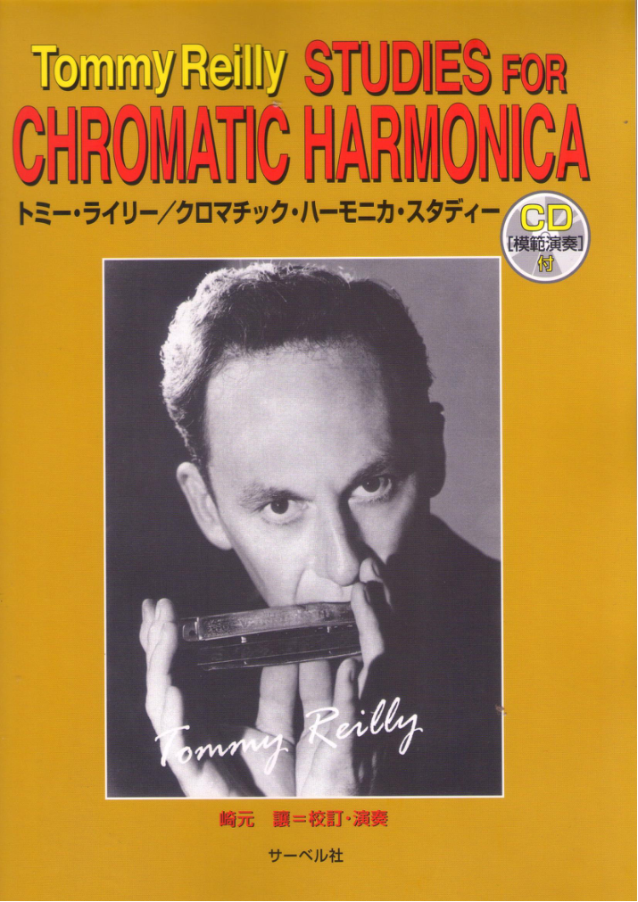
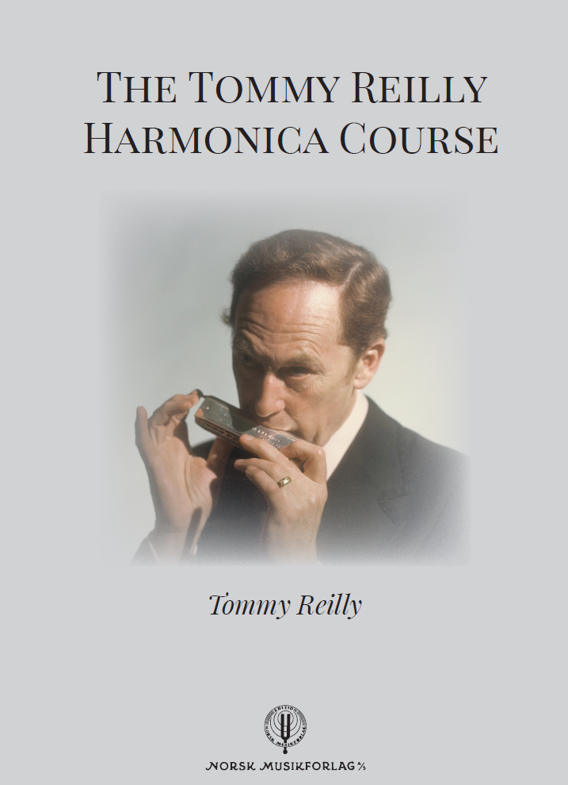
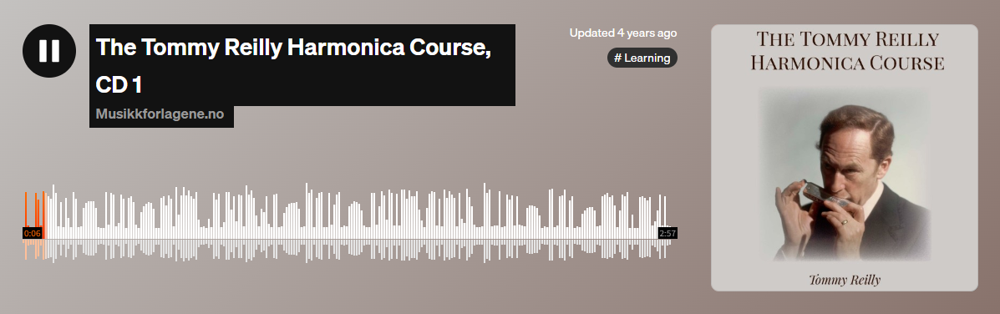
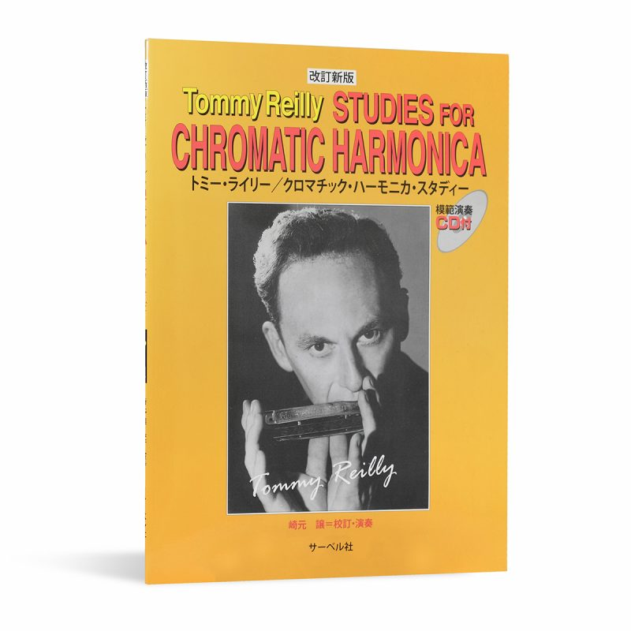
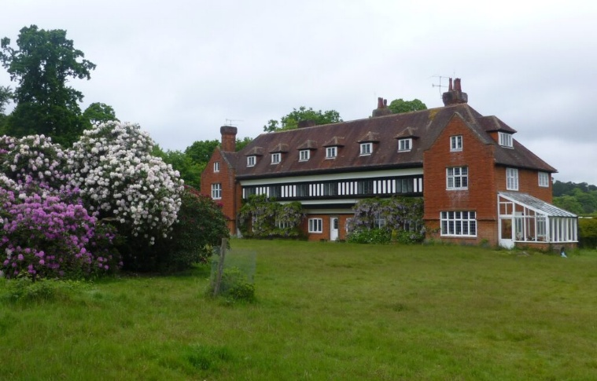
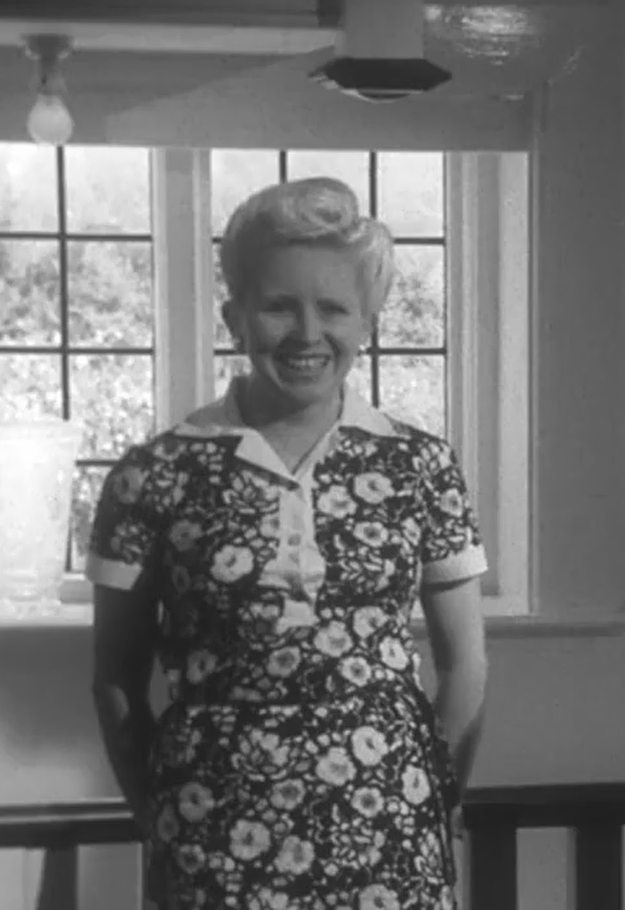
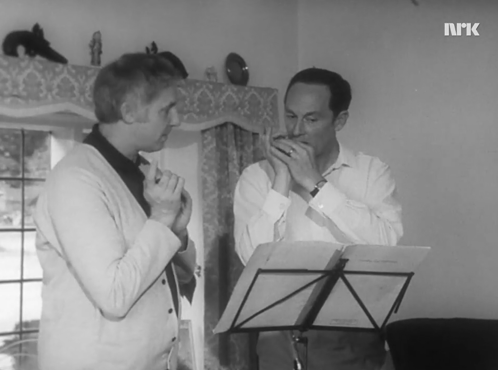
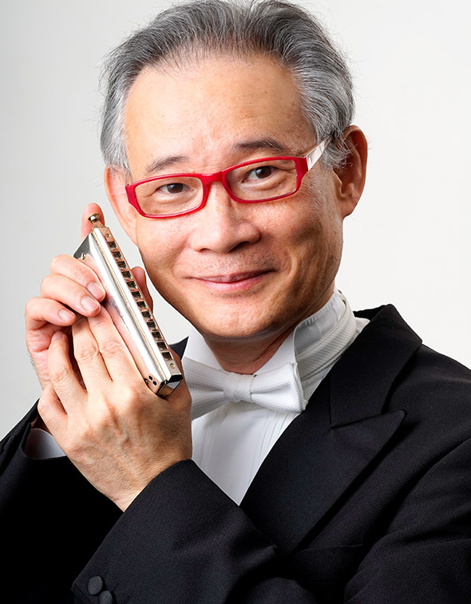
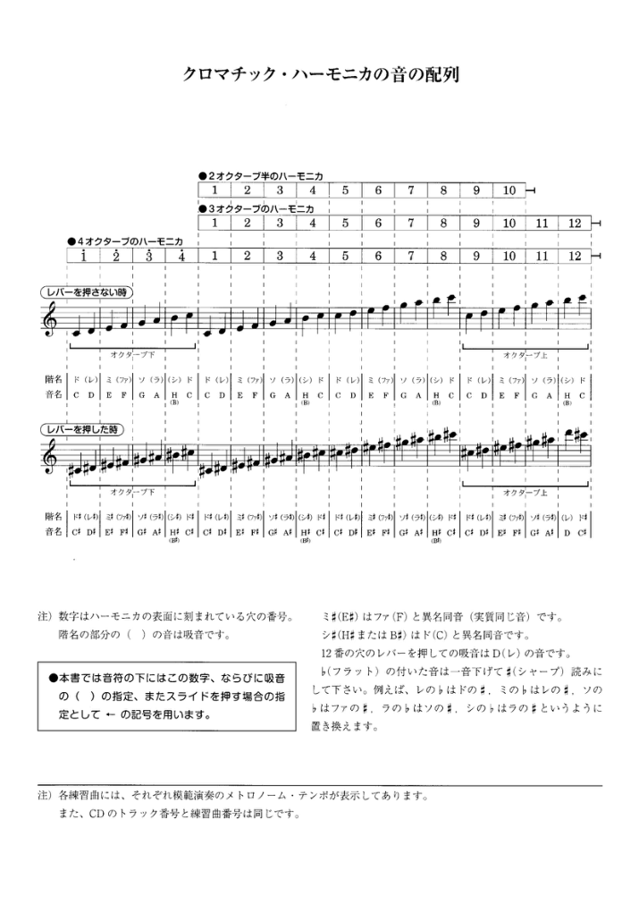
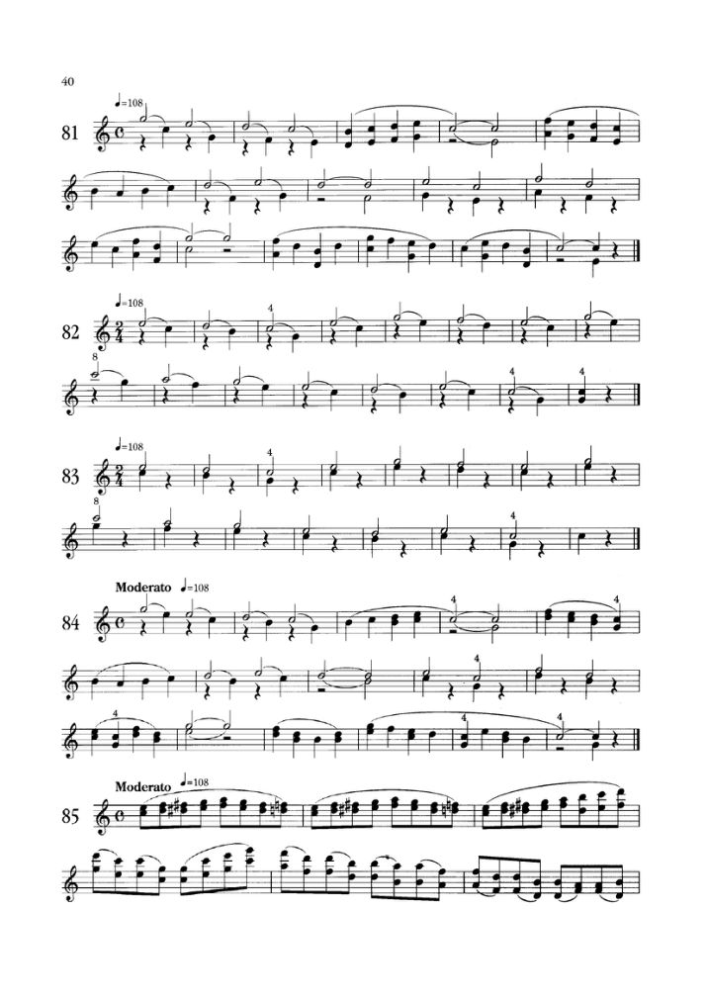

# 第七章 薪火相传：口琴教育奠基与传承

## 7.1 教学核心：以音乐表达为内核的技术训练

Tommy Reilly的一生，不仅是演奏家、作曲家的一生，更是一位伟大的音乐教育家的一生。他用数十年的时间，构建了一套完整、科学、系统的半音阶口琴教学体系，为口琴艺术的传承与发展，打下了最坚实的基础。而这套教学体系的核心，便是“以音乐表达为内核的技术训练”，这与他“技术永远服务于音乐”的演奏思想，一脉相承。

在Tommy Reilly之前，半音阶口琴的教学，始终处于“民间师徒制”的初级阶段，没有统一的教学体系，没有科学的训练方法，绝大多数教学，都只关注技术技巧的传授，却忽视了音乐素养的培养与音乐表达能力的提升。很多口琴学习者，能吹奏高难度的技巧，却看不懂总谱，听不懂和声，无法理解作品的音乐内涵，更无法完成有温度、有深度的音乐表达。

Tommy Reilly的教学体系，彻底颠覆了这种传统的教学模式。他从古典音乐院校的教学体系中汲取经验，结合口琴的乐器特性，构建了一套“技术训练与音乐素养同步提升，技巧掌握与音乐表达相辅相成”的完整教学体系。

这套教学体系，核心分为四个层级，层层递进，贯穿了口琴学习的全过程：

基础能力层：核心训练气息控制、单音纯净度、音准把握、按键精准度这四大基础能力。在这个阶段，他摒弃了传统教学中“快速上手吹旋律”的模式，要求学习者从长音、慢音阶练起，先打下扎实的基础，养成正确的演奏习惯，同时同步进行基本乐理、视唱练耳的训练，让学习者从一开始，就建立“音乐先于技巧”的认知。

技法进阶层：系统教授揉弦、滑音、颤音、快速音阶、连音、吐音等进阶技法。在这个阶段，他的教学，从来不是单纯的技巧示范，而是先告诉学习者，这个技法的音乐作用是什么，在什么样的音乐场景中使用，再进行技术要点的教学。他始终强调，“你只有知道这个技法是用来表达什么的，你才能真正掌握它”。

音乐诠释层：这是教学体系的核心。在这个阶段，他通过具体的作品，教授学习者如何分析作品的结构、和声、情感内核，如何处理乐句、把握强弱对比、调整音色变化，如何完成对作品的二度创作与个人表达。他的教学，从来不是让学生模仿自己的演奏，而是引导学生找到自己对作品的理解，形成自己的演奏风格。

艺术审美层：这是教学体系的最高层级。他会通过古典音乐史、作曲家生平、不同音乐风格的赏析，全面提升学生的音乐审美与艺术素养。他认为，一个演奏家最终能走多远，不取决于他的技术有多高超，而取决于他的艺术审美有多高。他希望自己的学生，不仅是优秀的口琴演奏者，更是全面的音乐家。

这套教学体系，彻底改变了半音阶口琴的教学格局，让口琴教学，从“民间经验传授”，变成了科学、系统、可传承的专业音乐教育。直到今天，这套体系依然是全球专业音乐院校口琴专业的核心教学框架。

小提琴式"演奏法：

Reilly的技术体系根植于小提琴训练背景。在TRIC教学中，他强调：

（1）左手持琴：模仿小提琴持琴姿势，追求稳定与灵活性的平衡

（2）右手推键：拇指根部操作，手腕保持自然舒适

（3）呼吸控制：运用"鼻吸口吹"技术，实现长乐句的连贯演奏

（4）音色观念：追求类似弦乐器的"歌唱性"音色，通过口腔空间变化实现音色层次

完美主义教学标准：

根据TRIC成员Carol Bloxsome的回忆，Reilly曾要求她花费至少20分钟练习4个连续音符，以达到其设定的音色与连接标准。这种极端的完美主义体现在教材编排中，表现为：

（1）慢速起步：所有练习均建议从60BPM或更慢速度开始，逐步提速；

（2）分段练习：强调不要通篇演奏，而是针对困难乐句进行"数百小时"的孤立练习；

（3）背谱要求：早期即要求脱离乐谱，建立听觉与触觉的直接联系。

## 7.2 经典教材的创作：教程与练习曲集

《Studies for Chromatic Harmonica》(绿皮书)原版封面,Tommy Reilly 肖像

Tommy Reilly对口琴教育的另一大伟大贡献，便是创作了一系列经典的口琴教材与练习曲集，这些教材，成为了半音阶口琴教育领域的“圣经”，陪伴了一代又一代的口琴学习者，其中最具代表性的，便是《The Tommy Reilly Harmonica Course》（1967，与James Moody合著）和《Studies for Chromatic Harmonica》（半音阶口琴练习曲集）两本核心著作。

早在1950年代，Tommy Reilly便开始了口琴教材的创作。彼时，随着他的演出与录音的传播，越来越多的人开始学习口琴，却没有一套系统、专业的教材，很多学习者因为错误的训练方法，走了弯路，甚至放弃了口琴学习。面对当时口琴教学资源的匮乏与演奏标准的混乱，为了解决这个问题，他结合自己的演奏经验与教学理念，耗时数十年，陆续创作了一系列完整的口琴教材。Reilly于1967-1971年间创立了Tommy Reilly International Club（TRIC），并在此期间编写出版了系统性教材。这些教材不仅记录了其技术体系，更体现了其"将口琴提升至弦乐器与木管乐器同等艺术地位"的教育理想。

Reilly的教材体系采用双轨制设计，分别面向不同层次的学习者：

| 著作名称 | 出版信息 | 目标群体 | 内容特点 | 配套资源 |
| The Tommy Reilly Harmonica Course | 1969年初版（Hohner，附2张LP唱片）； 2021年再版 | 初学者至中级 | 基础技术、音乐理论、渐进式练习曲 | 书籍+2张CD/磁带 |
| Studies for Chromatic Harmonica | 英文版、日文版多次再版 | 中高级演奏者 | 古典改编曲、高级技术训练、音乐会曲目 | 乐谱集（日版附带崎元譲的示范音频） |

值得注意的是，Reilly本人并不直接教授初学者。TRIC的入会要求明确显示，申请者需先通过《The Tommy Reilly Harmonica Course》达到基础水平，方可进入Hammonds Wood接受面对面指导。这种设计形成了"自学教材—精英俱乐部"的阶梯式教育模式。

### 《The Tommy Reilly Harmonica Course》（半音阶口琴演奏教程）

《The Tommy Reilly Harmonica Course》（半音阶口琴演奏教程），是他创作的第一本系统的口琴入门到进阶教材，也是半音阶口琴发展史上第一本对接古典音乐教学体系的专业教材。这本教材，完全遵循他的教学体系，从基础的乐理知识、演奏姿势、呼吸方法，到进阶的演奏技法、作品诠释，循序渐进，层层递进，每一个章节，都搭配了针对性的练习曲与乐曲，让学习者能一步步掌握口琴演奏的核心能力，同时同步提升音乐素养。

这本教材一经出版，便迅速风靡全球，被翻译成数十种语言，成为了全球口琴学习者的必修教材。哪怕是在出版半个多世纪后的今天，这本教材依然是半音阶口琴教学领域最权威、使用最广泛的教材，无数顶级口琴演奏家，都是通过这本教材，走进了口琴的音乐世界。

Norsk Musikforlag于2021年重新发行《The Tommy Reilly Harmonica Course》

该课程由Reilly与作曲家James Moody合作编写，Moody负责钢琴编配与音乐理论部分。课程设计遵循"模仿—分析—创造"的学习路径：

模仿阶段：通过配套的CD/磁带（现已上传到SoundCloud在线音频网站），学习者聆听Reilly的示范演奏，建立声音概念。

分析阶段：每课包含技术要点解析，如"吹单音时应保持口腔圆形，高音区需更开阔"。

实践阶段：渐进式练习曲，从《小星星》等简单旋律过渡到完整乐曲。

https://soundcloud.com/user-851383947/sets/the-tommy-reilly-harmonica-course-cd-1

https://soundcloud.com/user-851383947/sets/the-tommy-reilly-harmonica-course-cd-2

The Tommy Reilly Harmonica Course教材配套音频SoundCloud网站链接

根据BBC 1969年对TRIC的广播记录，Reilly在Hammonds Wood的教学采用一对一形式，课程常延长至2小时，重点纠正学生在自学过程中形成的"坏习惯"。这表明《Course》作为前置自学材料，其设计充分考虑了自学者可能遇到的技术误区，并通过系统练习预防错误习惯的形成。

### 《Studies for Chromatic Harmonica》（半音阶口琴练习曲集）

《Studies for Chromatic Harmonica》的初版时间为1954年，由伦敦John E. Dallas & Sons出版，甚至早于《The Tommy Reilly Harmonica Course》（1967）十多年。这表明该书是Reilly在战后重建职业生涯初期，将其在战俘营中发展的技术体系首次系统化记录的产物。值得注意的是，John E. Dallas & Sons是英国历史悠久的音乐出版社，以出版民谣与乐器教材著称。选择此出版社而非Hohner（后者出版了Reilly的其他著作），可能反映了Reilly希望将半音阶口琴定位为严肃古典乐器，而非仅仅是工业制造的民间乐器。几个版本：

（1）修订版（1959）：同一出版社，可能增加了部分练习曲或修正了初版错误；

（2）现代英文再版：通过Tommy Reilly官方网站（tommyreilly.co.uk）销售，具体时间约在2000年代初，现已停售；

（2）日文版：由日本田口乐器（Taniguchi-gakki）等渠道引进再版，日本口琴演奏崎元譲修订并示范演奏，在日文中常标注为「トミー・ライリー/クロマチック・ハーモニカ・スタディー」，也是目前网上唯一还能够买到的纸质版本。

《Studies for Chromatic Harmonica》共46页，收录超过90首练习曲（编号从No.1至No.90+），其曲目来源呈现鲜明的古典音乐导向：

巴洛克时期改编：包括J.S. Bach的《Partita a minor》（改编Louis Drouet原作）、Scarlatti奏鸣曲等，强调对位法与复调演奏技术；原创练习曲：针对特定技术难点设计的系统性练习，涵盖琶音(Arpeggios)、音阶跑动、连奏(Legato)等核心技术；民族风格作品：如《Valsentino》（快速圆舞曲）等展现技巧性与表现力的曲目。

| 章节 | 练习曲编号 | 核心技术目标 | 音乐风格来源 |
| Part One: Single Note Studies | No.1 - No.10+ | 单音纯净度、孔位精准、音色统一 | 原创练习曲 |
| Part Two: Intermediate Studies | No.11 - No.50+ | 音阶跑动、简单琶音、连奏技术 | 改编民谣、早期古典 |
| Part Three: Advanced Studies | No.51 - No.90+ | 复调音乐、复杂琶音、音乐会技巧 | Bach、Scarlatti、Rachmaninoff改编 |

Study No.1-10（基础单音）：其核心目标是解决半音阶口琴最基础的技术难题——单音纯净度。Reilly要求演奏者在第8-12孔（高音区）保持与第1-4孔（低音区）相同的圆润音色，这需要精确的口腔形状控制（'O'型嘴型）与呼吸压力调节。

Study No.90《Serenade》（小夜曲）：这是全书的标志性曲目，有Reilly本人的演奏录音传世。其技术难点在于：长线条乐句的呼吸规划（需运用鼻吸口吹技术），模仿小提琴揉弦的音色控制，推键（slide）与吹吸转换的平滑连接，多孔含法与多和弦切换吹奏。

《Partita a minor》改编：改编自J.S. Bach的无伴奏小提琴组曲（或Louis Drouet的长笛改编版），包含著名的"Gavotte en Rondeau"与"Gigue"等乐章。这体现了Reilly的核心教学理念——以小提琴技术为范本改造口琴演奏。

尽管《Studies》初版于1954年，但在1967-1971年TRIC运作期间，它仍是核心教材之一。根据BBC 1969年的广播记录，TRIC成员Carol Bloxsome（Axford）回忆，Reilly在Hammonds Wood的教学中使用了这些练习曲，但并非按顺序教学，而是根据学生具体问题选择性分配[6]。

TRIC的教学模式是：《The Tommy Reilly Harmonica Course》（1969）作为入门级自学材料（配备LP唱片示范），而《Studies for Chromatic Harmonica》（1954）作为中级到高级的技术精炼工具。这种"双轨制"设计体现了Reilly的教育分层理念。

根据意大利Conservatorio Santa Cecilia（圣切奇利亚音乐学院）公布的口琴专业课程大纲，《Studies for Chromatic Harmonica》的No.86-92号练习曲被明确列为第三学年（Triennio Primo Livello - III° anno）的必修技术材料。与之并列的教材包括：Gianluca Littera: 《70 esercizi e Studi Musicali progressivi》（No.53-70）；Luigi Oreste Anzaghi: 《25 capricci per Armonica a Bocca》

这表明Reilly的教材已被纳入欧洲正统音乐教育体系，与意大利本土口琴教材共同构成技术训练基础。

除了正式出版的教材，Tommy Reilly还留下了大量的教学视频、教学录音与手稿。这些珍贵的教学资料，完整记录了他的教学理念与演奏方法，成为了口琴艺术领域最珍贵的遗产。2000年他去世后，他的学生与合作者，将这些教学资料整理出版，让全球的口琴学习者，都能系统地学习到他的演奏体系与教学理念。

《Studies for Chromatic Harmonica》作为Reilly最早的教学著作（1954），其历史意义在于：

第一，技术标准化。在1950年代，口琴演奏普遍存在"民间习气"（如过分依赖颤音、忽视音准），Reilly通过这套练习曲建立了类似弦乐器的音准与音色标准。

第二，曲目经典化。通过改编Bach、Scarlatti等作曲家的作品，Reilly为半音阶口琴创建了最初的"标准曲目库"（Standard Repertoire），这些改编至今仍被音乐会演奏家使用。

第三，教育模板化。该书确立了"单音→音阶→琶音→乐曲"的渐进式教学路径，影响了后续所有半音阶口琴教材的编写逻辑，包括James Moody's《Little Suite》、Gordon Jacob的《Five Pieces》等。

## 7.3 教学传奇：TRIC国际口琴俱乐部

TRIC的诞生源于一位妻子的烦恼。

Tommy Reilly成名后，全球乐迷信件雪片般飞来。作为妻子的Ena Reilly承担了所有回信工作。当遇到技术问题时，她需要等到Tommy演出间隙请教后再回复。这项工作逐渐占据了她大量时间。约1965年，Ena提出了一个革命性的想法：与其分别回复数百封信件，不如建立一个俱乐部，让口琴爱好者们亲自来到家中，直接向Tommy学习，同时互相交流。

这一构想催生了TRIC——这不仅是教学场所，更是新作品的试验场和音乐家与作曲家的交流中心。

### Hammonds Wood庄园：全球口琴演奏者心目中的圣地

随着规模扩大，Reilly夫妇花费18个月寻找新址，最终购入了位于萨里郡弗雷纳姆村（Frensham, Surrey）的Hammonds Wood庄园。1967年，Tommy Reilly和妻子Ena在英国萨里郡的Frensham购买了名为"Hammonds Wood"的房产。这是一座拥有30个房间（一说14间卧室）的豪宅，坐落在10.75英亩（一说11英亩）的土地上，远离交通噪音。这座1905年的建筑成为了"口琴麦加"（Mecca for harmonica players）。

Hammonds Wood庄园——TRIC的所在地，全球口琴演奏者心目中的圣地

### 运营模式：非商业化的精英教育

会员制度：

入会费：10先令6便士（折合现今约55便士/0.55英镑）

会员编号：如保存至今的会员卡显示，最后一位会员编号为223号，有效期至1971年5月14日

服务：提供口琴界的各类信息服务，协助建立地方分会

教学定位：

不接收纯初学者：申请者需先通过《The Tommy Reilly Harmonica Course》（1969年出版，含书籍及2张LP唱片/磁带）自学至一定水平

一对一面授：Tommy坚持个别教学，无固定课程表

课时长度：名义上1小时，但常延长至2小时

无钢琴伴奏：教学房间不设钢琴，强调口琴的独奏技术与纯听觉训练

日常生活：

食宿：Ena亲自下厨，提供英式家庭料理（曾接待来自新加坡的Ho Chong Wing，教他吃煎饼并分享食谱）

氛围：无严格时间表，学员可练琴、听录音、喝茶聊天，"就像一个大家庭"

管理助手：儿子David Reilly、私人经理Sigmund Groven（挪威口琴大师）、偶尔James Moody（作曲家）协助管理

### Ena Reilly：家庭生活的温馨细节

Ena曾是战后伦敦大型歌舞秀的明星，是一位歌舞明星。Reilly在一场名为"Twinkle"的演出中遇到了Ena。他们的儿子David出生后，Ena放弃了自己的事业，全心全意支持Reilly的音乐事业。

"Tommy Reilly国际俱乐部"（Tommy Reilly International Club, TRIC）从1967年运营到1971年。来自世界各地的口琴演奏者来到这里，跟随Reilly学习。Reilly的教学不仅包括演奏技巧，还包括音乐理论、乐句处理、舞台表现等方面。

Reilly夫妇在"Hammonds Wood"的生活非常宁静简朴。Ena是一位出色的厨师，她的英式下午茶让学生和朋友赞不绝口。Reilly还热爱大自然，喜欢在花园中劳作，在温室里种植葡萄和番茄。他和Ena一直养狗，对动物福利非常关注，Ena多年来一直在英国动物福利组织RSPCA中非常活跃。

### Ena Reilly 与 Hammonds Wood 的生活（扩充）

说明:以下段落插入原 7.3《Ena Reilly:家庭生活的温馨细节》小节末尾。素材来源:Uwe Warschkow 书中 Ena 亲述与 Uwe 的观察。

### 舞台明星到"口琴之家"的女主人

Ena Reilly 战前与战后初期是伦敦大型歌舞秀与著名温泉胜地(Bournemouth、Eastbourne、Bath 等)的歌舞明星——用今天的话说,她是一位"音乐剧明星"。正是在战后歌舞秀《Twinkle》中,Tommy 与她相遇;彼时 Tommy 由战俘营结识的钢琴家 Frank Still 伴奏,定期在这些歌舞秀中演出。儿子 David 出生后,Ena 放弃了自己的舞台事业,全力支持 Tommy。

作为受过专业训练的舞者与歌手,Ena 对口琴事业最独特的贡献是舞台仪态:她亲自训练 Tommy 的学生如何在舞台上站立与移动。Uwe 观察到,Tommy 在舞台上优雅而从容的举止,正是 Ena 调教的成果;"我还从 Ena 那里学到了很多——此前我从没注意过这个相当重要的表演维度"。晚间一起看电视时,Ena 会指出哪位艺人的台步专业、哪位不够职业。

她还是"口琴之家"的总管:一位出色的厨师——Uwe 写道,她证明了"与普遍看法相反,英国菜也有其独特品质";TRIC 学员的食宿全由她操持,她甚至为新加坡学员 Ho Chong Wing 专门研究可口的食谱,教他吃英式煎饼。Tommy 则戏称她是自己的"英语教授"。

### 庄园漫步:Hammonds Wood 的空间记忆

Uwe 在书中细致记录了庄园的格局,为后人留下了珍贵的生活史资料:

庄园占地 10.75 英亩。从起居室望出去,是修剪整齐的大草坪,两侧是巨大的杜鹃花丛,草坪尽头的缓坡通向 Wey 河;右侧是长着大橡树的小树林;屋前高篱之内是种着小苹果树的野生花园,还有 Tommy 亲手种植葡萄与番茄的温室;左侧带暖房的区域是另一片大草坪,中央有池塘,再往前是暂租给邻居放马的草场。

室内:门厅挂着一幅 Tommy 音乐会的镶框海报;左廊通向书房与楼梯,右廊通向起居区与扩建的厨房;餐厅右侧是电视间,左侧是带大壁炉的客厅,旁边是体面的沙龙。楼上经采光门厅进入 Reilly 夫妇的私室与客房——其中一间后来被称为"Uwe 的房间",隔壁是"西格蒙德的房间"(Groven 作为 Tommy 的经纪人常驻)。顶层还有更多房间,自 TRIC 结束后便不再使用。

尽管宅邸气派,Reilly 夫妇却"没有任何势利气息",生活十分宁静简朴。两人都爱动物,家中一直养狗;Ena 多年来在英国动物福利组织 RSPCA 中十分活跃。1970 年挪威电视台(NRK)的摄制组正是来到这里,拍下了 TRIC 教学活动的珍贵影像——2025 年,Roger Trobridge 在 Sigmund Groven 帮助下为这部纪录片制作了英文字幕版,让"口琴麦加"的日常永远留存。

### 从辉煌到解散：1967-1971年

“我真羡慕那些有幸成为TRIC会员的人。这真是口琴历史上一个伟大的里程碑！ ”，新加坡口琴演奏家郑章明在2013 年《口琴世界》杂志上发表的文章中说道。

TRIC在1967-1971年间的四年间，确立了半音阶口琴作为严肃古典乐器的教学标准，创造了国际化的精英教育模式，其影响通过Reilly的学生网络延续至今，成为口琴教育史上不可复制的传奇。

1970年夏天，挪威电视台（NRK）带着摄制组来到哈蒙兹森林，拍摄了一部关于汤米在TRIC教学活动的特别节目。这部影片可以在NRK网站上观看。它配有挪威语配音，但没有演职员表。

最终，TRIC 于 1971 年解散。这对于 Ena 和 Tommy 来说都耗费了大量心血，而且他们没有任何经济赞助：会员费用经过大幅补贴，在 Hammonds Wood 待一周的费用甚至不足以支付伙食费；要兼顾 TRIC 的活动和 Tommy 繁忙的巡演日程以及其他工作安排也并非易事——1971 年，Tommy 52 岁，正值技艺、音乐素养和名气三方面都处于巅峰状态，他还需要为家人赚取更多收入，增加演出机会是显而易见的选择。

TRIC 项目的初衷并非为了盈利。除了收取低廉的学费外，Tommy 对学生十分友善，有时甚至会把钱返还给那些身无分文（或看起来）的学生，让他们买一双急需的鞋子。他把 TRIC 更多地当作一个聚会场所：结识志同道合的朋友，喝茶、吃美食、开怀大笑，顺带教授一些口琴课程；James Moody 也得以在这里尝试新的独奏与合奏作品。这位技艺精湛的世界顶级演奏家只收取几英镑的酬劳就传授他的秘诀，TRIC 在短短几年后逐渐走向衰落也就不足为奇了。即使在关闭 TRIC 之后，Tommy 也没有停止招收学生：他会在演出间隙，尤其是在夏季，继续招收一些精选的学生，并常在口琴节期间举办工作坊，让许多演奏者受益匪浅。

据档案记载，TRIC的活跃成员包括：英国的Carol Bloxsome（后名Axford）、Graham Butcher、Bryan Mapperley、Brian Chaplin、Frank Semus、Johnny Stafford、Wally Chapman，爱尔兰的John Ferguson，哥斯达黎加的Dimas Barrantes，新加坡的Ho Chong Wing，日本的Joe Sakimoto，香港的Ho Kit Fun，德国的Doris Ehmann、Brigitte Burgbacher、Helmut Herold、Heiner Schwenkglenks，瑞士的Ernst Hotan，荷兰的Peter Jansen，巴基斯坦裔英国的Tariq Hameed等。此外，美国的Richard Hayman、Jerry Murad等专业口琴家也是会员。1970年，会员们在莱斯特“手风琴与口琴日”上首演了James Moody的多首口琴合奏新作，参演者包括Reilly、James Hughes、Sigmund Groven、Brian Chaplin、Carol Bloxsome、Graham Butcher与Bryan Mapperley。

## 7.4 教学理念与方法的深入分析

Reilly的教学理念，深受他早年学习小提琴和与Spivakovsky合作的影响。他强调以下几个方面：

### 循序渐进的教学方法

Reilly的教学强调循序渐进。他的教材《The Tommy Reilly Harmonica Course》按照循序渐进的原则编写，从最基本的持琴姿势、呼吸方法开始，逐步介绍各种演奏技巧。

他特别强调慢速练习的重要性："不要在你确信能够准确掌握正确articulation和力度、没有错误之前，以比你觉得能够掌握的速度更快的速度演奏。我们这样做是为了避免最轻微的不准确变成永久性的。"

### 注重音乐性与歌唱性

Reilly的教学不仅仅是技术训练，更注重音乐性的培养。他认为，技术只是手段，音乐才是目的。

他经常鼓励学生"用口琴歌唱"："想象一位歌手会如何演唱。歌唱可以帮助你理解乐句的处理。"他认为，歌唱是理解音乐表达的最佳方式，通过歌唱，学生可以自然地感受到乐句的呼吸、高潮和结束。

### 倾听的重要性

Reilly非常重视倾听的训练。他说："你可能会惊讶，当我告诉你倾听自己的演奏是培养良好演奏技巧最重要的部分时。这适用于口琴，也适用于所有其他乐器。"

他教导学生，要批判性地倾听自己的演奏，注意每一个细微差别，包括音长、音色、articulation、力度、速度和乐句。他说："如果你的注意力始终放在批判性地倾听自己上，那么你就不会再草率地跳过某些段落。本能地，你会改善你的动作以及呼吸技巧。"

### 舞台表现与演奏心理

Reilly还非常注重舞台表现。他的妻子Ena作为受过专业训练的舞者和歌手，教导他如何在舞台上站立和移动。他教导学生：站立要稳定，双脚分开与肩同宽；身体要放松；头部要保持正直；手的动作要自然。

关于演奏心理，Reilly认为充分准备是克服紧张的最好方法。他建议用正面的想法取代负面的担忧，在演奏前做深呼吸帮助放松，将注意力集中在音乐上而不是观众的反应。

## 7.5 Tommy Reilly来自东西方的两大传承者

Tommy Reilly的教学传承，最直观的体现，便是他培养出了一大批世界级的顶级口琴演奏家。这些学生，不仅继承了他的演奏体系与艺术理念，更在全球范围内推广口琴艺术，让他的音乐火种，传遍了世界的每一个角落。其中，最具代表性的核心传人，便是挪威口琴大师Sigmund Groven（西格蒙·格罗文），与日本口琴大师Yasuo Watani（和谷泰扶）。

### Sigmund Groven（西格蒙·格罗文）：最正统的艺术继承者

Sigmund Groven，是挪威国宝级口琴演奏家，也是Tommy Reilly最得意的门生，被誉为“Tommy Reilly艺术理念最正统的继承者”。

Sigmund Groven出生于挪威的音乐世家，少年时期，第一次听到Tommy Reilly的唱片，便被他的演奏深深打动，立志要成为像他一样的古典口琴演奏家。16岁那年，Sigmund Groven远赴英国，拜入Tommy Reilly门下，开始了长达数十年的学习与合作。

在Tommy Reilly的悉心教导下，Sigmund Groven不仅全面掌握了他的演奏体系与技术技法，更深刻地理解了他“技术服务于音乐”的艺术理念。Tommy Reilly不仅教他演奏技巧，更教他如何理解音乐、诠释音乐，如何成为一名全面的音乐家。在老师的影响下，Sigmund Groven始终致力于古典口琴的演奏、创作与推广，沿着老师的道路，继续推动口琴在古典音乐领域的发展。

Sigmund Groven没有辜负老师的期望。他成为了历史上第一位在卡内基音乐厅举办独奏音乐会的口琴演奏家，与全球数十支顶级交响乐团有过长期合作，创作了大量的口琴原创作品，改编了无数的古典作品，让古典口琴艺术，在欧洲乃至全球，得到了更广泛的认可。他曾多次在采访中表示：“没有Tommy Reilly，就没有今天的我。他不仅是我的老师，更是我一生的精神导师，我所做的一切，都是为了延续他未完成的事业，让口琴这件乐器，在古典音乐殿堂中，拥有更重要的位置。”

### Yasuo Watani（和谷泰扶）：东方的传承与推广

Yasuo Watani（和谷泰扶），是日本顶级古典口琴演奏家，也是Tommy Reilly的重要传人，更是将Tommy Reilly的演奏体系与艺术理念，传播到亚洲的核心人物。

Yasuo Watani年轻时，远赴英国留学，拜入Tommy Reilly门下，学习古典口琴演奏。在学习期间，他被Tommy Reilly的演奏技艺与艺术理念深深折服，不仅系统学习了他的演奏体系，更深入研究了他的教学方法。学成归国后，Yasuo Watani在日本、韩国、中国等亚洲国家，大力推广Tommy Reilly的演奏体系与教学理念，培养了一大批亚洲的口琴演奏人才，让古典口琴艺术，在亚洲落地生根，蓬勃发展。

同时，Yasuo Watani还多次举办Tommy Reilly作品专场音乐会，录制了Tommy Reilly作品全集，撰写了大量研究Tommy Reilly演奏艺术的论文与教材，让亚洲的口琴爱好者，能全面、深入地了解Tommy Reilly的艺术成就。他曾说：“Tommy Reilly是半音阶口琴的奠基人，他为我们铺好了路，我们的责任，就是把这条路走得更宽、更远，让更多亚洲的人，认识到口琴这件乐器的艺术魅力。”

除了Sigmund Groven与Yasuo Watani，Tommy Reilly还有遍布全球的学生与追随者。这些音乐家，有的成为了职业独奏家，有的成为了音乐教育家，有的成为了口琴设计师、作曲家，他们都在自己的领域，延续着Tommy Reilly的艺术理念，推动着口琴艺术的发展，让他的薪火，代代相传。Reilly的学生遍布世界各地，包括德国、荷兰、日本、美国等。这些学生将Reilly的教学理念和演奏技巧传播到世界各地。

## 7.6 珍贵的学生指导回忆

### Sigmund Groven的回忆

Sigmund Groven（挪威著名口琴演奏家）是Reilly最得意的门生。他回忆道：

"我第一次见到Tommy是在奥斯陆，当时我只有14岁。他给了我一些练习的建议，还送给我一把口琴作为礼物。那天晚上，我甚至能和他一起听他们早上录制的录音。"

"我20岁时，Tommy邀请我在挪威电视的一个节目中与他一起演奏二重奏。那是一次令人兴奋的首次亮相，而Tommy的慷慨让我演奏独奏部分，他自己演奏第二声部。我们演奏了《音乐之声》中的《雪绒花》。"

"我记得一次与科隆广播乐团录音时，在演奏Francis Chagrin的《罗马尼亚幻想曲》的开头几小节后，指挥停下来说：'你演奏错了。'Tommy立即用流利的德语回答：'对不起，是您指挥错了。'乐团中的音乐家们微笑着，默默地鼓掌。"

### Uwe Warschkow的学习经历

Uwe Warschkow详细记录了在"Hammonds Wood"的学习经历：

关于Threnody的课程"：今天我们练习了Gordon Jacob《五首小品》中的第四乐章《挽歌》。Tommy说：'在第1小节，你必须吸气演奏所有音符。用按键演奏'c'。注意不要把音符分开。用一口气吹奏所有音符。首先不要揉弦。我们稍后会回到揉弦。他已经在第2小节后让我停下来了。他说：'口琴必须歌唱！想象一位歌手会如何演唱。歌唱可以帮助你理解乐句的处理。第1小节第3拍的'c'是通向第2小节回答的第一个乐句的高潮。因此，保持音量，不要让声音消失。在回答之前做一个小的呼吸停顿。'"

关于Caprice的课程："今天我们继续学习《随想曲》，特别是中间部分。但首先，我们看看'绿皮书'中的'练习10'，练习不同的断奏方式。Tommy说：'开始要非常慢，实际上要意识到硬而尖锐的断奏与软而宽的断奏（几乎像半连奏）之间的区别。他为我示范了。他说：'气息总是由喉咙推动的。现在轮到你了。'我练习了几次，他给予了耐心的指导。"

茶歇时光："英国人热爱他们的茶。在'Hammonds Wood'，一天的活动和职责只是通往下一次茶歇的桥梁。我必须承认，从来没有一杯茶像Ena Reilly的茶那样美味。看着她准备茶是一种特别的享受——在一个小茶壶里从茶叶中准备非常浓的冲泡，然后将冲泡倒入杯中，加入热水后，茶就完美了。"

### 陈冠斌参加大师课的经历回忆

他有一个习惯：每遇到一位口琴大师，他都会问同一个问题：「你的震音是怎么做出来的？」（"How do you produce your vibrato?"）

这个问题看似简单，实则涉及口琴演奏最核心的技术机密。然而，得到的答案通常都不令人满意，因为这些大师都没办法告诉一个一学就会的捷径。有些人说是"自然的"，有些人说是"练出来的"，但都没有给出具体的技术指导。

相较于其他口琴家，Tommy Reilly 的音色变化显然更为丰富而且有层次。他的音色不仅能温暖如丝绒，也能锐利如银铃；既能模仿弦乐的绵延，也能表现木管的清脆。这种多变性在口琴界是罕见的。

1998年，在 Dartington Music Summer School，陈冠斌终于有机会当面向 Reilly 提出这个困扰他多年的问题。他抓住机会问：「那丰富多变的音色是怎么做出来的？」（"How do you produce such rich and varied tone colours?"）

据陈冠斌的描述，当时的场景极具画面感：只见他（Reilly）遥望远方、充满禅意地慢慢吐出 "Imagination！" 就句点我了。这一个单词——"Imagination"（想象力）——让陈冠斌思考了20年、实验了20年，终究还是没有找到完全满意的答案。

在 Uwe Warschkow 后来出版的《Harmonica Lessons with Tommy Reilly》一书中，有整整4页的篇幅专门讨论 "Tone Colours"（音色），可见不只是陈冠斌，所有 Reilly 的学生和追随者都有同样的疑问。

### 课堂之外的音乐家日常

二十年的课程里,除了技术,还有大量珍贵的日常片段:拜访 James Moody 时,老搭档会弹着三角钢琴展示新作——《小奏鸣曲》——『我主要想着那些雄心勃勃的年轻演奏者,口琴的原创室内乐作品实在太匮乏了』;Ena 的茶是 Uwe 永远的怀念(『一天的活动和职责,只是通往下一次茶歇的桥梁』);某夜龙卷风掠过庄园,六棵百年橡树横在车道上,当天下午 Tommy 还要赶去与皇家爱乐乐团排练;还有他的录音室哲学——『录音室乐手必须是非常出色的视奏者,棚时昂贵,没有时间反复重来』。

## 7.7 Tommy Reilly关于音色问题的技术解密

Tommy Reilly对于半音阶口琴音色的掌控可谓到了出神入化的境界，陈冠斌先生找到了 Reilly 在1979年接受电台访问的录音。在这段珍贵的录音中，Reilly 详细示范了口琴音色的变化。即使英语听力不好也没关系，只要听前3分钟他对口琴音色的变化的示范，就能理解他的技术要点，这是关于Tommy Reilly半音阶口琴音色的唯一详细揭秘与阐述。

其实道理在他的教材中一再提过，这是一个系统性的技术框架，涉及四个变量的精密控制：

温暖音色（Warm Tone）公式：

口琴含深一点（同时喉咙张开） + 手掌密合（完全闭合） = 温暖的音色

强烈音色（Bright/Penetrating Tone）公式：

口琴含浅一点（同时嘴唇用力一点） + 手掌打开（微张） = 强烈的音色

Reilly 解释，这四个要素可以组合出无限的变化：

音色变化的四要素公式

气流强弱变化（Air pressure dynamics）

+ 口琴含深含浅（Mouthpiece depth / Embouchure aperture）

+ 嘴唇肌肉控制（Embouchure muscle control）

+ 手掌闭合幅度变化（Hand cupping resonance chamber）

→ 就可以幻化成无数的音色变化

陈冠斌在理解这个原理后感慨道：

道理就是这么简单，接下来再努力不懈怠地练习20年，(或许、大概、可能)就可以学会了。

这句话既道出了技术学习的艰辛，也暗示了 Reilly 技艺的高深——简单的原理，需要数十年的磨练才能真正掌握。

Uwe Warschkow 的书中还深入探讨了 Reilly 音色哲学的另一个层面：音色不仅仅是技术问题，还牵涉到演奏者的生理结构与心理及精神状态。

Reilly 曾对 Uwe 说，他认为 Uwe 是一个冷静认真的人，所以不自觉地会追求所谓"完美"的声音。但 Reilly 强调：

"But music is not notes, music is feelings."（但音乐不是音符，音乐是情感。）

既然是感情就会有喜怒哀乐，就不该是只有单纯一种所谓完美的声音。Reilly 认为，完美的音色在某些情况下反而是不恰当的——在悲伤的乐段中，音色可能需要一些"粗糙感"或"裂痕"来表达情感。

这一哲学深刻影响了陈冠斌的理解。他在后来写道：所以要是做不出像 Reilly 那样丰富的音色变化，至少可以安慰自己是個『单纯正直』的人。——这句话既是自嘲，也是对 Reilly 哲学的领悟：每个人的性格决定了他们的音色，强求不得。

在讨论不同口琴的音色时，新加坡好友郑章明 Cheng Jang Ming（YouTube 古典半音阶口琴演奏点阅率唯一破百万者）也提过类似的道理：每个人潜意识里对口琴音色都有某种既定的想法，所以不管你吹 Polle 银口琴或是 Easttop，都会朝着内心追求的音色去发展，最后听起来都是一样的。这意味着，器材只是工具，真正的音色来自演奏者的内心想象——这与 Reilly 的"Imagination"理念不谋而合。

Tommy Reilly 不仅音色变化丰富，他还擅长模仿其他口琴家的演奏，这显示了他对音色控制的绝对掌握能力。

有次 Uwe Warschkow 在 Reilly 家中听他过去的演奏录音，其中却混着一首 Jerry Murad's Harmonicats 的 "Peg O My Heart" 。这让他感到非常疑惑：为什么 Reilly 会演奏这首著名的三重奏乐曲？

Reilly 笑着解释说，Jerry Murad 是他的好朋友，Harmonicats 的唱片他大多听过。当时有出电视剧找他录音，制作人非常属意 "Peg O My Heart" 这首曲子（这是 Harmonicats 1947年的超级畅销曲，创下金氏世界纪录），还找来一位手风琴家跟他搭配。

制作人要求 Reilly要吹得跟 Murad 一模一样。Reilly 凭借他对 Murad 演奏风格的深入了解，完美地模仿了 Murad 的音色和 phrasing。

后来 Murad 到 Reilly 家中作客，Reilly 特地送了这卷录音带给 Murad。Murad 听完当场笑着大骂：

「你这个浑蛋！」（"You bastard!"）

到底模仿得有多逼真已不可考，但这显示了 Reilly 对音色的绝对控制能力——他不仅能创造自己的音色，还能精确复制他人的音色特征。

### 课堂上的音色训练:渐变与颤音体系

Uwe 的实录还记录了 Reilly 的音色训练法:从一个最硬、最尖锐的强奏长音开始,在气息不中断的情况下逐渐过渡到最软、最圆润的弱奏长音,再反向过渡,全程保持音准稳定——这一练习整合了双手开合(共鸣箱)、唇与喉头的状态、气息压力三个变量。颤音则按音区分工:『我只在第六孔以下的低音区使用喉咙颤音,第七孔以上的高音区只用手的颤音』——高音区簧片极小,喉颤音会导致音准摇摆;手颤音绝不能完全闭合双手,『那会产生哇哇音,让音准偏低』。颤音必须与节奏、与弦乐声部对齐,『颤音是调味品,而不是主菜』。

## 7.8 口琴教育的全球化推广：从院校课程到国际传播

Tommy Reilly对口琴教育的贡献，不仅在于培养了一批顶级的演奏家，更在于他推动了口琴教育的全球化、专业化发展，让口琴这件乐器，第一次走进了专业音乐院校的课堂，成为了正式的音乐专业学科。

在Tommy Reilly之前，全球没有任何一所专业音乐院校，开设口琴专业。口琴被视作民间业余乐器，根本没有资格进入专业音乐教育体系。而Tommy Reilly，用自己一生的努力，彻底改变了这个局面。

早在1960年代，Tommy Reilly便开始与英国皇家音乐学院、皇家北方音乐学院等英国顶级音乐院校合作，开设口琴大师班与选修课，让专业音乐院校的学生，第一次系统地接触到古典口琴演奏。他用自己的演奏实力与教学成果，向古典音乐教育界证明，口琴是一件值得被纳入专业音乐教育体系的严肃乐器。

在他的持续推动下，1970年代，英国皇家音乐学院正式将半音阶口琴纳入了学院的正式专业课程，设立了口琴专业的本科与硕士学位，这是全球音乐史上，第一次有顶级音乐院校设立口琴专业。这一事件，是口琴艺术发展史上的里程碑，标志着口琴这件乐器，正式得到了专业古典音乐教育界的认可。

随后，在他的学生与追随者的推动下，挪威音乐学院、德国汉诺威音乐学院、日本东京艺术大学、中国中央音乐学院等全球数十所顶级音乐院校，陆续开设了口琴专业课程，设立了口琴专业学位。口琴教育，正式进入了全球化、专业化的发展阶段。

同时，Tommy Reilly还通过国际口琴节、大师班、比赛等形式，在全球范围内推广口琴教育。他曾多次担任世界口琴节的艺术总监与评委，开设大师班，将自己的演奏体系与教学理念，传授给来自全球的口琴爱好者。他还推动设立了多个国际口琴比赛与奖项，鼓励年轻的口琴演奏者成长，为口琴艺术的发展，培养了大量的后备人才。

直到今天，全球的专业音乐院校口琴专业，依然在使用他创作的教材，遵循他构建的教学体系。他用一生的努力，为口琴教育搭建了完整的框架，让口琴这件乐器，从民间的业余爱好，变成了一门专业的、系统的音乐学科，这是他留给口琴艺术最伟大的遗产之一。

《Tommy Reilly Harmonica Course》于2006年由Barbara Tate（Douglas Tate遗孀）数字化再版，2021年由Norsk Musikforlag以书籍+2CD形式重新发行，证明了其持续的教学价值。

Uwe Warschkow的电子书《Harmonica Lessons with Tommy Reilly》（208页，含大量照片和乐谱示例）是基于长期学生视角的珍贵文献。

### 英国口琴组织生态补笔

Reilly父子所处的英国口琴组织生态值得一提：1935年，Hohner公司成立“Hohner歌曲乐队联盟”（Hohner Songband League，HSBL），James Reilly应召回国担任其音乐总监；二战后，该联盟于1951年改组为“国家口琴联盟”（National Harmonica League，NHL），Ronald Chesney担任首任主席，Reilly父子均为核心成员；1981年，NHL在John Walton领导下脱离Hohner独立，创办了《Harmonica World》杂志——郑章明等TRIC学员回忆口琴界的文章即发表于该刊。这一组织网络为Reilly的教学与推广活动提供了重要土壤。

| 英文 | 中文 | 说明 |
| --- | --- | --- |
| legato | 连奏 | 音与音之间平滑连接 |
| staccato | 断奏 | 音与音之间短促分离 |
| slide | 滑键 | 半音阶口琴的按键,按下可升高半音 |
| articulation | 发音法 | 各音的起音与连接方式 |
| phrasing | 乐句处理 | 对乐句的划分与塑造 |
| trill('tr') | 颤音 | 相邻两音快速交替 |
| grace note | 倚音 | 装饰音 |
| upbeat | 弱起 | 从小节弱拍起的起句 |
| blow / draw | 吹 / 吸 | 吹音 / 吸音 |
| sixteenth note / thirty-second note | 十六分音符 / 三十二分音符 |  |
| eighth note / quarter note | 八分音符 / 四分音符 |  |
| dotted half note | 附点二分音符 |  |
| full value | 完整时值 | 音符应吹足的长度 |
| crescendo / diminuendo | 渐强 / 渐弱 |  |
| piano / forte | 弱 / 强 |  |
| ritardando / accelerando | 渐慢 / 渐快 |  |
| agogics | 缓急法 | 为表情而作的速度微调 |
| dynamics | 力度变化 | 强弱层次 |
| accent | 重音 |  |
| syncopation | 切分 | 重音落在弱拍 |
| pizzicato | 拨弦 | 弦乐用手指拨奏 |
| sordino | 弱音器 | 加弱音器的(闷)音色 |
| espressivo | 富有表情地 | 意大利语表情记号 |
| piu mosso | 更快 | 意大利语速度术语 |
| breathing pause | 换气 | 乐句间的呼吸停顿 |
| circular breathing | 循环呼吸 | 边吹边用鼻吸气的技巧 |
| up-bow / down-bow | 上弓 / 下弓 | 弦乐弓法 |
| coda | 尾声 | 乐曲结尾段 |
| Cradle Song / Caprice / Threnody / Country Dance / Russian Dance | 摇篮曲 / 随想曲 / 挽歌 / 乡村舞曲 / 俄罗斯舞曲 | Gordon Jacob《五首小品》五个乐章 |
| Studies for Chromatic Harmonica | 《半音阶口琴练习曲集》 | 俗称"绿皮书" |

## 7.9 十七课实录精要:Uwe Warschkow 的课堂笔记

德国会计师 Uwe Warschkow 从 1978 年起每年到 Hammonds Wood 跟随 Reilly 学习一周,直至 2000 年大师去世,前后二十余年。他把这段经历写成了《Harmonica Lessons with Tommy Reilly》,以 Gordon Jacob《五首小品》为教材,逐课记录了 Reilly 的教学过程。以下为该实录的核心内容提炼。

### 第一原则:头部稳定,移动乐器

第一课从《摇篮曲》开始,Reilly 首先纠正的是"最根本的错误"——移动头部去对准音孔:

"你的头部必须始终保持稳定,只有口琴在移动。否则你永远无法对演奏拥有绝对的控制,也永远无法实现完美的连奏。"

他把这一原则拆解为一套可操作的体系:

- **最短路径**:从一个音孔到另一个音孔,永远走最短的直线、用最小的动作。吹奏相邻音孔时可通过轻微倾斜乐器缩短移动距离,大跳时必须保持琴身水平。

- **嘴唇永不离琴格**:即使八度、两个八度的大跳,嘴唇也要贴住琴格滑过去,在前一个音还在发声时就完成移动——"你的嘴唇上不应该看到任何动作"。

- **舌头引导**:舌尖的触感控制着在吹嘴上的滑动位置。

- **持琴如戴羔皮手套**:拇指在底盖板、食指在顶盖板,轻轻握住,绝不用力挤压;左臂像支架一样完全放松,移动由右手腕驱动。"任何紧张都会影响你的演奏。"

- **镜前练习**:每天对着镜子检查头部是否移动、动作是否多余。

绿皮书练习1:全曲由相邻音孔的十六分音符构成,专为连奏与运琴训练设计

### 连奏:口琴的灵魂

连奏(legato)在 Reilly 教学体系中的地位至高无上:"《摇篮曲》看起来最容易,却是整部组曲中最难的乐章——只有当演奏者能够连奏时,才能打动听众。我在各种口琴比赛里当评委,几乎所有的参赛者都能演奏高难度的炫技曲目,但几乎没有人能真正连奏。"

连奏的核心是"持续气息流":吹与吸的切换在喉咙处瞬间完成,没有任何中断与力度变化。他定下的标准近乎苛刻:"最终的效果应该是,没有人能听出你什么时候在吹、什么时候在吸。这是口琴演奏中最困难的挑战。"

配套训练包括:每个音吹满时值("每一个音都重要");以乐句为单位思考("没有音乐家是一个音一个音思考的");哼唱乐句以把握张力走向;换气只发生在乐句之间,在乐句中间换气会"破坏音乐的弧线";以及"按键编辑"——乐谱上的 C 与 F 各有两种奏法,上课第一件事就是在谱上标记每个 C、F 的奏法,选择最适合乐句表达的方案,"你以后演奏每一首曲子,都应该这样做"。

### 歌唱与断奏:挽歌与随想曲

挽歌(Threnody)课强调"唱":"挽歌的标题是悲歌,它的核心就是'唱'。你要像歌剧咏叹调那样,用口琴唱出悲伤的旋律。"乐句处理上,第一小节第三拍的 C 是通向下一乐句的高潮,"保持音量,不要让声音消失;在回答之前做一个小的呼吸停顿"。

随想曲(Caprice)课把发音法推向系统:断奏(staccato)"几乎就像咳嗽,气息由喉咙压进孔里",而非舌尖撞击琴格;硬而尖锐的断奏与软而宽的断奏(几乎像半连奏)需要慢速练习以感受区别;断奏与连奏的连接、强与弱的对比必须清晰可闻;快速段落的音符时值必须均匀——"宁可慢,也要准"。

### 小夜曲:双音的平衡

小夜曲(Serenade)是 Reilly 自己的作品,也是训练双音的最佳教材。这首曲子速度缓慢(Moderato),"能否奏出完美的连奏,是最重要的"——他曾感叹某届世界口琴节上"几乎没有一个参赛者能把它吹对"。

双音教学的要点:三度、六度双音必须完全平衡融合,"像同一个声音一样";六度双音含四个音孔、八度双音含五个音孔,舌尖位置控制被堵住的中间音孔;在持续气息流上用喉部断奏切分音符,练就"气息不断、音符断开"的控制力;从单音长音起步,先练气息持续,再叠加双音。

### 舞曲的律动与八度大跳

乡村舞曲(Country Dance)三课的核心是"律动":强弱段落之间速度必须一致,"无论强弱,律动和速度必须保持稳定";口琴的力度范围不如其他管乐器宽,"要始终特别注意,有意识地用足口琴的全部力度范围";双八度跳进要找到"一次连贯运动"的感觉,练到绝对有把握命中为止。

针对八度大跳,Reilly 指定绿皮书练习38 为必修课——这条贯穿所有调性的练习专为培养"八度的距离感"而设计:移向八度音时手腕与手臂保持松弛;把"移向下一个八度的大动作"与"移动到二度的小动作"结合起来,各自奏足时值;"每一条练习曲也都应该演奏得富有音乐性";动作内化之后,学新曲子遇到八度音程就能自动反应。

绿皮书练习38:贯穿所有调性的八度大跳练习

俄罗斯舞曲(Russian Dance)作为全曲技术巅峰,用了五课打磨:无舌堵的三度双音与鼓点般精准的重音;快速音阶中"肌肉一紧张,流畅的动作就无从谈起";滑音靠口腔形状与气息角度实现;强奏段落先不追求音色优美,"试着把这一段尽可能响亮地结束";Andante con moto 段落要形成清晰的力度层次;进入 piu mosso 尾声时动作更小更省,头与身体纹丝不动。贯穿五课的方法:难点段落孤立练习、极慢速确保均匀精准后再提速、练习时绝不犯错。

### 教学法九条

纵观十七课,Reilly 的教学法可以归结为:头部稳定,移动乐器;持琴如戴羔皮手套;连奏是口琴的灵魂,吹与吸必须无法分辨;每一个音都重要;以乐句为单位思考,哼唱是理解乐句的最佳方法;慢练是唯一安全的提速方式("宁可慢,也要准");永远不要在缺乏专注的情况下练习;倾听自己的演奏;技术永远服务于音乐——"你首先是一个音乐家,其次才是一个口琴演奏者"。
