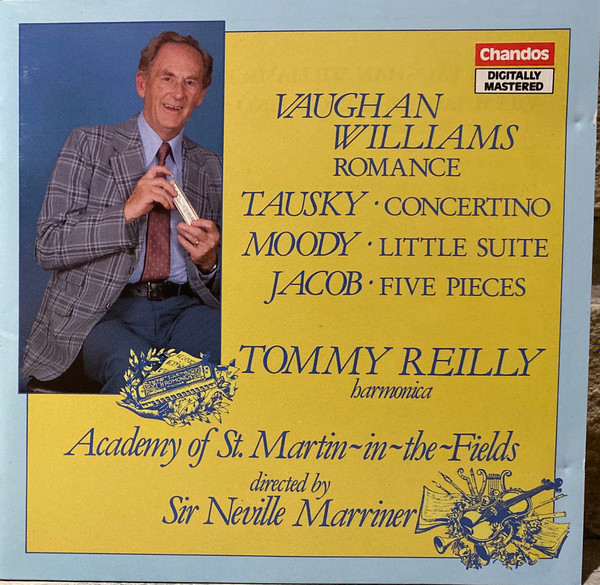
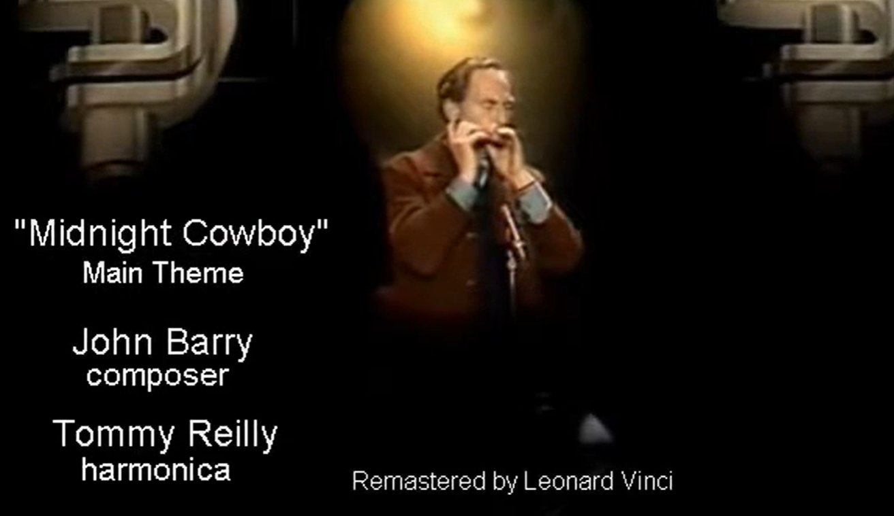
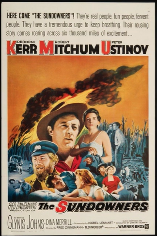

# 第十章 录音、演出与跨界合作

## 10.1 与圣马丁室内乐团的合作

Tommy Reilly与圣马丁室内乐团（Academy of St Martin-in-the-Fields）的合作，是他艺术生涯中最辉煌的篇章之一。这一乐团由Neville Marriner于1958年创立，以清晰的纹理、精确的节奏和优雅的风格著称，成为二战后"古乐运动"之外最具影响力的英国室内乐团。Reilly能够成为其常规独奏伙伴，表明其演奏风格与乐团的美学理念高度契合。

他与乐团录制了两张专辑，包括多部口琴协奏曲和独奏曲，被认为是口琴音乐的里程碑。

指挥家Neville Marriner评价道："学院乐团最初的许多抱负都体现在Tommy的音乐才能中：技术上，他以最小的fuss实现了卓越的virtuosity。音乐上，他以精致和华丽的方式开发他的乐器，最终似乎重要的不是他演奏什么，而是他如何演奏。"

## 10.2 重要录音与演出回忆

Reilly的重要录音包括《Tommy Reilly Plays Harmonica Concertos and Virtuoso Works》（1993，Chandos唱片），收录了Spivakovsky、Farnon、Jacob的作品；与Sigmund Groven合作的《Colours of my Life》（1968）；以及多张与BBC、挪威广播、德国广播、荷兰广播等合作的录音。

难忘的演出经历1951年《不列颠节》首演：在伦敦广播大楼音乐厅首演Spivakovsky《口琴协奏曲》，标志着口琴正式进入古典音乐殿堂。

1953年斯图加特"轻音乐周"：获得巨大成功，立即带来了欧洲各地广播和电视的邀请。

1953年奥斯陆《流浪者之歌》录音：带有现场观众的掌声，记录了历史演出的直接氛围。

1966年挪威国王面前的演出：在奥斯陆首演Farnon《前奏曲与舞曲》，挪威国王Olav V出席。

世界各地的音乐节：参加过英国的Proms、荷兰的Holland Festival、德国的Bayreuth Festival等。

## 10.3 电影配乐领域的突破

Reilly在电影配乐领域最著名的贡献是1969年电影《午夜牛郎》（Midnight Cowboy）的主题曲演奏。这部由John Barry作曲、获得奥斯卡最佳影片奖的电影，其主题曲的口琴独奏成为电影音乐史上的经典时刻。口琴的孤独、忧郁音色与电影中纽约底层生活的叙事完美契合，创造了强烈的情感共鸣。Reilly的演奏赋予了这一主题以深刻的抒情性和记忆点，使其成为口琴在严肃电影音乐中应用的标杆案例。

很多人不知道中间这段故事，所以常常搞错。总之你在网络上看到听到的所有电影原声带录音或影片剪辑的配乐都是 Reilly 演奏的，要听 Thielemans 演奏这首曲子只能看电影或听他现场演奏。

1969年发行的奥斯卡最佳影片《午夜牛郎》(Midnight Cowboy)，电影里的主题曲大家都知道是 Toots Thielemans 吹的，但后来发行电影原声带时却改由 Tommy Reilly 演奏。

Toots Thielemans 是比利时爵士口琴大师，其演奏版本出现在电影正片中，而 Reilly 版本出现在官方原声带专辑中。这一替换的原因至今未有确切解释，但很可能与当时唱片公司的商业决策或音乐风格取向有关。Reilly 的版本更加古典化，而 Thielemans 的版本则带有明显的爵士风格。

除《午夜牛郎》外，Reilly还参与了多部重要电影的配乐工作，包括1960年的《漂泊者》（The Sundowners）等。这些作品的共同特征是充分利用了口琴音色的叙事潜力——其既能够表达民间的、乡土的情感，又能够承载现代的、都市的孤独感。Reilly的技术精确性和音乐表现力使他成为电影作曲家的首选口琴独奏家。

Reilly的指挥家合作网络涵盖了古典、轻音乐和电影音乐等多个领域。在古典领域，他与Neville Marriner、Charles Gerhardt、Cedric Dumont等指挥家合作录制了多部协奏曲；在电影音乐领域，他与Bernard Herrmann、Elmer Bernstein、Dimitri Tiomkin、Maurice Jarre、Jerry Goldsmith和John Barry等著名作曲家-指挥家合作，为众多电影配乐演奏口琴独奏。

### 从《漂泊者》到《北京55日》：其他影片与电视主题

说明:以下段落插入原 9.3《电影配乐领域的突破》末尾,与 9.4 年表衔接。

### 从《漂泊者》到《北京55日》:好莱坞配乐大师们的首选口琴

1960 年,Reilly 为弗雷德·津纳曼执导的《漂泊者》(The Sundowners)录制了主题音乐——Dimitri Tiomkin 作曲的《Theme from "The Sundowners"》与《Down Under》,由 Wally Stott 管弦乐团伴奏(Philips PN 1094 单曲;1961 年又以《Harmonica Magic》EP 形式再版,收入《Yokohama Holiday》等曲目)。这部讲述澳洲内陆放牧家庭的电影,其口琴声部天然契合"民间的、乡土的情感"。

1963 年,他为尼古拉斯·雷执导的史诗片《北京55日》(55 Days at Peking)录制了《So Little Time》与《Moon Fire》两首插曲(Tiomkin 作曲,Philips PB 1248,与 Ivor Raymonde 合唱团及乐队合作)。同年他还为德国西部片录音(《Dakota》《S.O.S.》,Oriole CB 1833,The Tradesmen 伴奏)。

1970 年代,他的电影配乐触角延伸至北欧:1976 年挪威动画长片《Flåklypa Grand Prix》(《孤筏重洋》?注:挪威经典动画,国内多译《弗莱克拉帕大奖赛》)由 Bent Fabricius-Bjerre 配乐,全部口琴声部由 Reilly 演奏(Polydor 2382 066 原声专辑);1979 年英国电影《Tarka the Otter》由 David Fanshawe 配乐,Reilly 与器乐重奏组演奏(Argo ZSW 613)。

1981 年,他为德国著名的 Winnetou 西部片系列录制了《Winnetou Melodien》专辑(Teldec 6.24965 AS):《Old Shatterhand-Melodie》《Apanatschi》《Winnetou Melodie》《Grand Canyon-Melodie》《Chinla-River-Song》,全部由 Martin Böttcher 指挥慕尼黑广播乐团伴奏——Böttcher 正是 Winnetou 系列电影的配乐作曲家本人。

1994 年,伯纳德·赫尔曼(Bernard Herrmann)的遗作《Night Digger》配乐由 X 厂牌以 CD 形式再版(LXCD 12),其中《Scenario Macabre for Orchestra》收录了 Reilly 的口琴演奏——由赫尔曼本人指挥 Sessions of London 乐团。同年,他还在加拿大作曲家 André Gagnon 的专辑《Romantique》(Star STR-CD-8057)中客串了口琴声部(曲目《Le pianiste envolé》,John Coleman 指挥国家爱乐乐团)。

### 英国电视的黄金时代:口琴主题曲

Reilly 为英国电视剧与广播喜剧留下了多首脍炙人口的主题曲:

- **1953 年**《The Night of the Fourth》主题曲(Parlophone R 3693,Eric Spear 指挥)——注意:此曲并非 Reilly 创作,作曲者为 May,常被误记为 Reilly 作品。

- **1954 年** BBC 家庭剧《The Grove Family》主题曲《Family Joke》(Eric Spear 作曲,Parlophone R 3860)。这首曲子后来作为制作音乐被广泛使用。

- **1958 年** ITV 警匪剧《Dixon of Dock Green》主题曲《An Ordinary Copper》(Oriole CB 1426,与主演 Jack Warner 合作演唱)。这是英国电视史上最著名的口琴主题之一。

- **1960 年** BBC 广播喜剧《The Navy Lark》主题曲(Hohner T 4007)。Reilly 与 James Moody 合创了这首后来成为经典的旋律;制作音乐专辑中的《Trade Wind Hornpipe》即是其主题音乐的管乐改编版。1996 年 EMI Premier 的《Vintage Themes from British Radio, Television & the Newsreels》专辑收录了这两个主题的原始录音。

### 制作音乐库:笔名背后的庞大曲库

除了商业录音,Reilly 还为生产音乐库(Production Music Library)录制了数百首曲目——这些短小的功能性音乐被用作电影、电视与广播的背景音乐。他与 James Moody、儿子 David Reilly 合作,使用多个笔名——**Max Martin、T Rundle、Dave Holland、Dwight Barker**——为 Conroy、Berry Music、Chappell、Weinberger(JW Media Music)、AudioBMP、Boosey and Hawkes 等公司录制了大量音乐。

其中 Conroy 公司的制作音乐专辑《Harmonica》(KCR0160,29 分钟,49 首)是 Reilly 与 Moody 各占 50% 版权的作品集,曲目包括《Sophisticated Party》《Wind In Her Hair》《Trade Wind Hornpipe》《Child's Play》《Hurry Hurry》《Pins And Needles》《Night Out》《Shooting The Rapids》《Alley Cat》《Mirabelle》等——每首只有几十秒到一分钟,是"功能性音乐"的极致体现。

值得注意的是,Reilly 在唱片上署名 "T. Rundle" 或 "Rundle-Morris"(与 Moody 合用)的作品(如《Esmeralda》《Tokyo》《No Time》),正是这一笔名系统的延伸——"Rundle" 取自他的本名 Thomas Rundle Reilly。

## 10.4 电影与电视配乐年表

Reilly的口琴声出现在大量电影、电视与广播配乐中。以下年表依据Groven唱片目录整理：

• 1953年 电影《The Night of the Fourth》主题曲（Parlophone R 3693，Eric Spear指挥）；

• 1954年 BBC剧集《The Grove Family》主题曲《Family Joke》（Eric Spear，Parlophone R 3860）；

• 1958年 剧集《Dixon of Dock Green》主题曲《An Ordinary Copper》（Oriole CB 1426，与主演Jack Warner演唱）；

• 1960年 电影《The Sundowners》（Tiomkin配乐，Philips PN 1094单曲）；BBC广播喜剧《The Navy Lark》主题曲（Hohner T 4007，与Moody合创）；

• 1963年 电影《北京55日》（55 Days at Peking，Tiomkin配乐）插曲《So Little Time》《Moon Fire》（Philips PB 1248）；

• 1969年 电影《午夜牛郎》主题曲单曲版（Polydor NH 59323，John Scott乐团）；

• 1976年 挪威动画电影《Flåklypa Grand Prix》全部口琴配乐（Bent Fabricius-Bjerre作曲）；

• 1979年 电影《Tarka the Otter》配乐（David Fanshawe作曲，Argo ZSW 613）；

• 1981年 德国西部片系列《Winnetou》音乐专辑（Teldec，Böttcher指挥慕尼黑广播乐团）；

• 1994年 伯纳德·赫尔曼遗作《Night Digger》配乐再版（X厂牌LXCD 12，赫尔曼亲任指挥）；安德烈·加尼翁专辑《Romantique》口琴客串（Star STR-CD-8057）；

• 1996年 EMI Premier《Vintage Themes from British Radio, Television & the Newsreels》收录《The Navy Lark》（Moody-Reilly）与《Family Joke》（Spear）。

此外，他还为Bernard Herrmann、Elmer Bernstein、Dimitri Tiomkin、Maurice Jarre、Jerry Goldsmith、John Barry等作曲家录制了大量未单独发行的广播与影片配乐段落。
