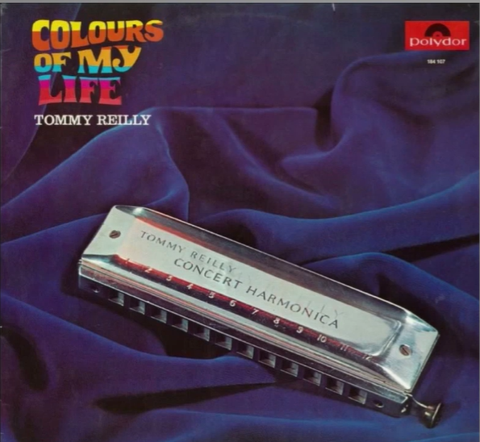
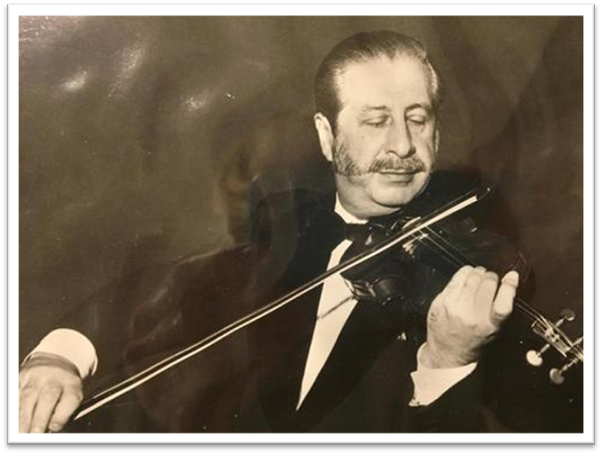

# 第十一章 主要唱片目录与研究

## 11.1 早期LP、EP唱片赏析

Reilly的录音生涯可追溯至1950年代初：1951年他与Parlophone厂牌签约，由年轻的George Martin制作了一系列78转唱片。其中《Deep Purple》（DeRose曲）是其最早的代表性录音之一（确切年份待考，收录于2019年Chandos百年纪念专辑《A Life in Music》），这一选择具有象征意义：该作品作为爵士标准曲的流行地位，与Reilly的古典抱负形成对话关系。

Album coverTommy Reilly's, 1967 albumColours of My Lifefeaturing a photograph of his signaturechromatic harmonica.

## 11.2 录音室专辑与EP时代（1960—1985）

在CD时代之前，Reilly于1960至1985年间在各大厂牌留下了一批重要的录音室专辑与EP，涵盖爱尔兰民歌、流行、拉丁、古典与电影配乐等多种风格。以下信息依据Sigmund Groven编制的权威唱片目录：

### EP与单曲（1960—1963）

• 1960年 Tivoli 43008《The New Sound of Tommy Reilly》（College Girl、Blue Violets、Far、Fortune's Favourite）与43009《The Virtuosity of Tommy Reilly》（Never、Days of Yearning、Lotus、Someday Soon），Bob Hueting指挥乐队伴奏；

• 1960年 Hohner T 4007：The Navy Lark、The Sailing Valse、Before The Breeze、Hoopla（Reilly/Moody创作，James Moody钢琴与节奏组）；T 7003：Swiss Merry-go-round（Reilly）、A la Francaise（Martin）、No Limit（Young）、Bulgarian Wedding Dance（Moody）；

• 1962年 Philips BF 326 543：Blow, Man, Blow、No Dice（均为Reilly与Warren合作创作）；

• 1963年 Philips PB 1248：So Little Time、Moon Fire（电影《北京55日》插曲，Tiomkin作曲，Ivor Raymonde合唱团与乐队）。

LP专辑（1965—1985）

• 1965年 World Sound T 541《The Life of Reilly》——26首爱尔兰民歌，James Moody及其乐队伴奏；

• 1967年 Concorde ORL-ST 5002《Chromonica Rallye mit Tommy Reilly》——与The Continentals乐队合作（其中Flirt in Rio署Reilly-Arnold，No Time、Esmeralda、Tokyo署Rundle-Morris——即Reilly的笔名）；

• 1968年 Polydor 184 107《Colours of My Life》——David Reilly与Durham的原创歌曲（Paper-hearted Friend、Colours of My Life等），并混入巴赫《Badinerie》、斯特拉文斯基《Chanson Russe》等古典改编；由Groven于1967年在挪威制作；

• 1969年 Polydor 222 002《Melody Fair》——与Kai Warner歌手与管弦乐团；

• 1970年 Polydor 184 367《Latin Harmonica》——与Kai Warner乐团，12首拉丁经典；

• 1971年 Polydor 2382 002《The Harmonica of Tommy Reilly》——古典专辑，Kaare Ørnung钢琴与弦乐四重奏（斯卡拉蒂、巴赫、拉赫玛尼诺夫《小夜曲》、莫什科夫斯基等）；2382 008《The Music of Robert Farnon》——收录《Prelude and Dance》的世界首录；2383 046《Western Harmonica》——西部音乐专辑；Apollo Sound AS 1008《Tommy Reilly Plays Fried Walter》——Fried Walter作品专辑（含与Groven的二重奏《Duettino》）；

• 1972年 Polydor 2382 016《Harmonica Parisien》——法国香颂专辑（后由Philips以6382 062再版）；

• 1974年 Polydor 2052 101：乔普林《The Entertainer》与《Turkey Trot》（Kaare Ørnung钢琴）；

• 1975年 Philips 6382 081《Warm Latin Sounds》——12首拉丁情歌；Argo ZDA 206《The Silver Sound of the Harmonica》——Jacob《Divertimento》与Moody《五重奏》，Hindar四重奏团；

• 1976年 Polydor 2922 008《Music for Two Harmonicas》——与Groven的双口琴专辑（Hindar四重奏、Skaila Kanga竖琴、David Reilly吉他），收录Jacob《Introduction and Galop》、Farnon《Tête-à-Tête》、Moody《Seventeen-Seventy-One》、Reilly的《Valsentino》及《The Rose of Telemark》等；同期还为挪威动画电影《Flåklypa Grand Prix》（Bent Fabricius-Bjerre配乐，Polydor 2382 066）录制了全部口琴声部；

• 1977年 Argo ZRG 856——与圣马丁室内乐团、Marriner指挥，收录Moody《Little Suite》、Jacob《Five Pieces》、Tausky《Concertino》、Vaughan Williams《Romance》；

• 1978年 Argo ZK 55《Harmonica Recital》——Moody钢琴、Kanga竖琴，14首小品；

• 1979年 Argo ZRG 905《Tommy Reilly Plays Villa-Lobos Harmonica Concerto》——伦敦小交响乐团、Atherton指挥，收录Villa-Lobos、Arnold、Benjamin三部协奏曲；另有ZSW 613《Tarka the Otter》电影原声（David Fanshawe配乐）；

• 1981年 Philips 9500 997《Romantic Melodies》——与Kanga竖琴二重奏（巴赫-古诺《圣母颂》、古诺《浮士德》芭蕾音乐、Villa-Lobos《巴西的巴赫风格》第五号等）；Teldec 6.24965 AS《Winnetou Melodien》——Martin Böttcher指挥慕尼黑广播乐团，德国西部片系列音乐；

• 1985年 Nova-Zembla NZR 85001《Tommy Reilly and Pluche》——与Pluche沙龙乐团，Moody编曲（《Valencia》、Falling in Love Again、肖斯塔科维奇《浪漫曲》Op.97等）。

以上专辑构成了Reilly在CD时代之前的主要录音遗产，其中多张经Chandos等厂牌数字化再版发行。

## 11.3 CD时代唱片赏析（1986—2019）

Serenade

|  | 发行年份 | 1986 |
|  | 唱片厂牌 | Chandos |
|  | 发行国家 | 英国 |
|  | 目录编号 | CHAN 8486 |
|  | 曲目数量 | 13 首 |
|  | 播放时长 | 46:45 |

专辑简介

Tommy Reilly 与圣马丁室内乐团合作，展现其古典口琴演奏的精髓。专辑融合了古典名作与个人创作，体现了口琴在古典音乐中的表现力。

合作音乐家

Tommy Reilly - Harmonica

Academy of St. Martin in the Fields Chamber Ensemble

完整曲目列表

1. Bulgarian Wedding Dance (Moody)

2. Pavane Op. 50 (Faure)

3. Romance (Faure)

4. Norwegian Dance no. 2 (Grieg)

5. Adagietto (George Martin)

6. Aviator (David Reilly)

7. Serenade (Tommy Reilly)

8. Sonata (Handel, arr. Moody)

9. Au bord de l'eau (Faure)

10. Bruyeres (Debussy)

11. On Wings of Song (Mendelssohn)

12. My Lagan Love (trad., arr. Tommy Reilly)

13. Two Beatle Girls (Lennon-McCartney, Martin)

专业乐评

《留声机》杂志 (Gramophone) ★★★★☆

"专辑标题'小夜曲'很好地捕捉了音乐的风味——轻盈、温柔、不矫揉造作。这种风格在活泼的段落中表现得最为出色：James Moody 的保加利亚婚礼舞曲、格里格的挪威舞曲以及两首披头士歌曲都是其中的亮点。"

古典自由簧片评论 (Classical Free-Reed) ★★★★★

"Reilly 的主要贡献在于他让这件难以驾驭的口琴创造了奇迹，呈现出神奇般的独奏表演。录音质量极佳。圣马丁室内乐团的弦乐伴奏堪称完美。"

Tommy Reilly and Skaila Kanga Play British Folk-Songs

|  | 发行年份 | 1987 |
|  | 唱片厂牌 | Chandos |
|  | 发行国家 | 英国 |
|  | 目录编号 | CHAN 8559 |
|  | 曲目数量 | 20 首 |
|  | 播放时长 | 1:03:46 |

专辑简介

与竖琴家 Skaila Kanga 合作演绎英国民歌，展现了 Tommy Reilly 对传统英伦音乐的深刻理解。2005年再版为 CHAN 6643。

发行版本

CD - CHAN 8559 (UK, 1987)

CD - CHAN 6643 (UK, 2005 (再版)

合作音乐家

Tommy Reilly - Harmonica

Skaila Kanga - Harp

完整曲目列表

1. Skye Boat Song

2. Early One Morning

3. Blow the Wind Southerly

4. Scarboro' Fair

5. Londonderry Air

6. Trotting to the Fair

7. Drink to me only

8. Kathleen Mavoureen

9. Morning has broken

10. The Lark in the Clear Air

11. Cherry Ripe

12. Ash Grove

13. David of the White Rock

14. Keel Row

15. Ye Banks and Braes

16. Endearing Young Charms

17. Dashing away with the Smoothing Iron

18. My Love is like a Red, Red Rose

19. She moved thro' the Fair

20. The Rising of the Lark

专业乐评

音乐网国际 (MusicWeb International) ★★★★☆

"这是一张令人愉悦的英国民歌集，为口琴和竖琴而改编。Reilly 敏感的演奏与 Kanga 精致的竖琴伴奏营造出神奇的氛围。每首民歌都得到了尊重和艺术性的处理。"

《号角》杂志 (Fanfare) ★★★★★

"Reilly 与 Kanga 的合作证明是这一曲目的理想组合。口琴甜美的音色与竖琴完美融合，营造出亲密而迷人的聆听体验。民歌爱好者必听之作。"

Vaughan Williams: Romance; Tausky: Concertino; Moody: Little Suite

|  | 发行年份 | 1988 |
|  | 唱片厂牌 | Chandos |
|  | 发行国家 | 英国 |
|  | 目录编号 | CHAN 8617 |
|  | 曲目数量 | 4 首 |
|  | 播放时长 | 46:41 |

专辑简介

收录 Vaughan Williams、Tausky、Moody 和 Jacob 的作品，由传奇指挥家内维尔·马里纳爵士执棒。原版发行于 Argo 唱片 (ZRG 856)。

发行版本

CD - CHAN 8617 (UK, 1988)

LP - Argo ZRG 856 (UK, 原版)

合作音乐家

Tommy Reilly - Harmonica

Academy of St. Martin in the Fields Orchestra

Sir Neville Marriner - Conductor

完整曲目列表

1. Romance (Ralph Vaughan Williams)

2. Concertino (Vilem Tausky)

3. Little Suite (James Moody)

4. Five Pieces (Gordon Jacob)

Thanks for the Memory

|  | 发行年份 | 1988 |
|  | 唱片厂牌 | Chandos |
|  | 发行国家 | 英国 |
|  | 目录编号 | CHAN 8645 |
|  | 曲目数量 | 29首 |
|  | 播放时长 | 44:59 |

专辑简介

向经典歌曲致敬的专辑，包含众多脍炙人口的爵士标准曲，展现了 Tommy Reilly 在流行音乐领域的深厚造诣。

发行版本

CD - CHAN 8645 (UK, 1988)

合作音乐家

Tommy Reilly - Harmonica

James Moody - Piano

完整曲目列表

1. Over the Rainbow (Arlen)

2. Medley: There's a Small Hotel

3. Once in a While

4. A Pretty Girl is like a Melody

5. I'll Follow my Secret Heart

6. In a Sentimental Mood

7. Medley: A Nightingale Sang in Berkeley Square

8. Dancing on the Ceiling

9. Love is the Sweetest Thing

10. Misty

11. Medley: Goodnight Vienna

12. I am Getting Sentimental over You

13. The Way you Look Tonight

14. Sweet and Lovely

15. Medley: When you Wish upon a Star

16. Because I Love You

17. I'm a Dreamer

18. Smoke gets in Your Eyes

19. Medley: A Room with a View

20. Tenderly

21. The Breeze and I

22. Thanks for the Memory

23. Medley: Getting to Know You

24. September Song

25. Someday I'll Find You

26. Body and Soul

27. Medley: One Night of Love

28. The Very Thought of You

29. Love Walked In

专业乐评

《爵士期刊》 (Jazz Journal) ★★★★☆

"对流行歌曲黄金时代的动人致敬。Reilly 的口琴为这些标准曲目带来了独特的声音，他与钢琴家 James Moody 的合作堪称神奇。标题曲特别令人难忘。"

BBC 音乐杂志 (BBC Music Magazine) ★★★★☆

"Reilly 证明了口琴在爵士曲目中可以像任何乐器一样富有表现力。他的乐句处理无懈可击，他带给《彩虹之上》等抒情曲的情感深度真正令人感动。"

Tommy Reilly - Jacob/ Moody: Harmonica Music

|  | 发行年份 | 1990 |
|  | 唱片厂牌 | Chandos |
|  | 发行国家 | 英国 |
|  | 目录编号 | CHAN 8802 |
|  | 曲目数量 | 3首 |
|  | 播放时长 | 44:59 |

专辑简介

与弦乐四重奏和竖琴的室内乐作品。原版发行于 Argo (ZDA 206, 1975) 和 Philips (9500 997, 1981)。

发行版本

CD - CHAN 8802 (UK, 1990)

LP - Argo ZDA 206 (UK, 1975)

LP - Philips 9500 997 (Europe, 1981)

合作音乐家

Tommy Reilly - Harmonica

Hindar Quartet - String Quartet

Skaila Kanga - Harp

完整曲目列表

1. Divertimento for harmonica and string quartet (Gordon Jacob)

2. Suite dans le style francais (James Moody)

3. Quintet for harmonica and string quartet (James Moody)

专业乐评

Henry Doktorski, 古典自由簧片 (Classical Free-Reed) ★★★★★

"Gordon Jacob 的《口琴与弦乐四重奏嬉游曲》是该体裁的杰作。虽然这首作品不是炫技之作，但它对演奏者的技巧要求很高（双音贯穿整个小夜曲）。Reilly 的演奏具有权威性，音乐上令人满意。"

美国室内乐协会 (Chamber Music America) ★★★★☆

"难得有机会听到口琴在室内乐环境中的表现。Jacob 的嬉游曲风趣迷人，而 Moody 的《法国风格组曲》展现了乐器的多功能性。Hindar 四重奏提供了出色的支持。"

Serenade, Vol 2

|  | 发行年份 | 1992 |
|  | 唱片厂牌 | Chandos |
|  | 发行国家 | 英国 |
|  | 目录编号 | CHAN 6568 |
|  | 曲目数量 | 22首 |
|  | 播放时长 | 1:00:22 |

专辑简介

续集专辑，精选各国经典小品，从西班牙舞曲到法国印象派，再到巴西民族音乐。

发行版本

• CD - CHAN 6568 (UK, 1992)

合作音乐家

Tommy Reilly - Harmonica

Skaila Kanga - Harp

完整曲目列表

1. Spanish Dance No.2 (Moszkowski)

2. Siciliano (Bach)

3. Ballet Music from 'Faust' (Gounod)

4. Aria from 'Bachianas Brasileiras' no.5 (Villa-Lobos)

5. La Fille aux Cheveux de Lin (Debussy)

6. Allegro (Fiocco)

7. Gymnopedie no.1 (Satie)

8. Gavotte en Rondeau (Bach, arr. Reilly)

9. The Fog is Lifting (Nielsen)

10. Pizzicato from 'Sylvia' (Delibes)

11. Meditation de Thais (Massenet)

12. Merrily-Go-Round (Kanga)

13. Estrellita (Ponce)

14. Eastern Motif (Kanga)

15. Gavotte from 'Mignon'(Thomas)

16. Ave Maria (Bach-Gounod)

17. Elegy (Fisher)

18. Sleepy Shores (Pearson)

19. Song in the Night (Salzedo)

20. Canzonetta (Kanga)

21. Valsentino (Reilly)

22. Cavatina (Myers)

专业乐评

国际唱片评论 (International Record Review) ★★★★☆

"这是一张令人愉悦的续集，保持了第一卷的高水准。曲目更加多样化，从巴赫到维拉-洛博斯，Reilly 的艺术造诣继续令人惊叹。《巴西的巴赫风格》咏叹调特别优美。"

古典CD (Classic CD) ★★★★☆

"Reilly 和 Kanga 是这一折衷曲目的理想二重奏组合。录音质量极佳，捕捉到口琴独特音色的每一个细微之处。这是第一张小夜曲专辑的当之无愧的续作。"

Tommy Reilly plays Harmonica Concertos

|  | 发行年份 | 1993 |
|  | 唱片厂牌 | Chandos |
|  | 发行国家 | 英国 |
|  | 目录编号 | CHAN 9248 |
|  | 曲目数量 | 5首 |
|  | 播放时长 | 1:00:24 |

专辑简介

口琴协奏曲专辑的巅峰之作！收录 Spivakovsky、Arnold、Villa-Lobos 三位作曲家的协奏曲。

发行版本

CD - CHAN 9248 (UK, 1993)

合作音乐家

Tommy Reilly - Harmonica

Münchner Rundfunkorchester - Orchestra (1, 4)

Basel Radio Sinfonieorchester - Orchestra (2)

Rundfunkorchester des Südwestfunks - Orchestra (3)

完整曲目列表

1. Concerto for Harmonica and Orchestra (Michael Spivakovsky)

2. Concerto for Harmonica and Orchestra (Malcolm Arnold)

3. Concerto for Harmonica and Orchestra (Heitor Villa-Lobos)

4. Toledo, Spanish Fantasy for Harmonica and Orchestra (James Moody)

5. Prelude and Dance for Harmonica and Orchestra (Robert Farnon)

专业乐评

Henry Doktorski, 古典自由簧片 (Classical Free-Reed) ★★★★★

"这张唱片收录了三首重要的口琴协奏曲。Spivakovsky 的协奏曲是一部重要作品，乐章标题为'热情的-滑稽舞曲'、'浪漫曲'和'谐谑曲'。维拉-洛博斯的协奏曲现已被公认为该乐器最重要的作品之一。Reilly 的演奏是权威版本。"

美国唱片指南 (American Record Guide) ★★★★★

"这是一张重要的发行，记录了三首重要的协奏曲。Arnold 为 Reilly 创作的协奏曲特别有效，爵士节奏和抒情的慢乐章令人印象深刻。整个乐团的伴奏都是一流的。"

Harmonica Recital

|  | 发行年份 | 1994 |
|  | 唱片厂牌 | London |
|  | 发行国家 | 日本 |
|  | 目录编号 | POCL-3683 |
|  | 曲目数量 | 14首 |
|  | 播放时长 | 47:17 |

专辑简介

日本发行的专辑，精选浪漫主义时期钢琴小品改编。原版为 Argo ZK 55，日本London唱片公司在1994年进行了CD修复再版发行。

发行版本

CD - POCL-3683 (Japan, 1994)

CD - Argo ZK 55 (UK, 原版)

合作音乐家

Tommy Reilly - Harmonica

James Moody - Piano

Skaila Kanga - Harp

完整曲目列表

1. Waltz in D-flat Major, op. 64 no.1 (Chopin)

2. Jasmin (Hazell)

3. Popular Song (Walton)

4. Air and Rondo (Händel)

5. Fair Maid of Perth (Bizet)

6. Cancion y Danza (Mompou)

7. Italien Dance (Dring)

8. The Swan (Saint-Saens)

9. Humoresque (Reizenstein)

10. Chanson Russe (Stravinsky)

11. Sonatine (Scarlatti)

12. Gymnopedie no. 1 (Satie)

13. Trotting to the Fair (trad., arr. Moody)

14. Sonatina (Saunders)

专业乐评

国际唱片 (Records International) ★★★★☆

"一套迷人的小品集，展现了 Reilly 将钢琴音乐改编为口琴的能力。肖邦的《一分钟圆舞曲》和萨蒂的《吉诺佩第》特别有效。这是经典 Argo 录音的日本发行版。"

古典音乐杂志 (Classical Music Magazine) ★★★★☆

"Reilly 证明了口琴可以优雅而有风格地处理最细腻的钢琴曲目。改编很有品味，演奏也很精致。这是稀有作品的珍贵再版。"

Tommy Reilly Classic People

|  | 发行年份 | 1995 |
|  | 唱片厂牌 | Classic People |
|  | 发行国家 | 韩国 |
|  | 目录编号 | CPCD-07 |
|  | 曲目数量 | 13首 |
|  | 播放时长 | 未知 |

专辑简介

http://www.the-archivist.co.uk/1995年，韩国发行的精选集，汇集了 Tommy Reilly 各个时期的代表作品。目前除了http://www.the-archivist.co.uk/上对此专辑有过介绍外，整个网上几乎没有这张专辑的任何信息，应该是非常稀少的一张CD，因此，也没有唱片封面。至于此前网传的专业乐评，多为AI生成的臆想内容，不足采信，故不收录。

发行版本

CD - CPCD-07 (Korea, 1995)

合作音乐家

Tommy Reilly - Harmonica

Skaila Kanga - Harp

Academy of St. Martin-in-the-Fields - Ensemble

James Moody - Piano

完整曲目列表

1. Scarborough Fair

2. Kathleen Mavoureen

3. David of the White Rock

4. Pavane (Fauré)

5. Norwegian Dance no.2 (Grieg)

6. On Wings of Song (Mendelssohn)

7. One Night of Love

8. The Very Thought of You

9. Love Walked In

10. In a Sentimental Mood

11. Concertino: 1st Movement (Tausky)

12. Little Suite: Cantilena (Moody)

13. Harmonica Quintet: 3rd Movement (Moody)

专业乐评

"这是了解 Tommy Reilly 艺术造诣的绝佳入门之作，融合了民歌、古典作品和流行曲调。选曲展现了他的多才多艺和技术精湛。这是新听众的完美起点。"

发烧友试听 (Audophile Audition) ★★★★☆

"这张韩国编译专辑提供了一个精心挑选的节目，涵盖了 Reilly 的职业生涯。音质极佳，演奏始终引人入胜。强烈推荐给那些发现这位杰出艺术家的人。"

Harmonica Parisien

|  | 发行年份 | 1999 |
|  | 唱片厂牌 | Sterndale Records |
|  | 发行国家 | 英国 |
|  | 目录编号 | STE 3461 |
|  | 曲目数量 | 23首 |
|  | 播放时长 | 47:17 |

专辑简介

向巴黎音乐致敬的专题专辑，收录法国香颂经典。1972年 LP Polydor 2382 016 的再版，增加了11首曲目。

发行版本

CD - STE 3461 (UK, 1999)

合作音乐家

Tommy Reilly - Harmonica

Tommy Reilly and his orchestra - Orchestra (1-12)

Various accompaniments - Accompaniment (13-23)

完整曲目列表

1. La Vie en Rose

2. Plaisir d'amour

3. Sous le ciel de Paris

4. Quand je reviendrai

5. J'attendrai

6. Clopin Clopant

7. Les feuilles mortes

8. Moulin Rouge

9. La Ronde de L'Amour

10. Hymne à L'Amour

11. Le Mer

12. Les trois cloches

13. Valsentino (T. Reilly)

14. Shadow Valse

15. Le Grisbi

16. Un Homme et une Femme

17. Loin du Bal

18. La Mattchiche

19. Poupée Valsante

20. Objet d'art

21. Berceuse (Fauré)

22. I'll remember today

23. La Petite Tonkinoise

专业乐评

法国音乐评论 (French Music Review) ★★★★☆

"对法国香颂传统的深情致敬。Reilly 以风格和精致捕捉了巴黎咖啡馆音乐的精髓。《玫瑰人生》和《巴黎的天空下》特别令人难忘。扩展的 CD 版本包含有价值的额外曲目。"

国际口琴通讯 (International Harmonica Newsletter) ★★★★☆

"这张专辑展现了 Reilly 跨越音乐边界的能力。法国曲目非常适合口琴，Reilly 的诠释既真实又个人化。这是他唱片目录中令人愉悦的补充。"

A Life in Music (Vintage Tommy Reilly)

|  | 发行年份 | 2019 |
|  | 唱片厂牌 | Chandos |
|  | 发行国家 | 英国 |
|  | 目录编号 | CHAN 20143 |
|  | 曲目数量 | 30 首 |
|  | 播放时长 | 77:20 |

专辑简介

Tommy Reilly 艺术生涯的回顾精选集，收录1945-1988年间的珍贵录音，展现了他从古典到流行的全面艺术成就。这是对他一生音乐贡献的致敬。包括之前从未发行过的Zigeunerweisen（流浪者之歌）、Hora Staccato（霍拉舞曲）等数字修复版本的早期录音曲目，是非常有意义的一张CD专辑。

发行版本

CD - CHAN 20143 (UK, 2019)

LP - Polydor 2382 016 (France, 1972)

合作音乐家

Tommy Reilly - Harmonica

Various orchestras and accompanists - Accompaniment

完整曲目列表

1. Zigeunerweisen (Pablo de Sarasate)

2. Sonata L 338 KK450 (Scarlatti)

3. Gigue from Partita no. 3 BWV 1006 (Bach)

4. Serenade (Rachmaninoff)

5. Age of Innocence (David Reilly/Robert Farnon)

6. Italian Dance (Dring)

7. Spanish Dance No. 2 (Moszkowski)

8. Voice from the Past (Tommy Reilly/James Moody)

9. Firebrand (Alan Langford)

10. Deep Purple (Peter de Rose)

11. Dance of the Comedians (Smetana)

12. Overture to 'Le Nozze di Figaro' (Mozart)

13. Midnight in Mayfair (Newell Chase)

14. Cumbanchero (Rafael Hernandez Marín)

15. Jealousy (Jacob Gade)

16. Dinah (Lewis/Young/Aksi)

17. Bop! Goes the Weasel

18. Firefly (Donald Phillips)

19. Begin the Beguine (Cole Porter)

20. Gin ginger (Bobby Young)

21. No limit (Tommy Reilly/Bobby Young)

22. Bulgarian Wedding Dance (James Moody)

23. Hora Staccato (Dinicu/Heifeizi)

24. 18th Century Rock (Jimmy Leach)

25. Irish Medley (traditional)

26. The Breeze and I (Lecuona)

27. Le Grisbi (Jean Wiener)

28. The Red Flame (Tommy Reilly/Maurice Arnold)

29. Waltz Op. 64 No. 1 'Minute Waltz' (Chopin)

30. Golden Girl (Tommy Reilly/James Moody)

专业乐评

音乐网国际 (MusicWeb International) ★★★★★

"《音乐人生》是对20世纪最伟大的口琴演奏家之一的恰当致敬。这张合辑涵盖了1945年至1988年的录音，展现了 Reilly 从古典演奏家到流行艺人令人难以置信的广度。重新制作的音质极佳。"

《留声机》杂志 (Gramophone) ★★★★★

"这张百年纪念致敬专辑（Reilly 出生于1919年）全面概述了他的艺术成就。选曲恰当，平衡了严肃的古典作品与轻松的曲目。对于任何对口琴在音乐史上地位感兴趣的人来说，这是一份重要文献。"

亚马逊用户评论 (Amazon Customer Review) ★★★★★

"这张CD是对这位音乐家百年诞辰的致敬，Ralph Vaughan Williams 和 Gordon Jacob 等作曲家为他创作了古典作品。这是一套精彩的收藏，展示了为什么 Tommy Reilly MBE 是他那一代最杰出的古典口琴演奏家。"

Parlophone 单曲 Bop! Goes the Weasel 唱片封面(1953,George Martin 制作)

## 11.4 聆听指南：如何进入 Tommy Reilly 的音乐世界

说明:本章为增补小节,插入原第十章(现第十一章)CD 唱片赏析之后。依据 Groven 目录与各专辑乐评整理。

### 入门路径:三张唱片

对于第一次接触 Reilly 的听者,建议按以下顺序聆听:

1. **《Tommy Reilly Plays Harmonica Concertos and Virtuoso Works》(Chandos CHAN 9248,1993)**——一部作品同时展现口琴的"协奏曲能力"(Spivakovsky、Arnold、Villa-Lobos 三部完整协奏曲)与"炫技小品传统"(Toledo、Prelude and Dance)。这是理解"口琴如何与交响乐团对话"的最佳入口。

2. **《Serenade》(Chandos CHAN 8486,1986)**——与圣马丁室内乐团合作,展现口琴的抒情面:Faure 的帕凡、Grieg 的挪威舞曲、George Martin 的柔板、Reilly 自己的《小夜曲》与《我的拉根之爱》。Gramophone 称之为"轻盈、温柔、不矫揉造作"。

3. **《A Life in Music》(Chandos CHAN 20143,2019)**——百年诞辰纪念精选,30 首录音横跨 1953-1988,从流浪者之歌到 Hora Staccato,从 Deep Purple 到 Bulgarian Wedding Dance。一张唱片看尽他 35 年的风格变迁,其中 15 首为首次公开发行。

### 必听录音清单

| 曲目 | 推荐录音 | 聆听要点 |
| ------ | --------- | --------- |
| Zigeunerweisen(流浪者之歌) | CHAN 20143(1953 年奥斯陆,带现场掌声) | 历史演出的直接氛围;早期颤音更浓烈、更具"小提琴性" |
| Prelude and Dance | CHAN 9248(1993,Farnon 指挥) | 开篇 D-A 两音的连奏——Reilly 自称最满足的两个音符 |
| Toledo | CHAN 9248(1993,Farnon 指挥慕尼黑广播乐团) | ♩=280 的炫技与 93 小节口琴华彩 |
| Five Pieces | CHAN 8617(1988,Marriner/圣马丁) | 五个乐章听"技术百科全书";对照 Uwe 书的 17 课教学实录 |
| Valsentino | CHAN 6568(1992)或 STE 3461(1999) | 3/8 拍快速圆舞曲;注意华彩段的"按键预动作" |
| Serenade | CHAN 8486(1986) | 双音平衡与持续气息流的典范 |
| Bop! Goes the Weasel | CHAN 20143(1953,Parlophone) | George Martin 制作的叠录实验录音 |
| Midnight Cowboy | CHAN 20143 或 1969 单曲版 | 与电影中 Toots 版本对比:更古典化的抒情 |
| Hora Staccato | CHAN 20143 | 八度双音喉部断奏的极限技术 |
| 《The Navy Lark》主题 | EMI Premier《Vintage Themes》(1996) | 英国广播喜剧黄金时代的集体记忆 |

### 版本对比:同一首曲子的不同年代

- **Valsentino**:1976 年《Music for Two Harmonicas》(与 Groven 合作版,吉他手紧邻 Reilly 以求节奏同步)→ 1992 年《Serenade Vol.2》(与 Kanga 竖琴版)。后者的速度与清晰度是晚期风格的基准。

- **Bulgarian Wedding Dance**:1971 年《The Harmonica of Tommy Reilly》→ 1986 年《Serenade》。可听出 15 年间音色从"更锐利"到"更温暖"的演变。

- **Serenade(Rachmaninoff)**:1971 年《The Harmonica of Tommy Reilly》(Ørnung 钢琴)→ 2019 年选集。Rachmaninoff 的原曲为声乐作品,Reilly 的两次录音是理解他"以人声为范本"理念的窗口。

### 聆听方法论:像 Reilly 那样听

Uwe 书记载,Reilly 要求学生学习"批判性地倾听自己",同样的方法适用于欣赏他的录音:

1. **先听乐句,再听技术**:注意他如何处理乐句的呼吸与高潮,而不是先关注速度。

2. **分辨吹与吸**:他毕生追求"听众永远分不出哪个音是吹、哪个音是吸"——听他长线条段落时,试着找出换气点,你会发现几乎找不到。

3. **比较不同年代的同一曲目**:他的颤音从早期"更浓烈、更小提琴化"演变为晚期"更克制、更纯净"(郑章明的观察)。

4. **对照乐谱听**:本书附带的 Valsentino、Serenade、Toledo 乐谱(franchbach 排版版)与录音对照,是学习其诠释的最佳方式。
