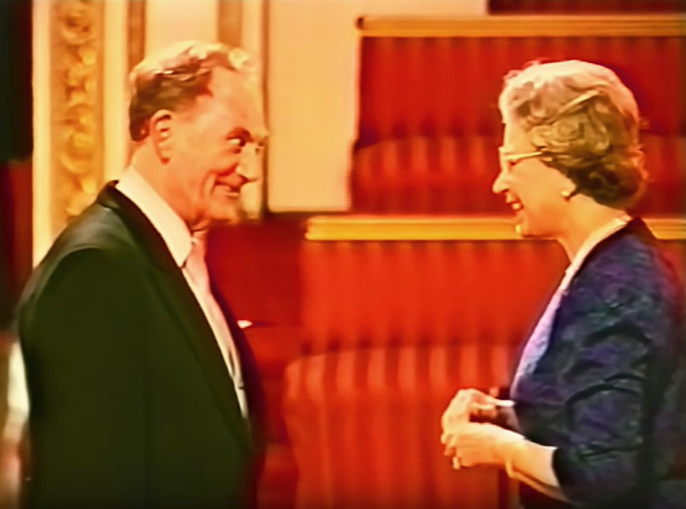

# 第十二章 Legacy与影响：银声不朽

## 12.1 对口琴艺术的多方面贡献

Tommy Reilly对口琴艺术的贡献是多方面的、深远的：

提升口琴的地位：让口琴成为了能够与交响乐团合作的独奏乐器，赢得了古典音乐界的尊重和认可。

建立演奏标准：建立了一套完整的古典口琴演奏技法和标准，他的教材至今仍是标准参考书。

丰富口琴文献：通过委托创作，为口琴获得了超过30部高质量作品，极大地丰富了口琴的文献库。

革新口琴乐器：与Hohner合作创造的银口琴，是口琴制造史上的里程碑。

培养后继人才：通过教学和国际俱乐部，培养了大量口琴演奏人才，将口琴艺术传播到世界各地。

Reilly终身追求的核心目标是提升口琴的艺术地位，使其从民间玩具和流行伴奏乐器转变为具有高度艺术价值的独奏乐器。这一追求体现在他艺术活动的各个方面：委托作曲家创作原创协奏曲，为口琴建立古典曲目库；在Decca、EMI、Chandos等主流古典厂牌录制专辑，进入古典音乐发行体系；与Academy of St Martin in the Fields等顶级室内乐团合作，获得古典音乐界的制度性认可；编写系统教材、创立教学机构、培养国际学生，构建口琴的专业教育传承。

## 12.2 与同时代音乐家的比较

要全面了解Reilly的艺术成就，有必要将他与其他同时代的口琴演奏家进行比较：

| 演奏家 | 核心领域 | 与Reilly关系 | 历史定位 |
| Larry Adler | 流行、爵士、跨界 | 同时代竞争者，相互尊重 | 流行影响力更大，古典深度不及 |
| Toots Thielemans | 爵士即兴 | 不同路径，爵士领域开拓 | 口琴在爵士乐中的标杆 |
| Sigmund Groven | 古典、北欧 | Reilly传承者，档案整理者 | 北欧口琴界领军人物 |
| Franz Chmel | 古典、奥地利 | 技术继承，曲目拓展 | 欧洲大陆古典口琴代表 |

Reilly 与 Larry Adler、Toots Thielemans、Sigmund Groven、Franz Chmel 等同时代口琴家的详细比较(含三巨头时代、爵士与流行路线、欧洲学派、东方传承),见第十三章“二十世纪口琴艺术地图”;下表的速览仅作索引。

## 12.3 荣誉与晚年生活

Tommy Reilly于1992年获得MBE（大英帝国员佐勋章），由伊丽莎白二世女王亲自授勋，理由是"对音乐的贡献"。他是迄今为止唯一获得英国皇家荣誉的口琴演奏家。美国作家Kim Fields在他的口琴参考书中说："在他所属的那一小群精英中，Tommy Reilly通常被认为是最优秀的古典演奏家。"

Igor Stravinsky（伊戈尔·斯特拉文斯基）曾说："在听到你演奏我的《俄罗斯歌曲》之后，我很乐意让你演奏我的任何作品。"

Reilly的舞台形象——通常身着白色礼服演奏——成为其标志性特征，被评论家称为"白衣巫师"（The Man in White）。这一形象具有多重意义：视觉上，白色在舞台灯光下形成强烈的聚焦效果，强化了独奏家的中心地位；象征意义上，白色暗示纯洁、精致和超凡脱俗，与口琴的"平民"起源形成对比，提升了乐器的文化地位。

进入1980年代后，Reilly的公开演奏活动逐渐减少，但他仍保持选择性演出，尤其是在音乐节和特殊场合。他的最后一次专业演出是1998年在德文郡达廷顿国际夏季音乐学校（Dartington International Summer Music）为来自四大洲的学生举办的大师班。这一选择具有象征意义：他将晚年精力集中于教育传承，而非个人演出，体现了其对口琴艺术长远发展的深切关怀。

1993年12月，Reilly遭遇严重车祸，身体受到重创，此后健康每况愈下。Uwe Warschkow回忆，即使在那之后，他仍坚持要求学生到Hammonds Wood上课，教学热情与强度丝毫不减。

晚年Reilly将更多精力投入教学和著述。他持续接受精选学生进行个别指导，尤其是在夏季演出间隙；他在口琴音乐节上举办工作坊，影响了大量演奏者；他的教材和练习曲成为标准教学文献。这些工作确保了其技术体系和艺术理念的系统传承，使其影响超越了个人演奏生涯的局限。

## 12.4 最后一次大师班

1997年，陈冠斌在著名的口琴论坛 Harp-L 上偶然得知一个令他兴奋的消息：隔年（1998年），Tommy Reilly 和 Sigmund Groven 即将联合在英国 Dartington Music Summer School 举办口琴大师班。

Dartington Music Summer School 是英国著名的音乐夏季课程，位于德文郡（Devon）的达廷顿庄园，拥有悠久的历史和优美的环境。这里不仅是学习的场所，更是音乐家交流的重要平台。

得知这个消息后，陈冠斌花尽所有积蓄，远渡重洋，只为参加这次大师班。他没有预料到的是，这次旅程将成为他口琴生涯中最重要的一次经历，也将是 Tommy Reilly 人生中的最后一次公开教学活动。

这一点在历史上是有明确记载的——1998年的 Dartington 是 Reilly 最后一次公开露面教学。

Sigmund Groven 是挪威最重要的半音阶口琴大师之一，当时正值盛年，在北欧古典口琴界享有崇高地位。他与 Tommy Reilly 的联合教学，代表了英伦学派与北欧学派的交汇。

Groven 后来回忆与 Reilly 的这次合作时，也提到了 Reilly 对音乐表现的严格要求。Groven 本人也是一位追求音色完美的演奏家，他在这次音乐营中与 Reilly 的交流，成为北欧与英伦口琴学派交流的重要一页。两位大师的教学风格可能有所不同：Reilly 代表了传统的、受小提琴训练影响的严格古典派；Groven 则可能带来更多北欧音乐特有的清新与民族色彩。对于参加的学生来说，能同时接受两位大师的指导，是千载难逢的机会。

在1998年的 Dartington 音乐营中，陈冠斌还遇到了另一位重要人物——James Hughes。

James Hughes 人称「现代世界口琴大赛之父」（Father of the Modern World Harmonica Festival），是现今世界口琴大赛能有如此规模的擘划者。他临时得知有这个音乐营就匆匆忙忙赶来，还带来一套他刚编写完成的 "Essential Exercises for the Chromatic Harmonica"（共2册）。

1998年网络尚不是很盛行，陈冠斌当时还不知道 James Hughes 这么有名。他认识 Hughes 是因为偶然得知 Hughes 代理 James Moody 的口琴乐谱，并正在为他编写练习曲。

这次偶遇让陈冠斌获得了 Hughes 编写的珍贵教材，也让他了解到世界口琴大赛的组织架构和历史发展。

"Never ever play the hole 4 C and Hole 8 C"

在 Dartington 的某个时刻，陈冠斌与 James Hughes 聊天时，Hughes 突然正色地对他说了一句技术性极强的话：

"Never ever play the hole 4 C and Hole 8 C"

（绝对绝对不要吹第4孔C和第8孔C）

陈冠斌当时满脑子问号。虽然他知道这可能与口琴的构造和音色统一性有关，但 Hughes 说的斩钉截铁，让他印象深刻。音乐营结束后，陈冠斌又跑到 Douglas Tate 家里跟他上了几天课。在课堂中，陈冠斌试探性地问：「这里的C要吹第4孔？还是第5孔呢？」

没想到 Tate 也是斩钉截铁地说了同样的话：

"Never ever play the hole 4 C and Hole 8 C"

此时陈冠斌茅塞顿开，原来还有这第三招，从此心无悬念，不再犹豫，直接跳过第4孔及第8孔C，再也没有选择上的困难。

这一原则基于口琴构造的物理特性：第4孔和第8孔的C音（吹气音）在音色和音量上与其他音孔存在差异。在半音阶口琴上，这些音孔由于簧片尺寸、共鸣腔体大小以及空气动力学特性的不同，往往会产生与其他音孔不够统一的音色。对于追求音色一致性的古典演奏家来说，避开这些"问题音孔"，转而使用替代指法（如用第5孔吹气C替代第4孔吹气C），是获得专业级音色的关键技术之一。

这一原则体现了古典口琴演奏的精细化程度——不仅仅是吹出正确的音高，更要确保每个音的音色、音量和音质都完美统一。

## 12.5 永恒的音乐遗产

Tommy Reilly于2000年9月25日在英格兰萨里郡弗伦沙姆（Frensham, Surrey）的家中逝世，享年81岁。他被安葬在弗伦沙姆村教堂墓地，墓碑上镌刻着简洁而有力的墓志铭："He was the greatest"。这一评价来自其同行、学生和音乐界的广泛共识，是对其艺术成就的最终确认。他的孙女Georgina Reilly后来成为加拿大影视演员，延续了家族的艺术传统。

### 纪念音乐会与演出活动

Tommy Reilly去世后，全球口琴界立刻举办了多场纪念音乐会，来自全球的顶级口琴演奏家，用一场场演出，致敬这位口琴先驱。

而最具代表性的，便是2025年在德国特罗辛根世界口琴节上举办的Tommy Reilly纪念音乐会。这场音乐会，是2025年全球口琴界最重磅的活动，汇聚了Sigmund Groven、Yasuo Watani等全球顶级口琴演奏家，完整演绎了Tommy Reilly的原创作品、改编作品，用一场跨越时空的演出，致敬这位半音阶口琴之父。音乐会现场座无虚席，来自全球的数千名口琴爱好者，共同聆听了这场演出，当《快速圆舞曲》的旋律响起时，全场掌声雷动，经久不息。

除了这场纪念音乐会，全球每年都会举办数十场Tommy Reilly作品专场音乐会，从英国伦敦，到挪威奥斯陆，从日本东京，到中国上海，他的作品，永远是口琴音乐会上最核心的曲目，他的琴声，依然在全球的音乐厅中回响。

### 国际赛事与奖项

为了纪念Tommy Reilly，推动年轻口琴演奏者的成长，全球多个国际口琴赛事，都设立了Tommy Reilly纪念组别与专项奖项。

其中最具影响力的，便是德国特罗辛根世界口琴大赛中的Tommy Reilly古典口琴组别。这个组别，是世界口琴大赛中最具含金量的组别之一，要求参赛选手必须演奏Tommy Reilly的原创作品，以此考察选手的古典口琴演奏功底与音乐诠释能力。这个组别，已经成为了全球年轻古典口琴演奏家的顶级竞技场，无数年轻演奏家，通过这个组别，走上了职业演奏之路。

同时，挪威、英国、日本等国家的国际口琴比赛，都设立了Tommy Reilly专项奖，奖励那些在古典口琴演奏领域表现突出的年轻演奏者。这些赛事与奖项，不仅是对Tommy Reilly的纪念，更是对他艺术理念的延续，推动着古典口琴艺术的持续发展。

### 学术研究与教学传承

随着口琴艺术的发展，全球音乐学界，对Tommy Reilly的演奏艺术、教学理念、创作作品的学术研究，也越来越深入。

全球多所音乐院校的学者与研究生，撰写了大量关于Tommy Reilly的学术论文与专著，从他的生平经历、技术革新、演奏思想、创作作品、教学体系等多个维度，进行了深入的研究。他的作品，被列为口琴专业的必修曲目，他的演奏体系，被列为口琴教学的核心内容，他的艺术理念，成为了口琴艺术学术研究的核心课题。

同时，全球多个音乐机构，都设立了Tommy Reilly口琴教学项目与研究中心，系统整理他的教学资料、录音录像、手稿文献，传承他的教学体系与艺术理念，推动口琴艺术的学术研究与教育发展。

Tommy Reilly于2000年去世，但他的音乐遗产永存。他的录音作品继续被世界各地的口琴爱好者聆听和学习，他的教材继续指导着新一代的口琴学习者，他委托创作的作品继续在音乐会上演奏。

Reilly的故事，是一个关于梦想、坚持和成就的故事。他从加拿大一个小城市出发，经历了战争的磨难，最终成为了世界著名的口琴演奏家。他证明了，只要有才华、有毅力、有信念，任何乐器都可以在古典音乐的殿堂中占有一席之地。

Reilly的遗产在当代口琴艺术中持续显现：古典口琴演奏的主流化——从口琴进入音乐学院课程到国际比赛的常态化；跨界演奏的常态化——从严肃与流行的壁垒消解到风格融合的普遍接受；国际交流网络的成熟——从口琴节的全球化到在线教学平台的兴起。这些发展趋势均可追溯至Reilly在半个世纪前的开创性工作。

## 12.6 全球口琴演奏者心中的精神偶像

今天，距离Tommy Reilly去世已经过去了20余年，距离他在战俘营中开启口琴技术革命，已经过去了80余年。但他的艺术理念、演奏体系、教学思想，依然是当代口琴艺术发展的核心指引，他依然是全球口琴演奏者心中的精神偶像。

当代口琴艺术的发展，无论是古典领域的深耕，还是跨界领域的探索，都始终沿着Tommy Reilly开辟的道路前行。在古典口琴领域，当代的顶级口琴演奏家，依然遵循着他“技术服务于音乐”的核心理念，致力于提升口琴的艺术表现力，推动更多作曲家为口琴创作作品，让口琴在古典音乐领域，拥有更重要的地位；在跨界领域，当代的口琴演奏家，在爵士、流行、摇滚、影视配乐等多个领域，探索口琴的无限可能性，延续着他开放的艺术观，让口琴这件乐器，被更多的人所喜爱。

同时，随着科技的发展，口琴的设计与制造，依然在延续着Tommy Reilly的理念——围绕演奏者的需求，不断优化乐器的性能，让口琴拥有更强的表现力、更稳定的品质、更丰富的音色可能性。无论是传统的口琴制造商，还是新兴的乐器设计品牌，都依然在参考他提出的设计理念，推动着口琴制造业的持续革新。

更重要的是，Tommy Reilly的精神，始终在激励着全球的口琴爱好者。他用一生的时间，对抗着世俗的偏见，在不可能中创造可能，让一件不被认可的乐器，走进了古典音乐的殿堂。这种对音乐的热爱、对理想的坚守、对创新的追求，不仅是口琴艺术的精神财富，更是所有音乐从业者的精神标杆。

最后用Tommy Reilly最得意的学生Sigmund Groven的一句话来结束本书吧：

“只要还有人吹奏半音阶口琴，Tommy Reilly就永远不会离开。他的音乐，他的理念，他的精神，已经融入了这件乐器的灵魂之中，只要口琴的琴声响起，他就依然与我们同在。”

—— Sigmund Groven
